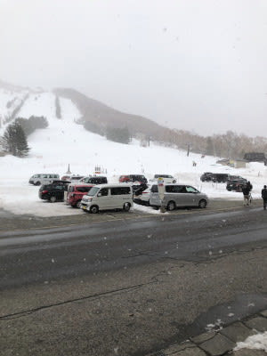

# 新型のVN LEVORGに試乗してみた…その2

📅 投稿日時: 2021-03-06 00:22:12

🏷️ カテゴリ: [車試乗](c07dec5709d34bd74e1f6cb9c8291061b.md)

えー．

本日も，志賀高原には

多数の優秀な特派員

が派遣されていたわけなので．

今日も特派員レポートからスタートする

わけですが…

今日の朝は，曇り空ながら，ところどころ

青空も見える天気でスタート！

今朝までの積雪0で，おこみんはシマシマの

上に鎮座してます…

で．朝の気温は-1℃と，

　朝は0℃をちょっと下回る程度．

という予想通りの高温で始まった

一日で…

バーンは見事なシマシマ！！！

…に，見えますが．

昨日緩んだ焼額のコースは，緩んだ雪が

固まったザラメのシマシマで，快感度は

ちょっと低かったようです…

奥志賀エキスパートコースも，

朝のうちはちょっとコロコロ気味

だったようですが．

じきに緩んでしっとり

滑りやすくなったようで．

そして，昨日も緩まなかった寺小屋が

実は一番良かったようですね…！

寺小屋はしっとりせずに，いい

雪だったようです．

ただ，昼ごろになると雪がぱらつきだし…

昼間の気温はプラスにふれてしまったので．

降る雪も，ウェアに着くとびっしょり

濡れるような雪で．

ゲレンデも滑りの悪い重い雪に

覆われて行き…

麓近辺では完全に雨っぽく．

ゲレンデの雪質は，全面的に

重い，滑りの悪い雪質になっちゃった

ようです…

午後3時ごろには，第1ゴンドラ乗り場は

ほぼ雨だったというレポートがありましたが．

…こんな天気＆ゲレンデコンディションに

関わらず，ラストリフトまで滑ったという

報告が数人の特派員から送られてきて…

今日も，

志賀高原の特派員は違う

という思いにあふれた，Skier_Sだったのでした…

で．

やはり明日は，朝から気温が高い，

終日曇り空ですね…．

…もしかしたら，明日ゲレンデに行く人の

行いが悪かった場合．

朝にわずかだけ，限りなく雨に近い雪が

ぱらつくかも…？？

そして，午後に冷えていくので．

午後はカリカリバーンになりそうな感じ…

あんまりいいコンディションじゃなさそう

ですので，覚悟しておいてください．

ってなことで．

本題へ．

LEVORG試乗レポート．

[前回](e89e52ac9b39d9502070971291d093017.md)の続きです…！

えー．

先日のレポートで．

不等長排気のところに，多くの方が反応してましたが．

これ，CB18エンジンはシリンダヘッド

一体型エキマニになったために，右バンクの1-3と

左バンクの2-4シリンダの排気がそれぞれ

ヘッドで一旦合流されてから，左右バンクの

排気管を繋ぐ…という仕掛けになったから

なんですが…

…普通はキャタライザをなるべく

排気直後に置きたいから，

あるいはターボまでの配管距離を短くして

圧損を減らしたい…

という目的で使う，このシリンダヘッド

一体型エキマニ．

水平対向エンジンのシングルターボだと，

どっちにしろ左右バンクの排気管を

繋げた後にしかターボを置けないし．

ターボ車だと，キャタライザーは

ターボの下流なので．

…なんでCB18エンジンをシリンダーヘッド

一体エキマニにしたのか，イマイチ

私にはよく分からないです…

排気干渉する右側1-3シリンダと，

左側2-4シリンダとでそれぞれ合流させた

あとの排気をターボに導くので，

排気干渉が起こらない

前2個の1-2シリンダと

後2個の3-4シリンダの排気を

それぞれ合流させてからターボに

導くFA20やFB16エンジンと違って，

ツインスクロールターボ化も

できないし．

（なので，FA20やFB16はツインスクロール

　ターボだけど，CB18はシングルスクロール

　ターボとなる)

これ，動圧が利用しにくくなるし，

A/R比も稼げないので，ターボ

レスポンス悪くなる方向に行くんだけどなぁ…？？

なんでシリンダヘッド一体型排気

マニホールドにしたんだろ？？？？

…でも．

排気干渉しまくりの不等長排気になったとはいえ．

新型LEVORGは，旧型LEVORGより静かです．

うーん．

音対策，かなり頑張ったんだろうな…

で．

私個人的には一番気になっていた，

リーンバーンの効果や如何に？

というところですが．

リアルタイム燃費系を見て走ってみたところ…

かなりの緩加速でも，加速フェーズだと

ストイキ（ストイキオメトリー：理論空燃比）

で燃やしているようで．

アクセルほぼオフのコーストに入れないと

リーンに入らない感じですね．

ゆるゆるとでも加速しようとすると，

燃費系がすっとリッター10くらいに

落ちますね…

運転領域のかなり広い範囲をリーンで

燃やせるようにしたって言ってるよう

だけど…

運転がラフな人の場合は，ストイキで加速，

燃料カット域で減速…

となるので，リーンのおいしいところは

使えない感じ．

気をつけて燃費走行する人以外，普通の人の

街乗りのアクセルワークだと，リーン域に

入らないんじゃないかな？

…気を付けてリーン域に入れる

運転をすれば，そこそこの燃費で走れそう

なんだけど．

おそらく，普通の人の場合，燃費は先代

1.6Lからそれほど改善しなさそうな予感…

すごい金と手間をかけたリーンバーン

エンジンなのに，ちょっともったいない…

…あ，そうそう．

この車，リーンバーンで点火しにくいところを

いろんな成層燃焼やプラグ形状の工夫で

無理やり燃やしているエンジンなので．

火が付きにくいハイオクガソリンはNGです．

必ずレギュラーを入れる必要があります．

説明書にも，

「無鉛レギュラーガソリンが入手できない

　ときなどは，無鉛プレミアムガソリンを

　使用することもできますが、エンジンの

　性能を十分に発揮できないおそれがあります」

と書かれているくらいで．

ハイオクを入れると，おそらくリーン燃焼

しないように制御されちゃうんじゃないかな…

で．

この1.8Lエンジンは，先代の1.6Lと同じく

アイドリングストップがついてるんですが．

このアイドリングストップ，クランク角

位相制御されてる？

先代のアイドリングストップからの始動時，

ちょっと「ブルルン」とエンジンがゆすられる

感じだったのが，かなりスムースに始動します！

そして，このアイドリングストップ．

ウインカーを点灯しているとエンジンが

止まらないんですね…

前はステアリングがある程度以上切られて

いるとストップしない，ステアリング角

制御で，ウインカー入れててもアイドリング

ストップした気がするんですが…

違いましたっけ？＞1.6Lに乗ってる方

ってなことで．

1.8Lエンジンが気になっていたので，

ついついエンジンに注目してしまいましたが．

続いて足回り．

足回りは結構いいよ！

ボディのしっかり感とダンピングの

心地よさで，先代より車格が上がった

感じがあります…

試乗したのはSTIだったので，ドライブモード

セレクタ―がついていて，

・コンフォート

・ノーマル

・スポーツ

・スポーツ＋

の4モードで切り替えられます．

画面タッチでも切り替えられますが，

ステアリングのこのボタンでもワンタッチで

モードが切り替えられます．

モードを切り替えると…

バネレート変えずに，ダンパーだけで

ここまで性格変えられるのか…！

と驚くほど，足回りが変わります．

コンフォートとスポーツ＋が

同じバネレートと思えない．

コンフォートは数kg/mmバネレートが

下がった感じ．

コンフォートはかなり優しい感じで，

足が柔らかく動くけど．

いや，意外とこれがいいかも…？

おそらく，タイトに攻めて狙ったラインを

走るにはスポーツがいいんだろうけど…

自分が普通に街乗りに使うなら，

NormalじゃなくComfort一択かも？

柔らかいのに衝撃も揺り返しがほぼ無く

一発で抑え込む感じ．

大きな横Gをかけなかったので，

コンフォートでのロールの出方まで

確かめられなかったけど…

スポーツは締まった感じになるけど．

普通に山道を流すぐらいだとコンフォートで

十分ですね．

私にとって，スポーツの出番はほとんど

なさそう…

コンフォートなら，同乗者からも

不満は出ないんじゃないかな？

スポーツも，先代A型の時のような

ゴツゴツ感は無く，いい感じに角が

とれた感じだけど．

ブッシュで高周波を別に吸収している

感じは無く．ダンパーがちゃんと仕事

してる感じ．

…むしろ，自分のVMG　LEVORGに

戻ってみたら．

普段は気にならない，ブッシュが動いてから

ダンパーが効き始める，わずかなラグを

感じてしまったので．

いや，このVMGも，フロントサスは一部

ピロボールだし．普通の車に比べれば

かなりブッシュが硬めのはずだけど…

新型LEVORG，かなり良くできてる…

あと，エンジン＆リニアトロニックの

変速制御もモードセレクタ―で切替わって．

SportsやSports＋では，なるべく高回転

まで引っ張る制御になりますが…

これは先代のSIモードと同じなので

それほどインパクトは無く．

モードを切り替えた時の足回りの変化の

方が，強烈に印象に残りました…

で．

ブレーキフィールは先代とそれほど変わった

感じは無いかな．

…というか，ブレーキペダルがちょい軽め

になり，ストロークが少し伸びた感じが

するのは気のせいか…

そして最後に．

ちょっと不思議だったのは，上下で固定

されないウインカーレバー．

普通はウインカーレバーは，ウインカー

点灯時は上，または下で固定されて，

ウインカーが止まると中間点に戻る…

ってのが普通のところ．

このウインカーレバーは操作してもすぐ

中立点に戻る仕様．

ウインカーを手動で止めたい場合は，

逆向きにウインカーレバーを操作します．

これには一瞬戸惑いました…

ってなことで．

さすがに2Lほどの悪逆な加速はしないものの．

これだけのパワーがあれば私には十分だし．

ガソリンもレギュラーで安いし．

コンフォートは乗り心地いいし．

…うーん．

2Lに乗っても，そんなにアクセルを踏むことが

無い私にとっては．

新型に乗り換えてもいいなぁ…

## 💬 コメント一覧

### 💬 コメント by (新米パパ)
**タイトル**: Unknown
**投稿日**: 2021-03-06 08:03:30

いつもレポートありがとうございます。

内容は全くわからないですが、Sさんがすごく頭が良いんだ！という事だけは伝わってきました。さすがです！

### 💬 コメント by (オオスギ)
**タイトル**: Unknown
**投稿日**: 2021-03-06 13:39:04

新型レヴォーク御成約‼️おめでとうございます🎉

うちは、子供たちが小学校卒業したら、念願のワゴン車に乗換たいです！

(もう、ミニバンは飽きました…)

### 💬 コメント by (アリス)
**タイトル**: 志賀高原は楽しい
**投稿日**: 2021-03-06 16:54:41

Skier_S様

お世話になっております。

3/4,5は１ゴンスタート、3/6は一の瀬スタートで10:00過ぎに切り上げて先ほど自宅へ到着です。

この時期の志賀高原TOPシーズンの雪質ではありませんが私は十分満足しています。

ヤケビの全コース一機滑りも出来ましたし、ゴンドラ、クワッド一人乗りも贅沢でした。

教えていただいた、アマズフィットが優れものですね♪スキーがまた一段と楽しくなりました。自分の滑走スピードが把握できたのは新発見です。

### 💬 コメント by (かず)
**タイトル**: Unknown
**投稿日**: 2021-03-06 19:10:00

今日レインボーさんお休みでしょうか？昨日はありがとうございました！

何年ぶりでしょうか？2ゴン 自分のイメージより倍のスピードでびっくりしました  女性も気になりマス！！笑

### 💬 コメント by (NONAME)
**タイトル**: Unknown
**投稿日**: 2021-03-06 21:35:32

スキーに行かず、貯まったお金で新型レヴォーグ！

合理的判断ですね♡

### 💬 コメント by (レインボー73)
**タイトル**: Unknown
**投稿日**: 2021-03-06 21:56:34

土曜日の志賀高原情報

朝、背筋がバキッと！　マッサージしてもらって、ダイヤモンドの試乗会へ。

無理せず、おとなしく、子供と滑る、をテーマに、　結構楽しめました。師匠のすべりの凄さに感動しながら、めっちゃ楽しめました。

視界も悪くコンディションはよくないけど、試乗会もあって、いい休養になりました。

### 💬 コメント by (Skier_S)
**タイトル**: 夢を見た…ようだ
**投稿日**: 2021-03-06 22:51:31

＞新米パパさま

頭は良くないですが…車は好きです！

というのがわかる記事だったかと(笑)．

＞オオスギさま

契約してませんから～！

そんなお金ありませんから～！！

＞アリスさま

あら．もう志賀から戻られたのですね．

今日は雨のあまり良くない感じの一日でしたが…

3日間，お疲れさまでした．

Amazfit Pace，リアルタイムでスピードが見られるのがいいですよね．

＞かずさま

今日はレインボーさんは出動でしたが…

お子さんの相手をされていて，ほとんど滑ってない感じでした(笑)．

＞Nonameさま

スキーに行かずLevorgを買うお金を貯めるには…

数シーズンスキーを禁止しないといけませんね(笑)．

STIとアイサイトXをあきらめれば何とかなるのかもしれませんが…

まあ，現行LEVORGの中古が出始めるまで待とうかな，

という感じです．

＞レインボー73さま

本日はお世話になりました～！

緊急事態宣言以降久しぶりの竜宮城，楽しかったです．

ありがとうございました．

### 💬 コメント by (りやまやり)
**タイトル**: Unknown
**投稿日**: 2021-06-23 10:15:31

いつも楽しく拝見してます！

3月にVNレヴォーグ納車しました。

馴らしが終わり真価が発揮されつつあります。

WRXからの買い替えなので、パワー不足が心配されましたが、むしろ実用トルクが優れているので問題は感じられません！

足腰、ボディが抜群で、とても姿勢のよい車です！

コンフォートなら高級車

スポーツプラスモードにすればWRX

キャラ変ステキです！

新型　おすすめします！

志賀高原に行く日を心待ちにしています！

### 💬 コメント by (Skier_S)
**タイトル**: ＞りやまやりさま
**投稿日**: 2021-06-24 01:40:05

コメントありがとうございます～！

VN LEVORG STi購入おめでとうございます！

うらやましい～！！！

WRXからの買い替えでパワー不足を感じないとは…

なら，VMGから買い替えても不満はなさそうですね．

試乗してもかなりいい車だと思ったので，物欲を激しく

刺激されています…

でも．

高すぎて買えない（涙）

