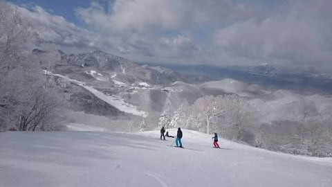
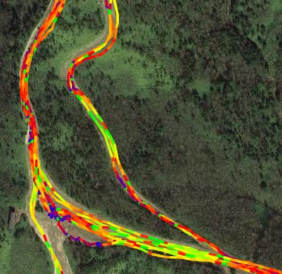
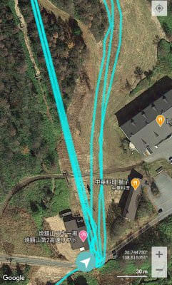

# Amazfitのスマートウォッチ，Amazfit GTRとPACEをしばらく使ってみて…2020/10/29のアップデート以降のスキーログを見てみる

📅 投稿日時: 2021-02-17 07:11:06

🏷️ カテゴリ: [PC,カメラ&小物](c0d8caed13e597efe97b661a8ae56bed0.md)

えー．

いろいろバタバタしてます(涙）

今日も朝更新です…

で．月曜に雨が降った後，昨日の火曜の志賀高原ですが…

朝は冷え冷えの－10℃！

そして，朝はかなりの勢いで

雪が降っていて…

昨晩からの積雪は20cmほど！！

圧雪コースも硬い下地の上に

5cmほどの雪が積もって，

意外と快適だったようです！

ただ，午前中は吹雪気味で，視界も

あんまりよくなかったようで…

積もった雪も，気温が低いながらちょっと

重めだったようで．

…午前中は，ゲレンデ誰も滑ってませんね…

午後になると，雲の切れ間から日が射すようになり…

晴れ間がだんだん広がっていったようです！

午後になっても気温は－10℃をキープ，

でも，風が強くて東館ゴンドラは

止まったようで．

さらに，奥志賀は第3高速ペアが強風で止まり，

第2高速ペア沿いのエキスパートコースも

圧雪車故障で非圧雪だったようです…

あ，奥ゴン，焼額ゴンドラは止まらなかった

みたいです．

とはいえ．

ゲレンデのコンディションは昨晩からの

雪のおかげで，下地は硬いながらも

結構いい感じで回復して行っている

ようですね！

今日もこれから一日雪が降りますし．

明後日18日も一日降りそうで．

18日はパウダーそこそこ積もりそう！

なので…

18日はパウダーねらい目だし．

そのおかげで，週末までにはゲレンデ状況はかなり

回復しそう…！

…また今晩，週末にかけての詳細天気予想

やりますので，お楽しみに…！

で．

今日もおこみんは猪苗代に出張しているようで…

志賀高原のご当地キャラとして，向こうの

ご当地キャラと対決しているようです(笑)．

元気なおこみんの姿を見てほっとしたところで，

本題へ．

えー．

2020/10/29にアップデートがかかり，

GPSファームが更新された

我がスマートウォッチ，Amazfit GTR．

[ファームアップ前は，Amazfit PACEの方が
GPS精度が高い](ee6f3a03af3456d208cf5957fed0a8876.md)…

と，前回報告したわけですが．

果たして，GPSファームがアップデートされた

後のGPS精度はどうなったのか，気になるところ．

ここで，ファームアップ後のGPS精度を

見てみましょう…

と言っても，ファームアップ後は登山に

行っていないので．

ファームアップ前は登山の比較でしたが，

ファームアップ後は，スキーのGPS軌跡を

見ての比較になります！

まず，ファームアップ前に焼額山

某所を滑った記録を，スマホアプリで

見てみると…

こんな感じで，コースからかなり

外れた感じの記録が残ってましたが…

アップデート後の記録を見ると，

うーん．

コースからの外れ方が少なくなった

ように見えますね…

ただ，スマホアプリはGPS軌跡を

間引いて表示していて，不正確

ですので．

GPXファイルを書き出して，

GPXデータで比較してみましょうか…

アップデート前だと，軌跡がコースから

はみ出したように見えるところも

ありましたが…

アップデート後だと，軌跡は見事に

コースの中に納まってます！

違う場所で見ても．

こちらがアップデート前で，

コースからはみ出していたところが…

アップデート後だと，

コースの中にしっかり納まってます！

さらに別の場所．焼額第2高速乗り場．

アップデート前だと，赤く囲った

部分のように，かなり草むらに

つっこんでからリフト乗り場に

行ったことになっていたところ…

アップデート後だと，草むらに

つっこまずにリフトに乗れるように

なりました！！

…って，いや．

元から草むらには突っ込んでませんから…

そのほかのいろんな場所を見ても．

大体，軌跡はコースから外れることは

無くなっており…

ちょっとGPSの精度が上がったように

見えます！

うん，いいんじゃないの…？？

GPS精度がもともと良かった，

Amazfit PACEと比べても．

PACEではこんな感じのところ．

GTRでもきれいにコース上に

乗ってるし．

これも，PACEの軌跡に比べ…

GTRの軌跡は遜色ない精度まで

上がった感じを受けます！

…うむ．

やっと，GTR.

PACEに近い精度が得られたかな…

と，思ったところ．

やっぱり電波の弱い，屋根のあるリフト

乗り場とかだと．

リフト乗り場の屋根の下で多少精度が

落ちて，軌跡が揺らぐGTRに比べると…

PACEの方は，電波が弱いところでも

軌跡は正確ですね…

さらに，なぜかGPS電波がいつも弱い

一の瀬ダイヤモンド近辺．

Amazfit PACEに比べると…

赤く括った部分，Amazfit GTRは

GPS電波を見失ってしまい，

水色矢印部分，記録が飛んで

直線で繋がれてます（涙）

そして，赤丸部分は記録が

ぐちゃぐちゃに…

ぐちゃぐちゃになった部分を

拡大すると．

概ね動きを正しく記録している

PACEに比べ…

GTRの記録は，ちょっと残念な感じに…

ってな感じで．

Amazfit GTRの2020/10/29のGPSファームアップ後の

GPS精度は．

電波が十分受けられるところでは精度は良くなった

ものの．

電波が弱いところの精度はまだ不十分

という感じで．

電波が弱いところでは，軌跡がぐちゃぐちゃに

なるところは残ったままでした…

ちょっと残念．

そして．

このファームアップデートでは．

以前報告したように，

下り標高差がスマホアプリで見ても

ウォッチ本体で見ても，

本来積算されていくはずの下り積算標高差が，

登ったぶん引かれていく

という謎仕様のバグが新たに埋め込まれて

しまいましたし…（涙）

（なので，登って下ってを繰り返すと積算標高差がほぼ0に…）

（なぜか登り積算標高差が7093mなのに，下り積算標高差が53mだと言っているGTR）

…まぁこれは，PACEの方にも

下り標高差が2倍になって表示される

という，こちらも謎仕様のバグが最初から仕込まれて

いて，改修されないままですし…

両方足して2で割るとちょうどいいんだけどな←違うから

しかし，なぜ両者．

20000mクラブメンバーが一番大事に

参考にしている下り積算標高差に，

このように見事に違うバグを仕込んで

くれるかなぁ…（ちょっと涙）

とりあえず．

GTRはGPS精度が多少上がったものの．

電波が弱いところでは，PACEが元気に

測位を続けていても，GTRは狂いがちだし．

さらに，PACEならこんな風に，リフトの

何本間を何分で滑ったか…という記録も

残るし．

さらに，GTRでは，スキーモードにすると

ウォッチ画面に時間が出ず，

時間を確認するための時計が別に必要

という，致命的欠陥もあるので．

やはり，登山の時の結論もそうでしたが．

スキー用に使うには，Amazfit GTRよりPACEのほうがいい

というのが，私の結論です．

しかし，[Amazfit GTR2](https://www.amazfit.com/jp/gtr2.html)が出て．

酸素飽和濃度が測れたり，

マイクとスピーカーがついて，

Bluetoothでスマホと繋げば，

スマホを取り出さなくても

ウォッチで通話できたり…

と，なかなか魅力的なんだけど．

いろんな報告を見ると，Amazfit GTR2の

GPS精度は，GTRと変わらないようなので．

うーん．

GTR2は，買わなくてもいいかな…

## 💬 コメント一覧

### 💬 コメント by (かず)
**タイトル**: Unknown
**投稿日**: 2021-02-17 09:42:36

若さん今日の非圧雪の状況お願いします！

### 💬 コメント by (レインボー73)
**タイトル**: Unknown
**投稿日**: 2021-02-17 11:43:42

水曜日の志賀高原情報

しんしんとさらさら極上雪が振り続ける一日。

かずさん、今でしょ！

朝の上林ー３℃　蓮池ー７℃　山頂ー10℃。

パノラマ、カラマツ共に、硬め圧雪の上に新雪すねパフ。20cmくらいかなあ。スネまでの抵抗でスピードは出ないものの、板は全く浮かない。普通のＧＳ板でも十分いけそう。

カラマツが最高と、４本サラ場ばかり。

ＧＳサイドの非圧雪では、浮く浮く深雪。こっちの方がよかった。スーパーもふかふか。皆さん、自分の所が最高と思って滑っているのかなあ、

ダイヤモンドの新雪は今日も期待を裏切りませんでした。

ファミリーはふかふかボコボコ。

タンネは今日から火曜日まで動くそうです。ありがとう。

そんなんで今日も銀嶺で午後の作戦会議。

西館は魅力だけど、雪がすごすぎます。

### 💬 コメント by (レインボー73)
**タイトル**: Unknown
**投稿日**: 2021-02-17 18:25:01

水曜日の志賀高原情報２

昼食後滑った西館様が本日のベスト。13時からしかリフトが動かないので、パウダー全開。50cmのさらさらパウダー。これが今年のシーズンベストだ！　皆んなが異口同音！

タマゴから高天の非圧雪。これもふかふか。私ごときでも何の抵抗もなく滑れる。そして、今日から動くタンネ回し。

その後、隊員らはパーフェクタ。深いけど底づきして、あんまり。私はいち早くダイヤへ。

このダイヤが最悪。降りしきるだんだん重くなってきた雪で、視界ゼロ。滑っていて上下どころか自分が動いているのか止まっているのかさえわからない。ダイヤで３回も止まったのは記憶にない。

そのあとのサウスごまた最悪。ボコボコでジ・エンド。

レインボーに30分余して！

今日は、エス様の優秀な終礼まで滑り続ける特派員を、夜の一杯にお誘いしたため、特派員を３時リタイアさせてしまいました。ごめんなさい。

### 💬 コメント by (Skier_S)
**タイトル**: コメント遅れました
**投稿日**: 2021-02-19 07:07:14

＞レインボー73さま

水曜はまたシーズンベストを更新したんですね…

うらやましい…

早く長野住民になりたいです…

