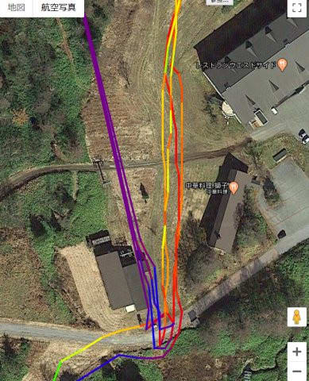
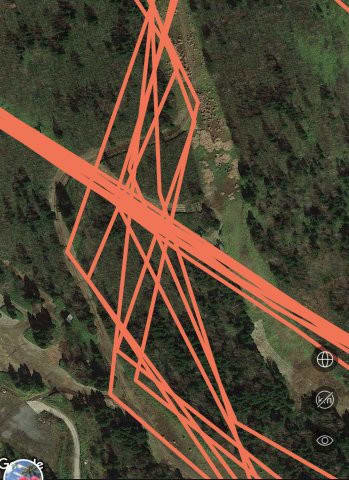

# Amazfitのスマートウォッチ PACEとGTR，GPXファイルを使ってGPS精度を比較してみる

📅 投稿日時: 2020-06-03 03:40:17

えー．

これまで長々と，Amazfit PACEのレポートを続けてきて．

[第1回　Amazfit PACEとは？](ed3d5d801313ccbb4de704222aba3cdc0.md)

[第2回　海外通販での注文から到着まで](ee08698196e276d6c47312dbced43bf34.md)

[第3回　到着＆開梱の儀＆初期設定](ed1bf51c8f4791b77b1b4731aae9be689.md)

[第4回　バンド交換＆時計本体の設定画面](e3928a10367db811404c9ce7b1d95f3fe.md)

[第5回　運動記録…スキーで使うとこんな感じ](e494f1a5f2dcecb6c986e7d9821c27fe4.md)

[第6回…過去のスキーの記録を時計本体で見る＆GPXファイルをGoogle Mapで見る](ef027dd244e860f24105fa098fbeedce4.md)

[第7回…スキーログ以外の，時計本体の機能も盛りだくさん](ea509a7c711b06640acb6477bdc2890df.md)

[第8回…スマホアプリを使ってみる](e1f31851c8b18814cc3cbc862eba42859.md)

[第9回…スマホでスキーのログを見てみる](e91749b873f56737982d3772e365e3b39.md)

[第10回…スキーのGPSログの精度はどのくらいか？](e3845e6c9aa4f4c3831b6bbf19114639d.md)

さらに，それ以前のAmazfit GTRのレポートがあり．

[その1．購入レポート，](e07b216ec3b426f7a5a1462a3b6fd1c02.md)

[その2．開封＆試してみた感じ，](edd1205f6bd9cd6dadb50e4fc6316b747.md)

[その3．アクティビティーログ](ecd7317c7980728b41dae1a21fe835803.md)

[その4．スマホアプリのインストール＆設定](eb88e9293dae421d12f27fe8b5b363344.md)

[その5．スマホアプリを使ってみた](ecf2d1a51d5012b9edf9fbf5307e586db.md)

[番外．常時点灯機能追加！](e031a6cc94592b655560de20fc58cacf1.md)

[番外その２常時点灯の表示モード追加！](ec221351f854b20de445e565d66acdf55.md)

[その6．GPS精度が低いのが欠点](eef49f5206ed798087941af71eebf0dee.md)

[その7．GPS精度，ちょっと改善したかも](e9f927972612f60570f5a704fb48030f8.md)

[その8．スキーモードを使ってみた](e29f3f0e50c4f1facc44bbff6d4859de6.md)

[その9．スマホアプリでログを見る](e759b2c876cb9c8b604ea08e152e39c20.md)

[その10．Auto pauseを切ったらどうだったのか？](e6095de159b336f431785b0cbbad1f6ab.md)

[その11．スキーでしばらく使ってみて？](e4de6cfa5a1f3cd4b4d3410691b1d2a05.md)

さらに前回，Amazfit GTRの追加ネタ…

というか，Amazfit用スマホアプリのネタとして

[番外その3　AmazfitのスマホアプリにGPXファイル機能追加…Amazfit GTRのGPS記録もGPX化できるようになったよ！](e22fcec6fd07c07c98eebd234c92bc5ea.md)

というのを追加したわけですが．

その，前回の時に．

Amazfit GTRとPACEの両方のGPXファイルを

もとに，両者のGPS精度を比べてみましょう…！

（続く）

って予告してたのですが．

…すみません．志賀高原のシーズン営業ラスト

ということで，中2日ほど違う記事を挟んで

しまいました…

ってなことでお待たせしましたが．

今回，Amazfit PACEとAmazfit GTRの両者の

GPXファイルで，GPS精度を詳細に比較

してみます！！

とりあえず，同じ日に滑った記録．

Amazfit PaceのGPXファイルと…

Amazfit GTRのGPXファイル．

GPXViewerで，比較してみるわけですが…

うむ．

この縮尺のレベルでは，両者にそれほど

差があるように見えないので．

ちょっと詳細を拡大して

比較してみましょうか…

まず，スマホのアプリで見ると．

Amazfit Paceでは，こんな感じで

コースをきれいにたどっていて…

Amazfit GTRでは，こんな感じで

コースからはみ出したようになっていた部分．

これを，GPXファイルで比較すると…

Amazfit Paceではこんな感じで…

Amazfit GTRでは，こんな感じで

ありゃ！！

GTRの記録でも，コースをちゃんと

たどっているじゃないですか…！

…うむ．

Amazfit GTRのGPS精度，スマホアプリで

見たときには，

「ひどいな」

と思ったけど…

スマホアプリがちゃんと表示してないだけで，

データとしては結構ちゃんとしてたんじゃ

無いですか…！！

ってなことで．

もう少し詳しく見てみましょうか…

Amazfit GTRの記録をスマホアプリで見ると,

赤丸で示したように，

毎回，30mほど森に突っ込んでからリフトに

乗っていることになっていた

この部分．

水色で囲ったように，リフト乗り場の

小屋を突っ切って滑っていくという，

テロリスト行為もやっていることに

なってましたが…

Amazfit GTRのGPXファイルを見てみると．

赤丸部分，多少森に突っ込んでますけれども…

それもせいぜい数m程度．

毎回30mも森に突っ込んでないし，

リフト小屋を突っ切って滑っても

いません！！

をを…ごめん．Amazfit GTR．

お前のGPS精度，それほどひどく

なかったんだね…

…とはいえ．このGPXファイル．

焼額プリンスホテル西館やレストラン獅子の

建物を突き抜けて滑っている記録が残っていて．

そして，私は建物の壁を突き抜けて

滑る特殊能力は残念ながら持ち合わせて

いないので．

…まぁ，Amazfit GTRのGPS精度は，

その程度ってことですね…

…それに比べ．Amazfit PaceのGPX記録を

見てみると．

こんな感じで，森に突っ込まないどころか，

ちゃんとリフト乗り場のゲートを通って

いる軌跡がきれいに残ってます！！

これは…誤差1mくらいの，ものすごい

位置精度では！？？

前の画面のGTRと同じ時間の，同じ場所の

GPS軌跡と思えない…！！

そのほかの場所で，精度をいろいろ比較

してみると…

同じ場所を何度も通ったところを見ると，

一目瞭然．

Amazfit GTRでは，毎回の軌跡がずれて

コースからはみ出たような跡が残ってる

ところもありますが…

Amazfit PaceのGPX記録では，

見事に狭い幅のコースを毎回見事に

トレースしています…！！

うーむ．

Amazfit PACE，かなりのGPS精度…

他の記録を見ても，Amazfit GTRでは，

赤く括った部分，コースからはみ出て，

森の中を滑った記録が残ってたり

しますが…

Amazfit Paceでは，

ちゃんとコースからはみ出さずに

滑ってます…

そのほかにも，GPSアンテナ感度が低いからか，

Amazfit GTRでは，リフト小屋の

屋根の下で電波を見失って，

軌跡がぐちゃぐちゃになった跡が

この画面左下に残ってますが…

Amazfit Paceでは，GPSアンテナ

感度が高いからか．

リフト小屋の屋根の下に入っても，

軌跡がぐちゃぐちゃになってないですね…！！

そのほかの場所を見ても，

Amazfit GTRでは，リフト小屋の

屋根の下でGPS軌跡が狂う傾向が

ありますが…

Amazfit Paceは，すごいきれいで

精度が高い軌跡が残ってますね…

…ってなことで．

直接比較してみると．

Amazfit PACEの方が圧倒的にGPS精度が高い

ということが分かりました…

とはいえ．

Amazfit GTRも，スマホアプリで見てた時に

20m~30m以上ずれていて，

「こんなもん，使えるか…！」

と思ってたのに比べれば．

GPXファイルでは，ずれていてもせいぜい

5~10m程度と，思ったよりはいい精度

だったので…

まぁ，Amazfit GTRのGPS精度は，

そこまでひどくないんだな…

ということが，GPXファイルを見て

分かりました．

…ただ，

Amazfit PACEのGPS精度が良すぎる．

精度1m程度という，圧倒的な精度はすごい…

いや．Amazfit PACE．

GPS精度は異常にいいんだから．

これで，高度計の精度さえ良ければ…

惜しい…

## 💬 コメント一覧

### 💬 コメント by (西館)
**タイトル**: Unknown
**投稿日**: 2020-06-04 06:50:50

Sさんの過去のテロ記事で大爆笑した記憶がありますが、風評被害拡散したんですね。

高度の把握は難しいという事がよく分かりました。検証ありがとうございます。

色の表示は変えられるんですか？凄く綺麗だし分かりやすいです。

もしかしてSさん、分かりやすい資料作成を目指してちょー頑張ったのでしょうか。Sさんならやりかねん。

### 💬 コメント by (Skier_S)
**タイトル**: >西館さま
**投稿日**: 2020-06-05 01:43:58

もう，Amazfit GTRの記録では，私はテロしまくってたり

森の中を探索していたり，突飛な行動だらけです…

このアプリでは，色は変えられなさそうです．

デフォルトのままの表示です…

…このスマートウォッチネタ，記事1本書くのに毎回3時間以上かかってます（涙）

ひそかに労働コストが高い記事です…

