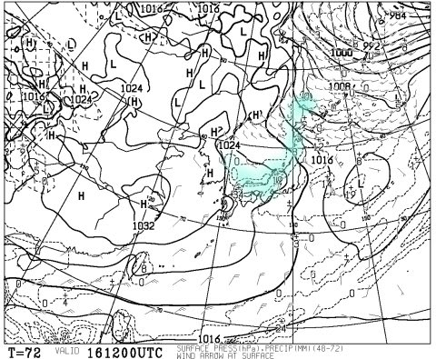

# 今週末，12月17，18日の週末までに，スキー場に雪は積もるのか？…今週は冷え冷え！だけど…

📅 投稿日時: 2016-12-14 02:32:57

えー．

この夜遅くまで．

志賀高原は，予想の通り．

雨となってしまったようです…（涙）

（[志賀高原索道協会HP](http://www.shigakogen-ski.com/lift-operation/detail?place-id=16)より）

でも．

安心するのだ．

12時頃にはようやく気温も0℃を割って，

今は，結構な雪が降り始めてます！

（[北信建設事務所道路気象情報ページ](http://www.q0.ws302.smilestart.ne.jp/index.htm)より）

ってことで．

昨日は残念な雨でしたが．

おそらく，朝までにはかなり積もると思いますよ～！！

そして，[焼額第2ゴンドラも，本日から営業開始](https://www.facebook.com/yakebitaiyama/photos/a.133097176785637.26773.116999658395389/1164182093677135/?type=3&theater)です～！！！！

よかった…今週末は，ゴンドラが滑れる…（一安心）

で．

先週の冷え冷えウィークのおかげで．

かなりのスキー場がなんとかオープンに

こぎつけたものの．

まだ，平年に比べると積雪が少ないですね…

はてさて．

今週末までに，さらにドカドカ雪が積もり．

もっと滑れるエリアが拡大するのか？

さらにゲレンデコンディションは改善するのか？？？

…このあたり．

いつも通り，専門天気図から読み解いてみましょう…

では．

まず，14日水曜の850hpa気温からですが…

うおおお！

これは，冷えるよ！

赤くマークした0℃線は太平洋まで

下がっちゃってるし．

水色の-6℃線も，志賀より南まで下がってます…

これは，志賀高原，朝は-10℃レベル．

12月としては，結構な冷え冷えです…

そして．

地上天気図を見ると…

ををっ！！冬型！

水色の降水域は日本海側にかかり．

典型的な冬型です！

そして，拡大してみると…

これは，JPCZ！？

それも，JPCZによる雪雲が．

矢印で示すように，ほぼ南側に

流れるということは…

そうです．

北風です．

志賀高原でも積もる風向きです！！

これは，志賀に限らず，新潟，北信のスキー場は，

14日は冷え冷えの雪降りですね～！

そして．

15日の木曜ですが．

500hpa図をみると…

え？えええ！？？

いわゆる，「上空5000mの-30℃の寒気」が，

信州まで下がってきてるよっ！！

…これは．

そこそこの雪が降る目安．

積もりそうな気配…

で，15日木曜の850hpa図は…

当然，赤い0℃線は太平洋のはるか南．

水色の-6℃線も志賀より南まで下がり．

この日も冷え冷え！！

地上天気図は…

日本海側に，見事な歓喜の噴き出し寒気の噴き出しの雲がっ！！

15日も…

これは．

冷え冷えパウダーデーです！

12月中旬にして．

来てます．

パウダーデー！

…平日なのが，惜しい…

で．

今度は16日，金曜ですが．

…この日も，500hpaの-30℃エリアは

信州を覆っていて．

…それどころか，-33℃線が信州に掛かる

くらいなので．

この日も，かなりの積雪になりそうっ！

16日金曜の850hpa図は，水色に塗った-9℃線が

志賀より南に下がっています！

…これは．

志賀高原の朝は，-12℃とか-13℃とかに冷えそう…

激冷えレベルですね．

地上天気図を見ると．

んーーもう，この日も

日本海側に雪雲が見事にかかってます．

16日も降ります．積もります．

パウダーです．

そして．

土曜17日は…

850hpa図はこんな感じで．

まだ―3℃線が志賀にかかっているので．

そこそこの冷えが続き…

地上天気図を見ると．

朝は雪が積もりそう．

午後には雪が止んでくるかな…？？

ってことで．

まとめると．

水曜：冷え冷え！朝までは結構積もるよ！

　昼間も雪が降り続ける

木曜：激冷え．2月並みの冷え込み．死ぬほど寒い．

　ひたすら雪が降り続け，志賀は30cm以上積もるかな？

　日本海側は終日ドサドサ積もるよ！

　パウダーデー！！

金曜：引き続き激冷え．トップシーズン並み．

　この日も終日雪．かなり積もる．

　2日連続パウダーデー！

　3日間の積雪で，かなりのコースが滑れるように

　なりそう…

土曜：朝まで雪が降り続け，朝イチはパウダーが

　楽しめるでしょう！

　今の天気図だと…ブーツパフ～脛パフくらいかな？

　前日から踏まれていないコースは，もっと深い

　パウダーが楽しめるでしょう！

　気温自体は平年並みに戻る．

ってことで．

このままの天気図なら．

今週は奇跡の冷え冷え積雪ウィークになりそう！

1ゴン動かないかな～？←いや，3連休までは動かさないと思う…

いやーーー．

今週末は土曜朝にパウダーを楽しめる可能性も

高いし．

いい週末になりそうかな！！

…

…しかし．

しかーーーし．

あう？？？

冷え冷えウィークは，今週で終わり？？？（ちょっと涙）

## 💬 コメント一覧

### 💬 コメント by (こじろう)
**タイトル**: Unknown
**投稿日**: 2016-12-14 10:24:15

いつも楽しみに拝読させていただいております。

今シーズンの初滑りはまだで、27日から30日まで志賀高原で滑る予定です。焼額でお姿を拝見できればと思っております。

### 💬 コメント by (Goku)
**タイトル**: Unknown
**投稿日**: 2016-12-14 20:14:53

え！来週暖かくなるんですか？

もう今シーズンは冷え冷え踊り＆降れ降れ踊りはしたくないよ～(笑)

きっとクリスマス寒波ってやつが来ますよね？

### 💬 コメント by (はなげ親分)
**タイトル**: んっ？
**投稿日**: 2016-12-15 00:53:41

高温＆雨・・・

昨シーズン同様、恐怖の大王が降臨するのですか？

誰かがそり遊びをしなければ（笑）

### 💬 コメント by (Skier_S)
**タイトル**: 来週は…マズい．ダメかも（涙）
**投稿日**: 2016-12-15 01:35:25

＞こうじろうさま

27～30までですか…

私は30日からなので，30日に焼額で

見かけたら，よろしくお願いします～！

子連れなので，子供と一緒に滑っていたら

ゆっくりお話しできないかもしれませんが，

その際はご容赦を…

＞Gokuさま

ダメです．

残念ながら，来週は期待できません…

踊らないとダメかもしれません（涙）．

クリスマス寒波…来てほしいですが…

まだわかりません．

明日，一か月予想図が出るので，

それを見てみたいところです．

＞はなげ親分さま

…今のままの天気図だと．

来週は，ヤバいです．

マズいです．

とりあえず，今週末は子連れスキーなので．

そり遊びするしかないのかな…（涙）．

