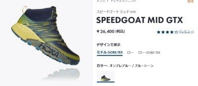
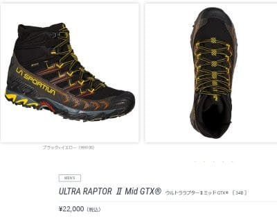
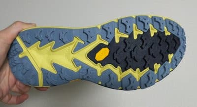
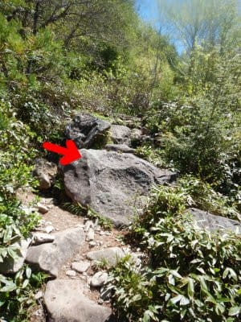
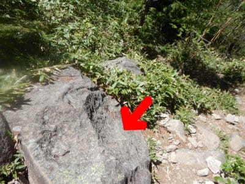

# 山歩き用にHOKA ONE ONEのSPEEDGOAT MID GTXを試してみた…トレランシューズ，すごくいいじゃないか！

📅 投稿日時: 2022-06-27 00:33:02

🏷️ カテゴリ: [日記](cc4b5682fb7b8b144980957a978653fb0.md)

えー．

渋峠に行くつもり満々だった6月最初の週末に，

渋峠がクローズになったので，

[今シーズン初の山登り](ef728ed1bf2ab2eda3c0b1d013d731c31.md)をやってきたと

書きましたが．

その後も，[笠岳に登ったり](eaa778909f0e595c7a789fb0dcbe92c6e.md)，

今日も午前中にちょっと近所の山を

ひとっ走りしてきたり…と．

スキーシーズンが終わって，オフシーズンの

トレーニングである山歩きを復活させて

いるわけですけど．

実は今シーズン，山登り用の新しい靴を

デビューさせたので，そいつのレビューをば…

これまで履いていた靴が，かなり使い

込んでボロボロになってきたし，

さらに登山用というより軽量ハイク

シューズだったために，泥や濡れた

岩の上でソールが滑り気味で，

もう少し登山に使える本格的な靴が欲しいな…

と．

新しい靴を探していたわけですが．

せいぜい日帰り登山しかせず，

重い荷物を背負うこともないし．

登山というよりファストハイク的な

山歩き(時々走りも）という私の

スタイルの場合．

「もしかすると，登山靴よりも

　トレランシューズの方がいいのでは？」

と，トレランシューズ系の靴を探して

みたのでした…

最近はあれですね．

トレランシューズ派生で，足首が

ちゃんとカバーされるミッドカットの

靴が，ファストハイク系の靴として

かなり増えてきていて．

その中でも評判がよさそうな，以下の二つを

候補に選びました．

HOKA ONE ONEのSPEEDGOAT MID GTX．

これは，本格トレランシューズのSPEEDGOAT4を

ミッドカットにして，ゴアテックスを入れたもの

ですね．

（[HOKA ONE ONE公式サイト](https://www.hoka.com/jp/speedgoat-mid-gtx/1106532.html)より）

LA SPORTIVAのULTRA RAPTOR Mid GTX．

こいつも，ULTRA RAPTORをミッドカットにして

ゴアテックスを入れたモデルですね…

（[La SPROTIVA公式サイト](https://www.sportivajapan.com/product-mountain/ultraraptor2midgtx/)より）

この両者をを比べてみたところ．

LA SPORTIVAの方はかなり幅が狭く，

自分の足型にはHOKA ONE ONEの方が

合ってそうだし．

そのほかにも，HOKA ONE ONEの方が

100グラム軽かったり，（Hoka：375g，La SPORTIVA 470g），

あとはHOKA ONE ONEのビブラム

メガグリップソールがかなり評判が

良かったり．

たまたまAmazonでかなりの値引きで

売っていたのを見つけたのもあり，

今回は，HOKA ONE ONEの方を選んでみました！！

ってなことで，ここ数回の山登りで

履いてみたけど…

草地，土，木の階段，ゴロゴロ岩場と，

いろいろと歩いてみたところ．

（岩場の登りや鎖場は無い，お気軽

ハイキングコースばっかりですが…）

まず，軽い！！

軽さは正義ですね…

登り坂でむっちゃ楽！

普通の登山靴に比べれば，ソールがかなり

厚く柔らかいので大丈夫か心配だったけど，

これだけの厚さでも足裏感覚が

しっかりあるし．

むしろソールが硬すぎる靴より，

下地の凸凹がよく分かるかも…

さらにソールが厚くて柔らかい分，

ゴツゴツ岩場でも痛さは全く無し．

そして…

噂のビブラムのメガグリップソール．

これはすごい評判がいいけど．

予想以上のグリップ力！

むちゃくちゃグリップが強いです！

濡れた岩場では試してないけど…

乾いた石の表面なら，驚くほど滑らない．

だもんで，こんな高さ1m近くある岩を

登るとき．

普通なら，この岩の中間に足を置こうとは

思わず，岩の上に足をかけてよじ登ろう

とするところ．

…でも．

この靴を履くと，ここの岩の真ん中で

一歩刻める！

下りの時でも，今まで足をおこうとも

思わなかった，こんな岩の斜めのところ

でもしっかりグリップしてくれるので，

えっこらさと落差を降りなくても，

途中で一歩ステップが刻めて，かなり楽！！

サラサラした土でも，湿った滑りやすい

急斜面の土の上でも，グリップ力は

抜群！！

しっかりと止まってくれます．

さすがこういう斜面を走っても大丈夫な

ように作られているだけあって…

湿った土の上で走っても，滑ったり

足場が流れたりすることは無くて．

…今までの靴と全然違う…！

とりあえず．

まだまだ書きたいことはあるけど．

ちょっと長くなったので，今日はここまで…

後日，インプレッション[後半戦に続きます](e40e5816a7205e35b68661ab4cd4994ec.md)！

## 💬 コメント一覧

### 💬 コメント by (モイストシルバー)
**タイトル**: Unknown
**投稿日**: 2022-06-27 20:59:31

SPEEDGOAT4持っています。当初ジョギング用に買いましたが、ソールがどう見ても悪路用なので、結局ジョギングには使わず、高尾山登るのに使いました。登山靴やトレッキングシューズより軽量で柔らかいのに、グリップするのは不思議な感覚ですね！

### 💬 コメント by (一愛読者)
**タイトル**: Unknown
**投稿日**: 2022-06-27 22:47:38

sさんのフィシャーscは、へたっていませんか?　sさんの物欲選手権を今か今かと待っています。ちなみに私は、お告げを信じて5月初めににフィシャーscを予約しています。

### 💬 コメント by (Skier_S)
**タイトル**: いろいろ物欲が…
**投稿日**: 2022-06-28 02:27:03

＞モイストシルバーさま

あ，SPEEDGOAT4お持ちですか！

SPEEDGOAT MID GTXのもととなった靴ですから，かなりいい感じなんだろうと思います…

Vibramのメガグリップ，すごいですよね．感動のグリップ力です．

アスファルトで使うのはもったいないですよね（笑）．

＞一愛読者さま

フィッシャーSCは…今シーズンはロング板ばっかり履いたから，まだヘタってないと信じたいところ…

でも，来シーズンのSCは大当たりですよ！すごいいい板です…買って後悔はしないはず！

