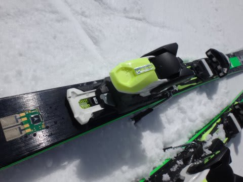

# 2015シーズンモデルのスキー試乗レポート20…BLIZZARD＆HEAD編

📅 投稿日時: 2014-05-21 02:07:43

うーむ．

なんだか，今週．

結構雨が降りそうなので．

この週末のかぐら，結構雪が解けちゃうかも…

テクニカルコースは，完全にアウトっぽいかな～．

とりあえず．

まだまだ続く，スキー試乗レポート．

今日は，ブリザードとヘッド，1機種ずつです．

では，どうぞ～

----

BLIZZARD SRC RACING S 165cm

SL競技＆基礎小回り用

しっかりと張りが強く，返りの反応がかなり速く，

強く出ます．

メタルのバネ感の強い，ビンビンした小回り板です．

エッジグリップも強め．

しっかりグリップする板を踏み込んでいくと，ぐぐぐっと

エネルギーがたまって小回りしていき，ぴゅんと返って

きます．

グリップはセンター～トップ．

あまりテールは使わない板ですね～．

トップ目をたわませていくイメージで抑えて行けば

良く回ってきます．

結構元気な板なので，SXが使える人はいけるかも？？

ATOMICのSXでは，テールが固すぎるように感じて，

トップでもっとコントロールを…

と思う人はこっちが合うかも．

HEAD i.Supershape MAGNUM 170cm

エキスパートオールラウンド用．

うむ？

エッジ調整がおかしい？

固い斜面では，カツンとエッジがかんで動かせないんですが…

フレックス自体はそこそこで，比較的楽にたわんでいくんだけど．

いったんたわんでグリップすると，板の動かしようがなくて，

板の行きたい方向にしか行けなかった感じ…．

この日の，志賀高原の試乗にもってきてた板は，

エッジが立ちすぎてて，正確な評価ができなかった

感じです…

＃SALOMONの方はこのBlogをチェックしていたようですが，

＃HEADの人も見てますか～
