# 夏の志賀高原へ行ってみた…志賀高原は…雨（涙）

📅 投稿日時: 2015-08-31 01:01:49

🏷️ カテゴリ: [登山・旅行](c1d637a11a25b457ac978d197adbdafc5.md)

ということで．

志賀高原の宿で目覚めた，日曜の朝…

…

…

…

雨だよ（激涙）．

ホントに雨か，確かめに宿の前に出てみたけど…

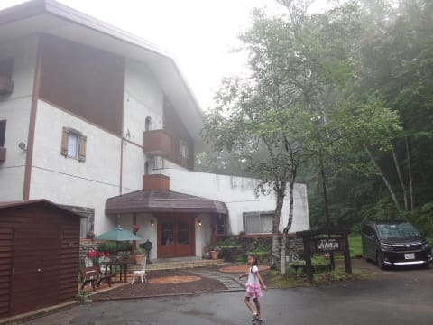

やっぱり，雨（涙）．

なんてこったいっ！！！！！！

昨日の朝の天気予報で．

土曜は曇りで，日曜は晴れそうだから，

土曜に長野観光，日曜に志賀高原…

ってプランに，急遽変更したというのに．

…これだったら．

土曜に志賀高原，日曜に長野観光の方が

正解だったじゃないか…（泣，泣，泣）

と，後悔したものの．

後悔しても始まらないので．

雨の降る外を眺めつつ，朝ごはんをいただきます．

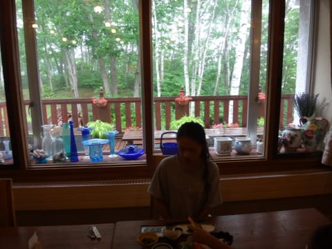

…シーズン中に，かなりの頻度で泊まる

この宿だけど．

…夏は，目の前がこんなきれいな白樺林で，

さらに，目の前にお花で飾ったテラスがあるとは…

知らなかった．

とりあえず．

宿で朝食を食べ終わった後．

…お祭り本番の，お練りがあるはずなので．

見に行ってみますか…

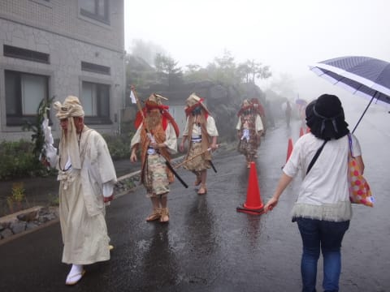

と，思ったら．

かなりの雨だったので．

なんだか，予定より早く終わっちゃったみたいで．

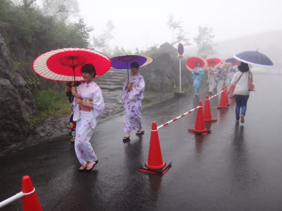

（ミス志賀高原候補者の皆さん）

見に行ったときは，もう行列はほとんど

終わってました…

でも，大蛇の山車も見れたし．

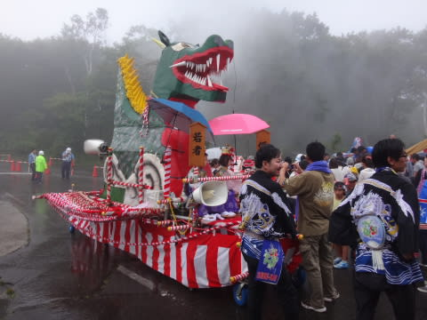

まぁ，良しとしておこう…

しかし．

会場は雨が降ったりやんだり…

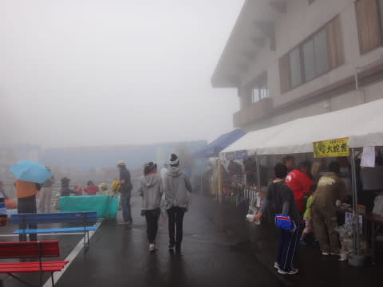

こんな天気の中，みんなで踊って…

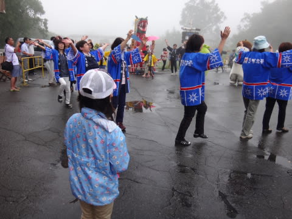

おこみんも，大蛇伝説の若者・姫役も踊ります．

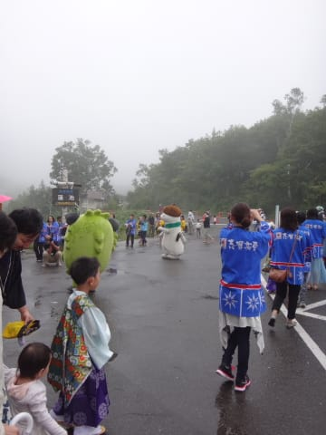

そして，獅子舞（なのかな？）があったりしますが…

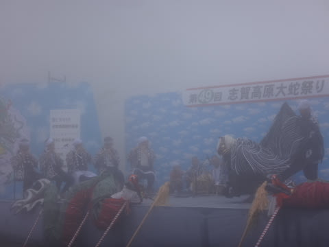

ステージの上までガスっているような状況で．

うーーーん．

残念な天気だ…

とりあえず．

いろいろお祭りのイベントをやっていますが．

この，イベントをやっているのは，3シーズン前まで

営業していた，蓮池ロープウェーの駅舎だった建物．

…どうやら，ロープウェー駅舎施設がまだ残っており，

見学できるようだな…

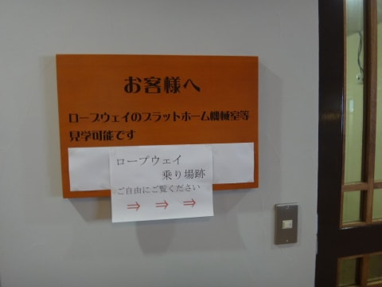

ってことで．

見に行ってみましたが．

うわーーっ！！

…懐かしい，懐かしいよ．

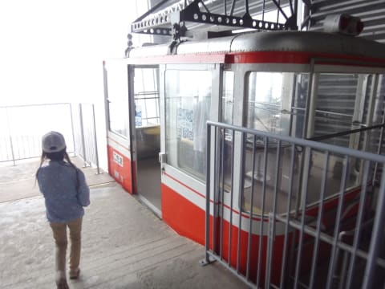

蓮池ロープウェーなんてめったに使わなかったから，

最後に乗ったのは…10年以上前かも？？

＃駅がゲレンデから離れてたし…不便だったからなぁ

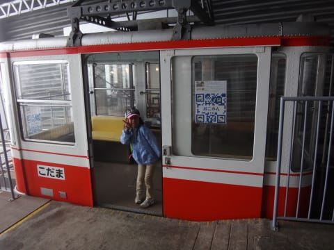

でも．

昔は，結構乗ったよなぁ…

…ってことで．

しばしノスタルジーに浸ったところで．

お祭りのイベントは，残すはミス志賀高原コンテストだけに

なったわけですが…

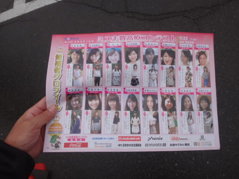

コンテストの開始は，1時間以上後の

11時半スタート．

それまでずっと，この会場でぼーっとしているのも

もったいないので．

雨をついて，本来の志賀高原散策へ，行ってみましょうか…

（つづく）
