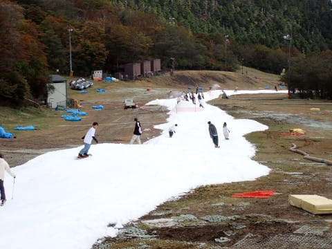

# 2023/10/21(土)，イエティの2024シーズンオープン翌日に初すべり！…雪は例年より薄くて土が出てます．古い板で来るべし．

📅 投稿日時: 2023-10-24 00:33:18

🏷️ カテゴリ: [2024スキー滑走日記](c453f687e8a0f05679e95831d0a02cd0c.md)

ということで．

昨日はBlogを書く気力と体力と時間が

なくて，土曜のイエティ滑走レポートを

書けずじまいでしたが…

いまさら感もちょっとあるけど．

イエティの2024シーズンオープン翌日，

10月21日の土曜のイエティの滑走

レポートです！！

ってなことで．

イエティにやってくると，

シーズンが始まったなぁ…という

感じがしますねぇ…

例年通り，朝9時のオープン前にゲートに

並ぶわけですが．

リフト券売り場はそれほど並んでませんが，

ゲート前はかなり長い列になってました…

そして，9時にゲートオープン！

ゲートの列も長かったし，ゲートから

ゲレンデまでもしばし歩くので…

ゲレンデ到着は9時を5分ほど過ぎたところ．

最初のほうに入場した人はゲレンデ前で

ちょっと待ったみたいですが，

ゲート待ちの列の後ろの方だった

私がゲレンデについたころは，

すでにゲレンデがオープンしてました！

ってなことで…

やってきましたよ～！！

月山から3か月と25日ぶりの

雪面だあぁ！！←アイスクラッシュだけど

うはーーー！！

雪だ，

雪だっ！！！←だからアイスクラッシュの氷だってば

オープン1本目…

つまり，私にとってシーズン1本目．

数日前からずっと，

「1本目は大事にゆっくり滑ろう…」

と思っていたのに．

目の前に誰もいないゲレンデを見たら…

そんな誓いは全くすっかり完璧に

頭から消え去り．

気づいたら，1本目から全力で

かっ飛ばしてました…(笑)

いや．

でも．

朝のうちは人も少なく．

コース幅は狭いながらも，

最初の4－5本はかなり気持ちよく

飛ばすことができて．

リフト待ちも最初の1時間はそれほど

待たずに済んだので．

本来なら大事に滑らなくてはならない

シーズン最初の4－5本．

「人が少ない今のうちに気持ちよく

滑らなきゃ，あとは混雑廊下の

我慢ゲレンデになっちゃう…！」

という思いで，ついつい思いっきり

かっ飛ばしてしまったのでした…

ただ，10時を過ぎると．

ゲレンデの人はだんだん増えていき…

いつもの，人を避けて滑らなくては

ならない人口密度の高いゲレンデに（涙）

そして…

今年は雪が少ないのか，

ちょっと雪を薄く広げすぎたようで．

朝10時半ごろに，すでにリフト乗り場

近辺には，茶色いものが…（泣）

いや…

午前10時半でこれはヤバいでしょ．

今日は営業終了まで，雪がもつのか？？

と心配になるレベル．

リフト乗り場近辺は，朝10時過ぎには

かなりの石ころバーンとなってたので…

新しい板は避けた方がいいです．

うーん．

例年だと，オープン直後は幅は狭いけど

雪は厚めに盛っており，こんなに土や石が

出ないんだけどなぁ…

今年はリフト乗り場付近，ちょっと幅を

広げすぎたんじゃないかな…？

かなり雪が薄いよ…(涙)

とはいえ，雪が薄いのはリフト乗り場

付近のみ．

コースの真ん中付近は，夕方までほぼ

穴が開くことなくもってくれたし…

リフト降り場付近は雪がたっぷり．

それに天気も瞬間的に日が

差すことが時折あったものの…

基本的に曇り空で，気温もトレーナー

だけだとちょっと肌寒く感じるくらいに

低め．

そのおかげで，ゲレンデの雪は，板に

張り付いて滑りが悪くなるような

ことはなく．

一日中ずっと，結構滑る雪だったのが

良かったかな．

リフト待ちも，平均的にこのくらい．

ピークでもこのくらいで，平均だと

5分待たないくらいの待ち時間

だったので，

クワッド1本しか動いてないわりに

待ち時間が少なく．

この時期としては結構恵まれてたかも．

うーん．

でもやっぱり．

コースの真ん中付近はいいんだけど…

コースの下のほう，リフト乗り場

近くの最後の落ち込み部分は，

昼になると，かなり土のエリアが

広がっていき…

どれだけ避けても，時々石を

踏んでしまうようなゲレンデ状態で．

うーん．

昼でもうこの状態って．

ここ数年のイエティではなかった，

ちょっと残念な状況…

コース状態によっては，早めの

営業終了もありうるかも，と言って

いたけど．

時折，わずかながらアイスクラッシュの

雪を撒いたりして，スタッフがコース

維持に努め…

まぁ，いい状態とは言えないまでも．

コース整備時間の16時まで，何とか

滑れる状態をキープしたのでした…

いや，最後の落ち込み部分以外は，

1か所だけピスラボマットが雪の上に

出ちゃってるところもあったけど．

そこ以外はゲレンデに穴が開いてる

所はなくて．

夕方になると，ちょっと凸凹になっては

きたものの，板も滑るし，

クワッド＋ペアの2本動いているとき

よりゲレンデの人も少なくて，

普段よりましな感じだったので…

それだけに，最後の落ち込みのだけ，

雪がひどかったのが惜しい感じ…

まぁ，最後の落ち込みのコンディションが

ひどかったから，すいてたのかもしれ

ませんが（笑）．

ってなことで．

予定通り16時から17時まで，

コース整備が入るので．

コース整備終了をポールポジションで

待って…

17時のコースオープンとともに，

コース整備したてのピカピカ

バーンへ，Go!!

うははははっは！！！

シマシマいただき！！

今シーズン初のシマシマっ！！

素晴らしい…

1本目は目の前に誰もおらず，

好きなラインを滑り放題！！

…この1本だけでも，今日滑りに

来た価値があろうというもの！

ってな感じで．

1本目はかなり気持ちよかったけど．

2本目からは，もう人も増えてきたし．

雪も柔らかめで，すぐに荒れてきて．

…その上．

リフト待ちが，昼間より長いんですが…！！？？

ってなことで．

暗くなったゲレンデで人口密度も

上がってちょっと危ないというのと．

シーズン初滑りってこともあり．

ナイター開始後1時間の午後6時ごろ

には，

「今日はこのくらいにしておいてやるか…」

と．←お前はいったい何様なんだ？

切り上げたのでした…

いやー．

しかし．

初日から，朝9時から1時間のゲレンデ

整備をはさんで夜6時まで．

昼休みも取らず8時間滑り続けて，

満足！！！

ってなことで．

2024シーズン，無事スタートしました！！

## 💬 コメント一覧

### 💬 コメント by (1kamakura)
**タイトル**: Unknown
**投稿日**: 2023-10-24 06:40:31

順調なシーズンスタート

おめでとうございます🍾

たくさん人が来ているのですね。

### 💬 コメント by (アリス)
**タイトル**: シーズンイン
**投稿日**: 2023-10-24 16:44:47

Ｓkier_S様

シーズンインおめでとうございます♪

オフが４ケ月弱とはなんと短いシーズンオフΣ（・□・；）

「1本目はゆっくり大事に滑ろう」が

気が付いたら全力で・・・・

思わず笑ってしまいました♪私も同じですから♪

初日にして8時間の滑走は驚きの体力ですね♪

ただひたすらヤケビのオープンを待ちます(^^♪

### 💬 コメント by (Skier_S)
**タイトル**: 今シーズン，普通にスキー行けるのか心配になってきた
**投稿日**: 2023-10-25 00:23:42

＞江戸の秋さま

ついにシーズンインです～！

この時期滑れるのはイエティだけなので，結構人は多いです…

コース幅が狭いので，なかなかエキサイティングです

＞アリスさま

今シーズンも，シーズンオフは4か月切りましたね…

以前は7月まで月山に行っていたので，板を履かないのは8月と9月だけでした（笑）．

今シーズンは山を走っていたからか，体力はいつものシーズンよりあるように

感じます…

