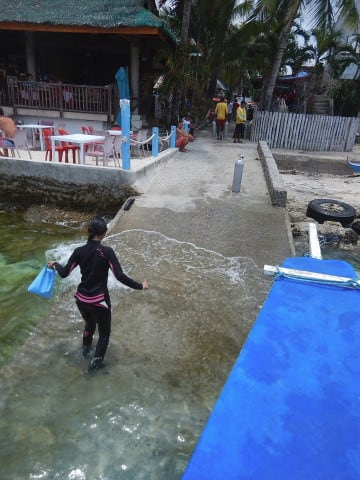

# 2019年8月，4度目のモアルボアル・小6の娘Cカード取得1周年！その6…ダイビング1日目のお昼休み

📅 投稿日時: 2020-07-30 01:27:41

例年なら，いつもは週末にいろいろ

遊び回っているのに，

家でじっとすることが多い今年．

ストレス発散のためなのか，ついつい

通販でまた買い物をしてしまいました…

マズい…

物欲に負けてしまった…っ！

…まぁ，何を買ったかはまた後日

報告するとして．

（あ，そんなに面白いものは買ってません…

　スキー用品系でもありませんので(笑)）

今日はまた，ダイビング旅行記です～！

----

ってなことで．

本日の午後2本目のダイブ，

ハウスリーフのイワシダイブのExit場所は，

ちょうどショップ前のボートを泊める

ところだったので…

Exitしたら，ボートに器材を置いて，

そのままショップへ戻ります．

ショップでウェットを脱いで，

軽くシャワーを浴びたら，

12時ちょっと前のお昼休みタイム．

「午後のダイブは1:15集合でお願いします～」

とのことで，1時間ちょいのお昼休み．

では，ちょいとお昼ご飯を食べに出ますか…

うーん．

お昼ご飯，どこにしようか…

と，悩んだけど．

選んだのは，去年もさんざんお世話になった，

ショップからホテルまで戻る道の中間点の

道沿いにある，Makan．

このお店，非常にコストパフォーマンスが

高く，一皿150～200ペソくらい．

日本円で300～400円くらいで十分

おなか一杯になるので，愛用してます…

今日頼んだのは，タイ風焼きそばの

パッタイと…

チキンを甘辛のタレで焼いた，

チキンシシグ．

鉄板の上でジュージューいってるのが

出てきて，食欲をそそります…

3人家族で，一人子供だったら二皿で十分．

かなり安く上がるよ！

ってなことで．

午後1時15分ショップ集合なので，

食事が終わったら，再びショップへ戻って．

ウエットスーツに着替えたら，

午後のダイビングへ出発！

午後は，太陽が隠れてしまったものの…

風が弱まり，波は収まってきましたね！

ってことで．

ボートに乗りこんだら，ただちに出航しますが…

午後は波が収まったので，午前中は渡航

できなかったぺスカドール島へ

行けるようです！

なので，行先は当然の如くペスカドール島．

いつもの娘の特等席の向こうに，

ぺスカドール島が見えてます…

そして，ぺスカドール島に近づくと．

本日3本目のブリーフィングですが．

どうやら，午後のダイビングも

2チームに分かれて．

12m制限のある我が家3人1チームで，

いつものアサミさんガイド．

それ以外のゲストの皆さんは

別のチームとなるようです．

ってなことで．

早くも本日ラストの3本目，

ぺスカドール島にエントリー！

