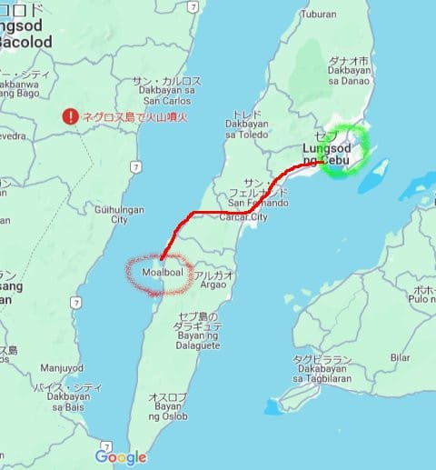
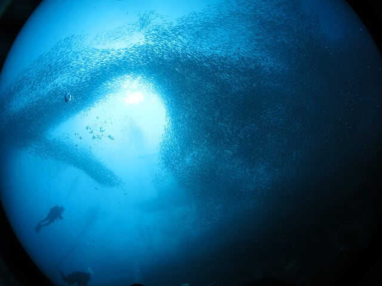

# 2024年8月，5度目の子連れモアルボアル，コロナ後初の海外へ！プロローグ2…モアルボアルってどこ？

📅 投稿日時: 2024-10-03 01:59:40

私の知らぬ間にこの世は10月の世界に

突入してしまったというのに．

とても10月とは思えない気温で…

この気温があと1週間は続きそうな

今日この頃．

…昨日レポートしたように，菅平とかもう

造雪し始めてるけど，溶けちゃわないか

心配…

ホントにあと3週間でイエティがオープン

するのかな…？？

ってなことで．

とてもスキーシーズンが近づいている感は

無く．

まだまだ海に行きたい天気が続いてるので…

今日もダイビング旅行記です！

…ってか，今日のは旅行記というより

解説だな…

ーーーーー

（[前回はこちら](e357f91916dce713687985e0605921b79.md)）

ってなことで．

座間味から帰ってきて中3日．

器材やら洋服の洗濯やらが

終わってすぐ，慌ただしく荷物を

詰めて，再び出発となった今回の

モアルボアル．

…モアルボアルを知らない人のために

繰り返し説明しておくと．

モアルボアルがあるのは，フィリピンの

セブ島，

日本からはこんな感じの位置関係で…

東京から直線距離で3200kmほど．

フィリピンの中央より南寄りにある，

この島が，観光でも日本人に有名な

セブ島になります．

セブ島は，こんな感じで南北に長い島で…

緑で記した部分が，セブ島の中心街．

このあたりに，セブの空港があります．

そして，セブの中心街から約80km，

赤線で記した道を走った先の西海岸沿いに，

ダイビングで有名な街．モアルボアルが

あります…

日本地図を同じ縮尺で見ると，だいたい

こんな感じでしょうか．

セブ島は，今から20年前は日本より20年

くらい遅れているのでは？と思わせる，

インフラも物も何もない田舎町でしたが…

ここ数年のフィリピンの経済発展は

すさまじく，今やセブの中心街には，

日本よりおしゃれかもしれない近代的な

ショッピングモールもいっぱいできて，

かなり都市化が進んでます…

モアルボアルも，海外からの観光客が多く，

おしゃれな店が増えてきていながら，

まだいい意味での古いフィリピンと

混在している感じの町です．

モアルボアルの中は，徒歩圏内で

ホテルからダイビングショップ，

レストランやお店が並んでいる

コンパクトな街で，おそらくやってくる

ゲストの9割がダイバー．

そんな中で，我々がいつもお世話になっている

ダイビングショップが，ここ．

エメラルドグリーンダイビングセンター

モアルボアル店です！

完全日本人経営の，日本人向けのダイビング

ショップで．

お店もきれいな感じだし，

店長の小見山さんは経験も長く，

魚にも詳しくガイディングスキルは

バッチリ！

さらにダイビングフィーも格安で．

モアルボアルだとよくある，船で20分

以上かかるペスカドール島や

ハゼポイントのトンゴベイ方面へ

行くと追加料金がかかる…というのもなく．

どこに行ってもボート2ダイブ3500ペソ，

追加1ダイブ1750ペソと，すごい明朗会計！

（今は1ペソ2.6円くらい）．

…さらに，リピーターだと割引が

あるので．

1ダイブ4000円くらいで潜れます…！！

さらに，Cカード取得の講習も28000ペソ．

これもリピーター割引が効いたうえ，

うちの娘は日本円がまだ強かった時に

講習を受けたので，日本の半額くらいで

Cカードが取れちゃいました…！！

（[5年前に講習を受ける](e236c9494959781d162d4ed151333cd21.md)我が娘)

それだけ各種費用がお安いのに，

こんな海なわけですから．

そのコストパフォーマンスの高さと言ったら…

で．

最近は物価が上がってきたとはいえ．

食費も結構安く．

食べ物がおいしいレストランも多いので…

ってなことで．

これまで，メキシコからタヒチやパラオ，

グアムサイパンにインドネシアはコモド，

フィリピンもボホール・ドゥマゲッティに

オスロブ，さらにはマレーシアのシパダン，

タイにモルジブのマーレやバアァ環礁＆

クルーズ船，果ては紅海まで…と，

いろいろ潜ってきたけれども．

LCCの直行便一発で行けるのもあり，

おそらく世界一コストパフォーマンスが

高い海，モアルボアル．

家族3人がすべてダイバーになった今．

モルジブの3分の1，パラオの半額以下，

沖縄は座間味の民宿泊まりより安く

あがるという，このありがたさ…

だもんで．

娘がCカードをとって，家族3人ダイバーに

なってから，海外はモアルボアル一択に

なってしまった感があるけど．

娘もこの海と町，そしてダイビングショップが

気に入ってるみたいなので．

娘もコロナ明けで心待ちにしていたらしい，

モアルボアルへ再訪することになったのでした…

（[続く](ee098b07e871c38d9f4da621aabcaf08c.md)）

　

