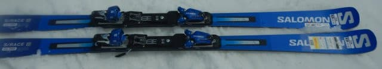
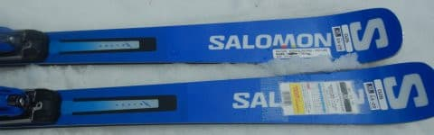
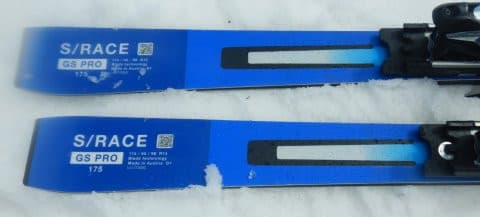
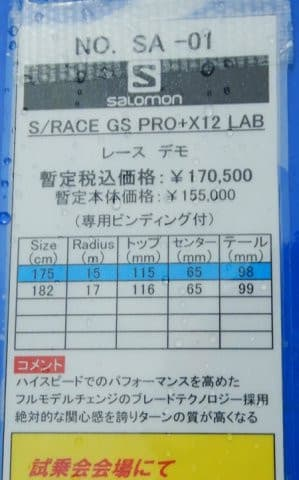
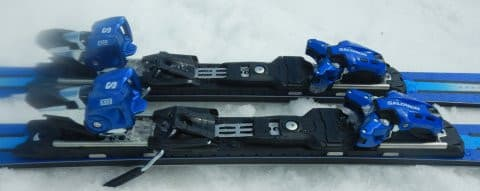

# 2023シーズンモデルのスキー板，試乗レポートその23 SALOMON S/RACE GS PRO

📅 投稿日時: 2022-07-06 03:05:28

🏷️ カテゴリ: [スキー板試乗](c0bd8048615710cee890e403a36cc9a2b.md)

昨日は3時ごろまで起きて頑張ってたんだけど．

そこで「ダメだ…眠い…ちょっと横に…」

となったのが運の尽き．

そのまま朝まで寝ちゃってました（涙）

だいたい，夜中に「ちょっと横に…」で

寝ずに済むわけがなく．

1時間ぐらいで起きれるわけもないのに．

眠い時のお布団って，どうしてこんなに

魅力的なんでしょう…

多分，人類にとって，

晴天のシマシマピカピカ圧雪バーン

の次に魅力的なのが，

眠い時のふかふかお布団

だと思います←人類一般論にしてはいけない．そして布団はシマシマバーンに負けるのね…

ってなことで，本題へ．

今日も2023シーズンモデルのスキー板試乗レポート

今回はサロモンの大回り板です．

では，どうぞ～！

○SALOMON S/RACE GS PRO + X12 LAB 175cm 

GS競技，基礎大回り

SALOMONは大回りモデルも基礎用・

競技用が一緒になって，上位モデルから

S/RACE PRIME GS

S/RACE GS PRO

S/RACE GS12

S/RACE GS10

の4グレードになるようですが…（FIS競技用除く）

今回試乗したのは，上から2番目のPROの

モデルです．

このモデルは，ビンディングがX12 LABで．

ATOMICでいうところのVARビンディングが

ついてますね．

S/RACE GS12以下のTLビンディングと比べれば，

かなり足元がガッチリした感じになります．

で，

今回試乗したのは175cmでR=15という，

「GSと謳うにしては，ラディウス小さいんじゃないの？」

という感じのサイドカーブ．

大回りは厳しいかな？

と，滑ってみると…

スピードを出した時の足元のどっしり感，

グリップのしっかり感を強く感じます．

ただ，春のかなり荒れたグサグサ雪で

試乗だったので…

板がちょっと荒れた雪に飛ばされて

ラインが落とされていく感じ．

そして，板の張りが結構強めなので．

春のザブザブ雪ではちょっとたわませら

ませんでした…（涙）

ずらしても滑れなくはないけど…

板も重めだし，あんまりずらして

滑ろうと思わない板．

荒れた雪の中でも，スピードを出していけば

結構グリップが強くて，張りも強めの感じがあり．

春先でもそこそ足元のシッカリ感もあったので．

おそらく，かなりのスピードに対する

ポテンシャルも十分ありそう．

多分，これ，硬い斜面に行けば本領発揮する．

板ですね．

かなり硬い斜面で，スピードを出して

滑ったら，エッジがガッツリグリップして，

R=15のサイドカーブで気持ちよく

大回りして行けたんじゃないかな～…

ただ…

惜しい．試乗したのは3月下旬の，

ドロドロに雪が解けた，一番日差しが強い

真昼間だったので，

この板の実力が分かり切らないままの

試乗だったのでした…
