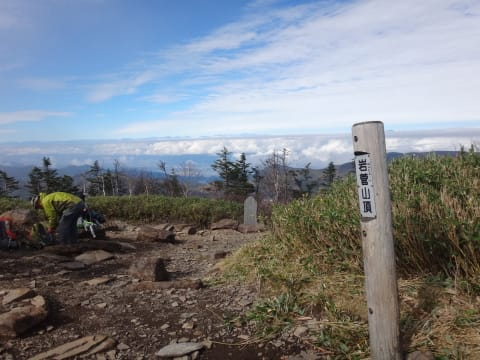
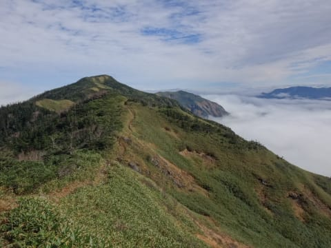
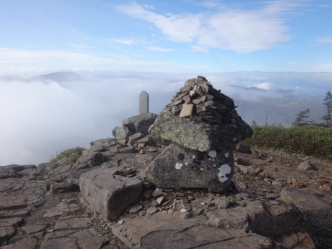
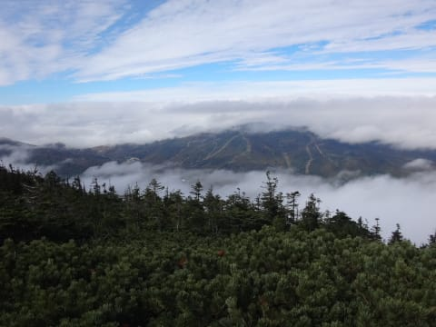

# 本日は志賀高原，岩菅山に登ってきました…

📅 投稿日時: 2016-10-11 00:37:55

🏷️ カテゴリ: [日記](cc4b5682fb7b8b144980957a978653fb0.md)

えー．

今日の志賀高原．

午前中は奇跡的に晴れたので

＃午後からはまた前が見えないほどのすごいガス…

一気に岩菅山に登ってきました～！！

…で．

ついさっき帰ってきたので．

もう，疲労困憊モード…（泣）．

また，明日詳細レポートしますので，

お楽しみに～．

＃…慣れない山登りなんてしたもんだから，体中が痛い…

## 💬 コメント一覧

### 💬 コメント by (Goku)
**タイトル**: Unknown
**投稿日**: 2016-10-11 22:39:10

お～！

すばらしい雲海ですね。

そういえば、長野オリンピック誘致の時は岩菅山にＤＨのコースを作る計画だったのですが、それが無くなって凄く残念だったことを思い出しました。

もしできていたら、日本一のスーパーコースができていたことでしょう。

### 💬 コメント by (Skier_S)
**タイトル**: Gokuさま
**投稿日**: 2016-10-12 00:06:52

今から考えると，焼額だけでも

お客さんが少なくて次々

リフトが無くなっているので，

岩菅山をスキー場にしなくて

良かったのかも，と思います…

あの当時は，「あの山，いい斜面だから

かなりいいスキー場になりそうだし，

北西だから雪もよさそう…」

って思ってましたが…

