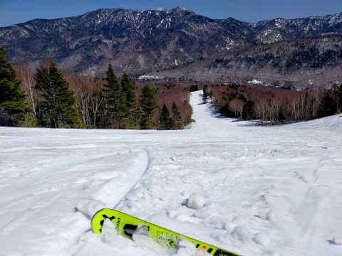
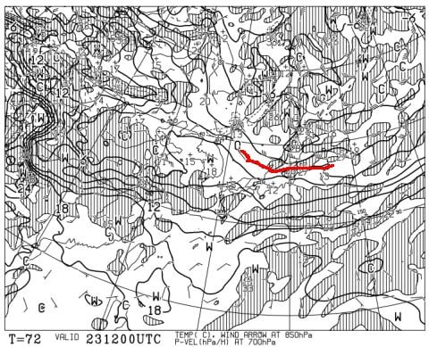

# え？スキーブーツのシェルってこんなにヘタるの？3シーズン目のREXXAM Revo 130Mが…終わったらしい（涙）

📅 投稿日時: 2023-04-21 02:38:11

本日も，特派員から志賀高原の写真が

送られてきましたが…

今日はすっきり晴れですね～！！

残念ながら，予想通りあさイチから気温は

かなり高めだったものの…

雪が積もったあとの高温で滑りにくかった

水曜に比べれば，一旦溶けてザラメ状に

固まった雪なので，滑走性はマシだったようで…

GSコースも思ったほど雪は減っておらず，

朝のうちは，意外と楽しめたようです！！

ただ，夏並みの気温が予想されていた本日．

やはり，昼間の気温は標高2000mの山頂でも

+15℃近くまで上がったようで…(涙)

朝10時ごろには，雪も解けていき，

表面に汚れが浮いた滑らない雪に

なっていったようです…(泣)

あぁ…

高温＆日差しで，雪が融けていく…(泣）

でも．

焼額では必死の雪出し作業が続けられていて．

ヤバそうなところにはブルでしっかり雪が

運ばれてきているので，今週末の焼額は，

問題なくパノラマコースとGSコースが滑れそう…

との報告でした～！

そして．

22日(土)の朝は，850hpaの0℃線が

志賀高原より南にあるし…

23日(日)の夜まで，850hpaの0℃線が志賀高原

付近にいてくれるので…

この週末の2日間，最低気温は-5℃くらい，

最高気温も+2-3℃くらいまでしか上がらなさそう！！

…これで曇り空ならいいんだけど…

土日とも晴れて日差しで雪が緩みそうなのが

惜しい…

でも，土日とも，朝のうちはかなり硬めに締まった

いいバーンが滑れそうですよ～！！！

そして．

来週は，水色矢印で書いたように28日まで

結構冷えそうなので…

これ，29，30日のGW前半まで，雪がもって

くれるかも！？？？

このGW全滅かと思ってたけど…

今週末からの冷え込みに期待！！

…ってなことで，本題へ．←いつものことだけど，ここまでで普通のBlogの記事の長さは十分にある

今シーズンで3シーズン目になる，

REXXAMのブーツ，Revo 130M．

メインのブーツは，今シーズンが2シーズン目に

なる，HEADのRaptorに変わってますが…

HEADのブーツはフレックスが140と強めなので，

柔らかい新雪やシーズンイン・アウトの雪が

緩んだ時は，フレックスが優し目のREXXAMを

履いていたわけですが…

4月8日のこと．

朝は雨上がりのユルユルザブザブの雪だったので，

REXXAMブーツを履いて滑り始めたわけですが…

この日は[午後になると冷えて下地がガチガチに
固まっていった上に新雪が載るという，
かなり過酷なコンディション](e9e058cbb1ef910bb7b877d1bc7880aeb.md)…(涙)

で．下地が硬くなった時に，REXXAMブーツで

滑ると…

板が…板が踏めない！？？

ブーツのタングに力がかかっても，

ブーツがぐっと前屈して板に力を伝える

感じがなく…

そして，ブーツからの返りが全く感じれない！！

柔らかい雪だと，そこまで強くブーツに圧が

かからないので分からなかったけど．

硬い斜面でこのブーツを履くと…

ブーツの前屈時の粘りや，ばね感のある返りが

全く感じられないんですけど！？？？

硬くて荒れた斜面だと，板が抑えきれない！！

うーむ？？

雪が凸凹のまま固まっちゃった難しい

バーンなので，自分がちゃんと滑れてない

だけかな…？

でも．この日は焼額⇒一の瀬と車で移動して，

車を運転するために一旦ブーツを脱いだので．

「モノは試しで，HEADブーツに履き替えてみようか…」

と，移動後はHEADブーツに履き替えてみたところ．

粘る！！！

HEADブーツ，粘るよ！！

ゴムのような粘りで前屈するので，板が

じんわり押して行けるし…

板に強い圧を掛けていけて，ターンの仕上げで

圧を抜いて行った時にブーツも気持よく返ってきて，

切り替えも楽だよ！！

…確か．

REXXAMブーツも新品の時はすごい粘りを

感じたし．

谷回りの捉えも早かったし．

返りもいい感じだったのに…

…これって．

まさか．

考えたくないけど…

ブーツがヘタッた？？？

HEADで気持ちよく滑ったあと．

もう一度REXXAMを履いてみると…

うん．

履き比べると分かる．

REXXAM，粘りも返りもなくなってる…（泣）

これまで何足もブーツを履いてきたけど．

インナーがひどくヘタッたとか，

新しい板を買ったとき，板と比べてブーツが

柔らかくてブーツがヨレて，「こりゃダメだ」と

感じたこともあったけど…

ブーツシェルのばね感と返りが無くなったと

感じたのは，これが初めて…

でも，これって．

板を1セットしか持っていない人は，徐々に

ヘタッていく板の性能劣化に気づかず．

板を2セット以上もっている人が，板を履き替えた

時に初めてヘタリに気づくのと同様．

これまでブーツを1足しか持ってなかったので，

ブーツをこまめに履き替えるなんてことが

なかったからヘタりに気づかなかっただけで…

もしかすると，これまでのブーツも，実はかなり

ヘタっていたのかも？？

ということで．

皆さんも，ぜひゲレンデに2セット以上ブーツを

もっていって履き替えることをおススメします．

ブーツのヘタリに気づくかも…←普通，ブーツを複数ゲレンデに

もっていく人はいないから！板を2セットもっていく人すら少数だから！！

しかし，REXXAMブーツ．

3シーズン目とはいえ．

2シーズン目からはHEADブーツがメインだったので，

日数的にはそれほど履いてない気がするんだけどなぁ…

おそらく，100日弱だと思う…

ブーツシェルって，このくらいでヘタるんだ…

ということで．

我が人生初めての，

「ブーツシェルが激烈にヘタる」

という事態により，REXXAMブーツは

3シーズン目にて引退が決定しました（泣）

ってなことで．

REXXAMの代わりに．

昨年夏の物欲選手権で負けてGetしていた，

FISCHERのRANGER 130をデビュー

させました～！！

履いてみたところ…

いや．

新しいブーツ．

粘る．

粘るよ…

そしてちゃんと返ってくる！！

板がしっかり踏み込めるし，切替も楽だよ…（感動）

そして．

FISCHERのRANGERからHEADブーツに

履き替えたとき…

HEADブーツもヘタっていることに気づいたのだった！

…というオチを期待している読者がいると

思いますが．

どうやらHEADブーツは無事でした．

いや．大丈夫．まだ行ける…（安心）

いや．

自分でも心配したんだけど．

HEADブーツが無事でよかった…

とりあえず，フレックス130のFISCHERブーツ．

140のHEADよりは心持ち優し目なので，

雪質やコンデションでこの二つのブーツを

上手く使い分けられそう…

…でも．

どうせこのFISCHERブーツがあるなら．

HEADのブーツのアキレス腱部分のビスを

1本から2本にしてフレックスを150に上げて，

もう少し二つのブーツの性格をはっきりと

変えて履き分けてもいいかも…

と思った，Skier_Sだったのでした…←だんだんブーツが強くなっていくという

恐ろしい循環に入っていってないか？

## 💬 コメント一覧

### 💬 コメント by (Unknown)
**タイトル**: Unknown
**投稿日**: 2023-04-21 19:19:40

MULTI FLEX POINT って凄いんですネ

### 💬 コメント by (なんちゃってレーサー)
**タイトル**: ご心配なく，普通ですよ！
**投稿日**: 2023-04-21 19:38:56

100日履いたのであれば，ブーツは性能が落ちてきて，そろそろ新しいのを，と思うころですね．

REXXAMが特に早くへたるということではないと思います．

FISCHERブーツはRANGERにしたんですね．

Skier_SさんならPODIUMがちょうど良い気がします．次の物欲選手権も楽しみにしています(笑)

### 💬 コメント by (Skier_S)
**タイトル**: 今週末が志賀高原でまともに滑れるラストか…？
**投稿日**: 2023-04-22 00:38:34

＞Unknownさま

REXXAMは，マルチフレックスポイントのおかげか，足幅が広い私でも小指が

痛くなることなく履けました…

新品の時は結構いいブーツだったので，私のREXXAMはヘタリましたが，良いブーツだと思います！！

＞なんちゃってレーサ―さま

100日履いたら，やっぱりシェルもヘタるんですね…

これまで，インナーがヘタッて「ブーツ買い替え時だな」と思ってましたが，

ふたつのブーツを履き分けるようになって，シェルもヘタるんだと良く分かりました…

普通ならPodiumを買うのかと思いますが，春＆夏スキーと山スキー兼用なので，

テックビンディング対応のブーツが欲しくてRANGERにしました…

