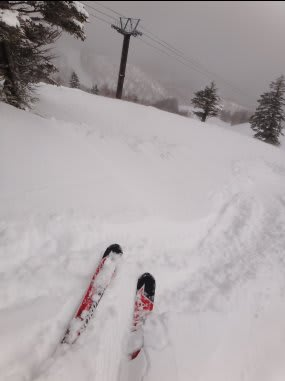
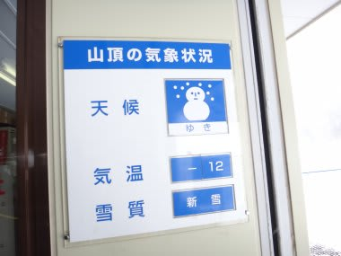
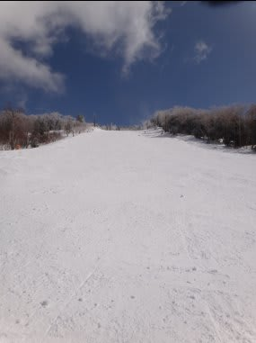
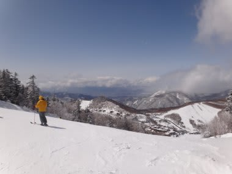
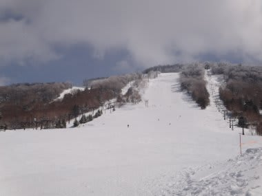
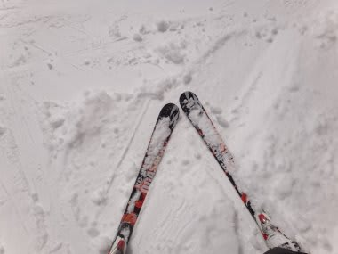
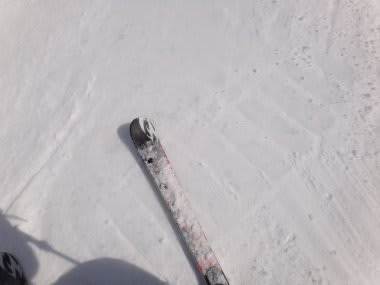
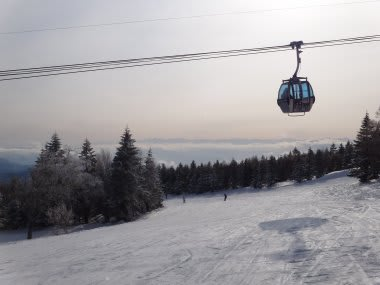

# 3月19日の志賀高原は…Goodコンディション！

📅 投稿日時: 2012-03-19 22:11:30

🏷️ カテゴリ: [2012スキー滑走日記](cca3a0e9524e0203150f790b1fc3c71ad.md)

えー．

以前にもお伝えしたように．

今日，強引に休みを取って4連休ですので．

今日も志賀高原に来ています．

昨日の夜から一気に冷え込み，朝方まで

20cm～30cmは積もったでしょうか．

朝は，ブーツが隠れるくらいの新雪！！

この新雪のおかげで，昨日までの雨で溶けた雪が固まった

アイスバーンが隠れて，朝イチは最高のコンディション．

朝の気温もマイナス12度，

午前中はちょっと雪雲がかかるときもあったけど，

昼には完全快晴になり，3月下旬と考えると

恵まれたコンディションの一日．

いやーーーーー．

昨日までとまったく違う！

トップシーズンのゲレンデが戻ってきたよ！

さらに．

やっぱりスキーは太陽の下でやるものですね～．

昨日までしかいなかった人はちょっとかわいそうな感じ．

平日にしては人が多かったけど，それでも休日のように

ゴンドラ待ちもなく．

快適な一日．

昼間もマイナス6度までしか上がらず，

一日最高の雪質でしたよ．

…ただ．

急斜面はだめだったよ．

急斜面は，下のアイスバーンが完全コンニチハ．

一の瀬メインバーン上部，焼額オリンピックなどは

アイスバーンでした．

あー

夕方になると，ゲレンデのいろんなところで時々

アイスバーンが出てたけど．

まぁ，昨日までに比べれば天国でしょう．

ということで．

3月下旬と考えれば，これ以上はないGoodコンディションな

一日．

ナイターも最高でした．

明日も冷えて天気がよさそうなので．

楽しめそうですね～．

## 💬 コメント一覧

### 💬 コメント by (雪上の翁)
**タイトル**: 良かったですね
**投稿日**: 2012-03-20 10:06:05

最悪から最高のコンディション、

良かったですね(*^_^*)

今日も楽しんで～U+1F3B5

### 💬 コメント by (Skier_S)
**タイトル**: 良かったです…
**投稿日**: 2012-03-21 00:10:49

天気予想では，降水量がほとんどない予定だったので，

アイスバーンを覚悟していたんですが…

いい方向に予想が外れました！

後半2日間は結構楽しめましたよ！

