# 5月18，19日のかぐらスキー場特派員情報！…何とか21日まではもってくれそう．そして自分のVO2Maxがちょっと上がったよ

📅 投稿日時: 2023-05-20 00:29:56

えー．

[Garminさんのスマートウォッチ](e516b23a4874189de2e9208be87fa5184.md)を利用して

このかた．

睡眠時間やら健康状態やらストレス状態やらを

Garminさんでチェックしているわけなんですが．

本日，VO2Maxの値がまたちょっとだけ

上がってました…！！

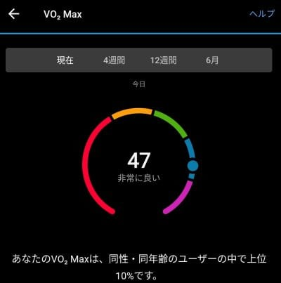

この時計を買ったばかりの7月，私のVO2Maxは

44と出てたから．

スキーシーズンを通じて，44⇒47に，3上がりました！！

うーん．

私は全くジョギングやらランをやらないし．

平日は運動する時間が全く取れないので，

運動するのは完全に週末のスキーだけなんですが…

スキーって，そんなVO2Maxが上がるスポーツ

なんだっけ？

とりあえず．

平日はずっと座り仕事で，さらに在宅だから

一日200歩くらいしか歩かず．

運動は週末のスキーだけしかしないのに，

ちゃんと身体は鍛えられているようです…

ってなことで，本題へ．

昨日，今日と．

いつもは志賀高原に行っている特派員が

かぐらに現れたようなので．

かぐらの写真をお送りします…！

まずは昨日，5月18日(木)のかぐらですが…

天気は晴れ！！

あさイチはフラットで，結構よさげに

見えますね…

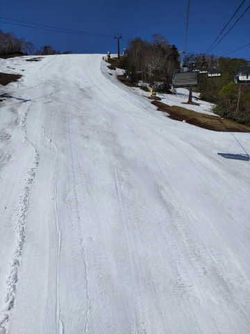

ただ，やっぱり日曜～月曜の雨とそれに続く

高温で，雪はかなり解けちゃったみたいで…

コース幅は狭くなってきたようです(涙)

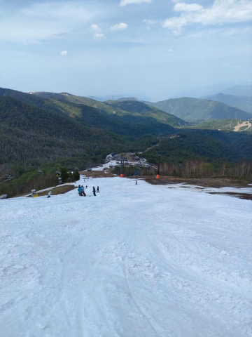

和田小屋からリフト乗り場までも，

結構雪が薄くなってきていますが…

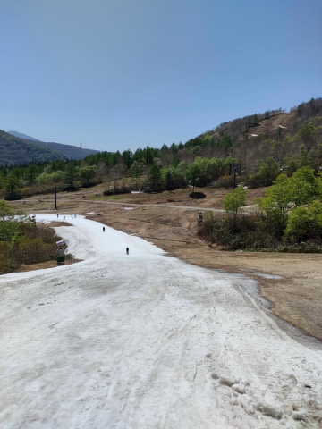

でも，まだリフト乗り場前は十分

雪がついてるし．

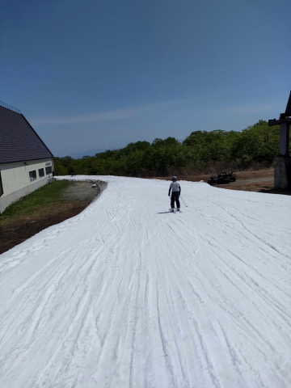

人も少なかったようなので，コースも

底が抜けてブッシュが出てくるほどの

凸凹にはならなかったようです…

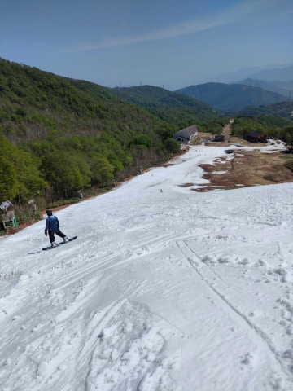

…とはいえ…

先週に比べれば，5日間で一気にコースが

狭くなってますね…（涙）

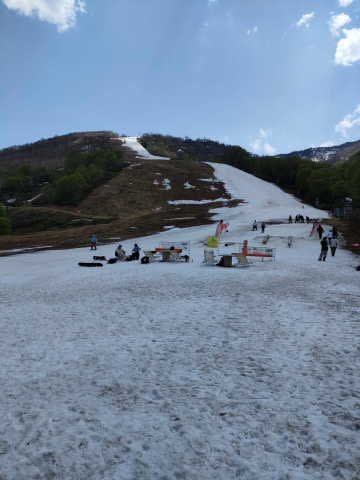

そして，今度は本日，

5月19日（金）のかぐらの写真ですが…

本日は朝から曇り．

10時ごろには雨になってきたようで．

そのおかげでガラガラだったみたいです．

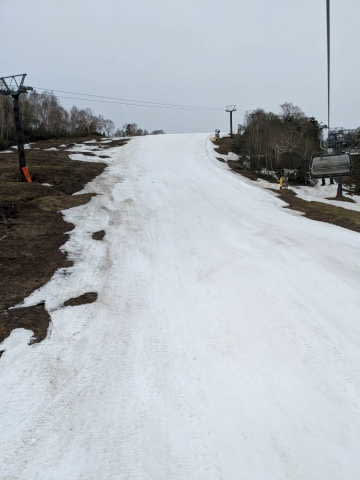

けど，まだリフト降り場近辺の雪も

しっかりついているし…

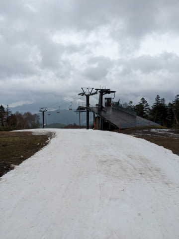

リフト降り場からの緩斜面も，雪を寄せて

コースに穴が開かないようにメンテ

されていて．

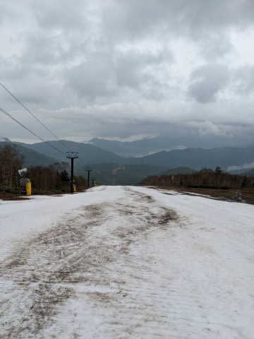

そこから先の落ち込みも，まだ思ったより

雪が残ってるように見えますね…！

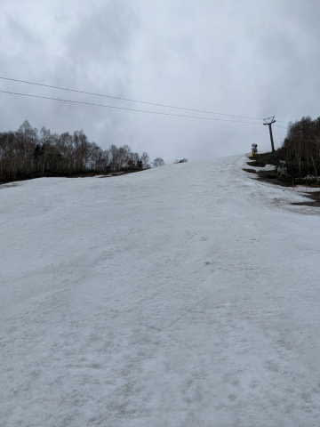

ただ，今日は人が少なかったから

コブコブにならなかったけど．

土日に人が増えてコブコブになったら…

雪の薄さから言って，コブ溝には

ブッシュが大量に出現しそうな予感…

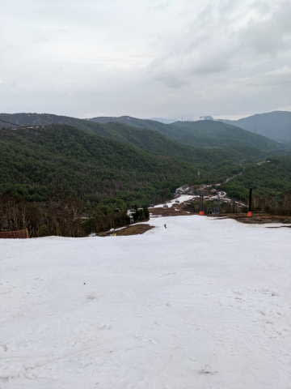

あとは，一番細いここがどこまで

もってくれるか…

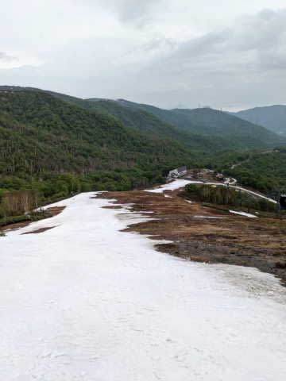

まぁ，でも．

なんとか21日までは営業できそうな

感じですね～…

土日の天気は，昨日の予想と変わらず．

土日のかぐら・横手ともおおむね曇りで，

気温はそこそこ高め．

一瞬，ポツポツ雨が降ることもあるかも…

という感じです．

ってなことで．

かぐら・横手ともに今週末がファイナル．

私は日曜にかぐら出没予定です～！！
