# 2019年8月，座間味で小6の娘と親子ダイビング！その2…ダイビング初日はどしゃ降りでスタート（涙）

📅 投稿日時: 2019-10-13 01:42:11

今回の台風ですが．

我が家でも，960hpaまで気圧が下がりました…

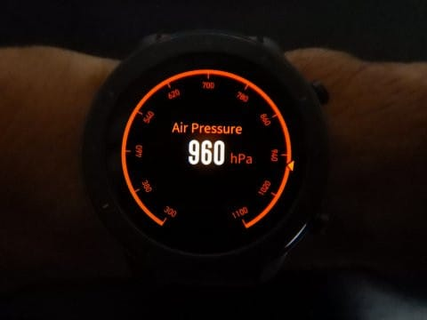

風はそこそこあったものの，

被害はなく終わりましたが．

皆様のところは無事だったでしょうか…？

ってなことで．

今日は座間味旅行記です．

---

座間味へ到着した翌日の朝．

さ～て，今日からダイビングだ！！！

と．

朝，外を見ると…

…

…

…雨，ですね（涙）

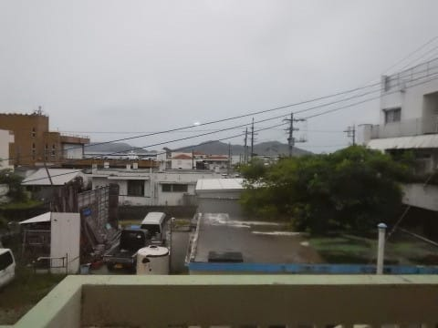

ダイビング初日というのに．

南国の日差しが拝めないと，

テンションが下がります…（泣）

とりあえず．

朝7時から朝ごはんタイム．

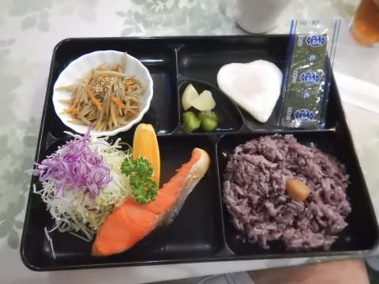

食後，ダイビングの準備をして．

9時前にボート集合なので，

宿を出ると…

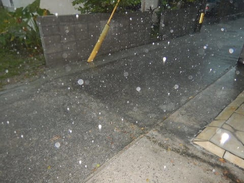

すごい巨大な雨粒の

豪雨が降っているんですが（激泣）．

向こうが煙って見えるような

豪雨の中，港に歩いていきますが…

船に着くころには，

「あれ？もう1本潜ってきたんだっけ？」

というびしょ濡れに（涙）

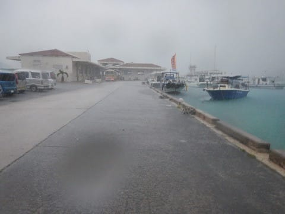

テンション低い中，

ダイビング器材をセッティングしますが．

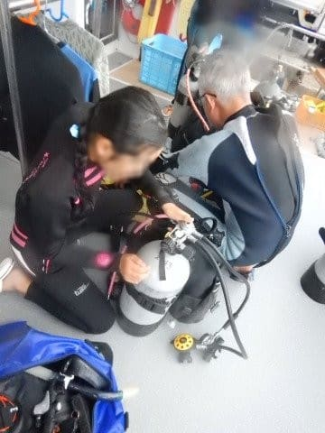

ほぼ1年ぶりのダイビングのわが娘．

「あれ～？タンクは，バルブがどっち

　向きになるようにBCに着けるんだっけ？」

「レギュレータ，どっち向きに

　着けるんだっけ？」

とか．

すっかり器材のセッティング方法を

忘れてました．

ってな感じで．

器材セッティングを終えたら，

雨の中，出航！

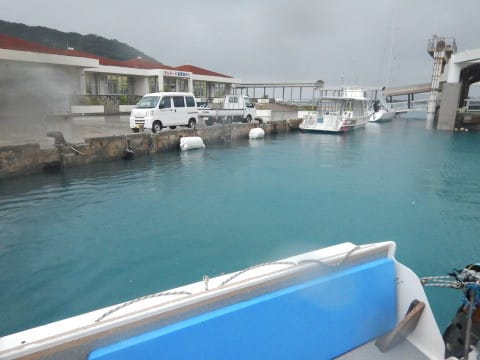

ボートはダイビングスポットに向かいますが…

移動中も，ひたすら雨の中．

南国の太陽は，1秒たりとも

拝めません…（泣）

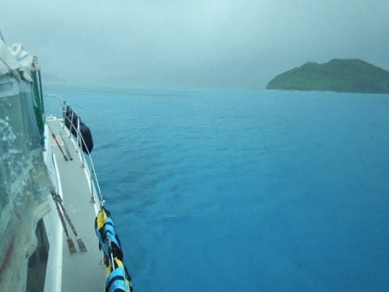

8月の沖縄というのに．

肌寒さも感じるほど…（涙）

とりあえず，ポイントに到着したようなので．

どしゃ降りの中，潜りに行く準備をして…

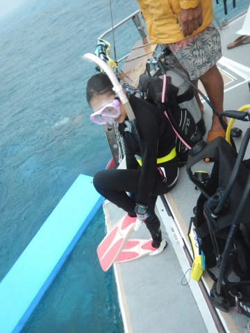

いざ，エントリー！

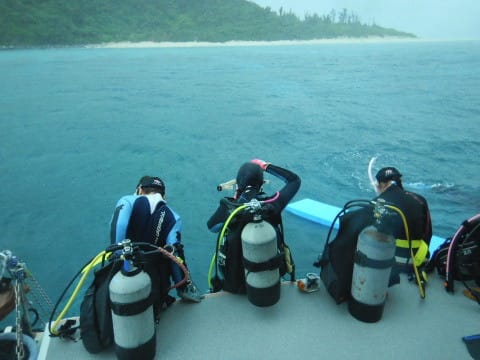

潜ったポイントは「ハタケジ」ですが．

…天気が悪いので，

海の中も，なんだか暗いよ…

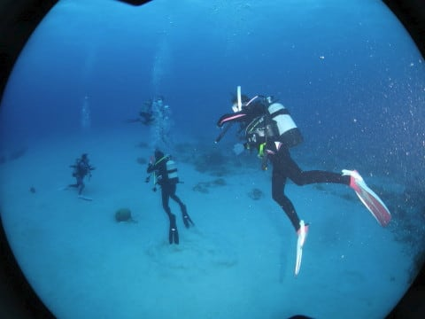

でも．

娘は一年ぶりのダイビングで．

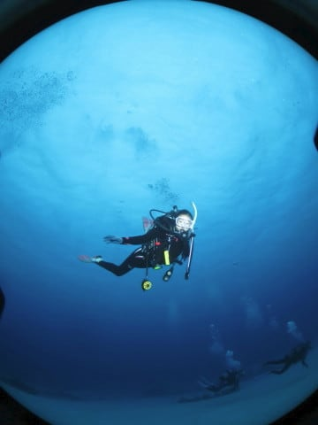

どうやら，すごい嬉しいようです…

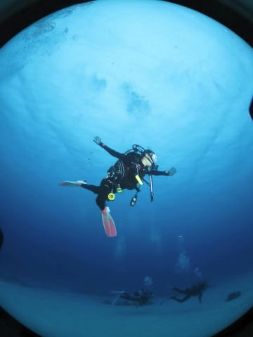

私も，この夏は[折れてしまったフィン](e554e7627c331e844453e0c4f22a5086f.md)を

新品にしたので．

ちょっと気分新たなダイビング…

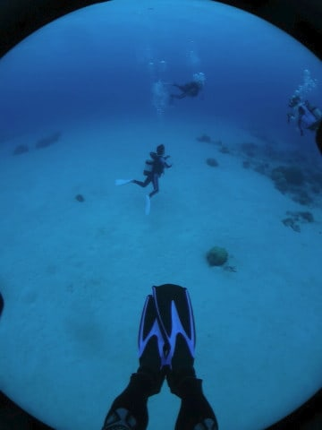

ちなみに，新しく買ったのも，荷物の

重さを考えて，軽いプラフィンにしました．

国内向けモデルではない，TUSAのIMPLEX-DUO．

すでに生産中止になっているモデルです．

まぁ，ちょいと固めに感じるので，脚力が

ある人に向きそう．

ってなことで．

私にとっても1年ぶりのダイビングなので．

水中でのいろんな感覚やら，

カメラの露出＆フラッシュの調整やら，

いろんなことを思い出しながらの

リハビリダイビングだったわけですが…

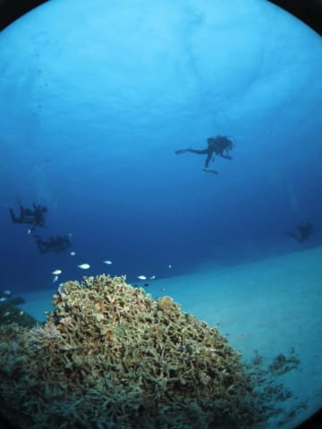

悪天候のおかげで，ずっと水中が

暗いままで．

かつ，リハビリダイビングというのもあり．

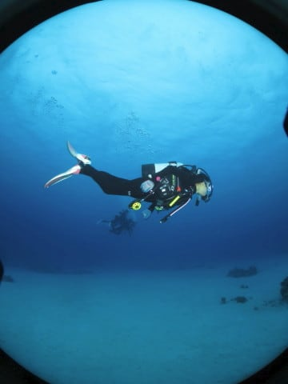

ほとんどまともな写真を撮れないまま，

ボート下に戻ってきました…（涙）

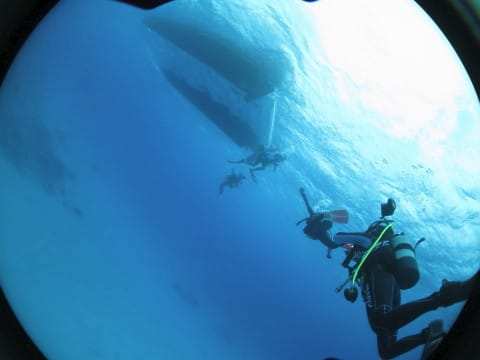

ってなことで．

今年の初ダイブ，これにて終了です…

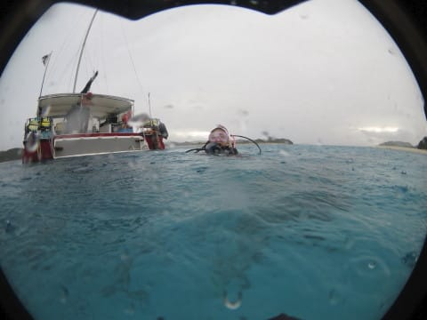
