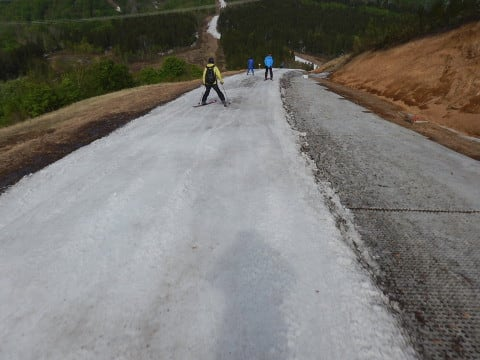
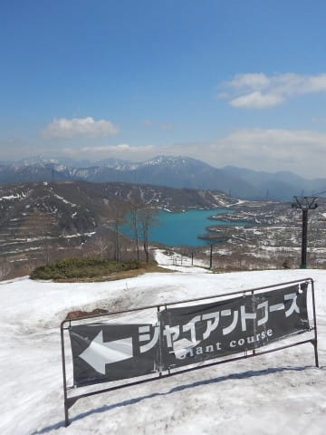
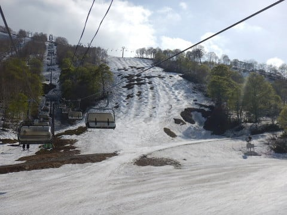

# 2019/5/19(日)のかぐらスキー場，いまさらの詳細レポート！…終日晴天！午後は気温も高く，雪がかなり減ったよ（泣）…そして混みました

📅 投稿日時: 2019-05-22 01:27:41

🏷️ カテゴリ: [2019スキー滑走日記](c3e4496fc0fb7f9c17ff21214a35b1ace.md)

えー．

やはり，昨日の予想通り，

本日の雨がとどめを刺したようで…

かぐらは，ゴンドラコースも終了して

しまいました（涙）

滑れるのはかぐらメインバーンのみ，

下山はゴンドラで下りて，ピスラボを滑るか

リフトで下りるかになったようです…

（[かぐらHP](http://www2.princehotels.co.jp/ski/kagura/files/pdf/20190522kagura_map.pdf)より）

…でも．

ここまでは想定内なのだ．

想定外だったのは．

なんと．

日曜まで真っ白だった，かぐらメインバーンが…！！！

なんだか，すごい土が出てきてるんですが！！！

うーむ．

わずか2日で，こんなに土だらけになってしまうとは（泣）．

…今週末は，先週から見ると全然狭いコースで

滑ることになりそうですね（泣）．

ってなことで．

本日は，今さらながらの感がありますが，

日曜のかぐらの詳細レポートです～！

まず．

朝7:30の営業開始時点にロープウェーに並びますが．

…開始5分前でまだこのくらいの待ちだったので．

この時期にしては人は少なめかな？？

駐車場も6割くらいの埋まり具合なので．

今日はそれほどひどい混雑にならないんじゃないかな～？？

と．

この時は楽観的に捉えてましたが．

…この認識は甘かったことが，後で

明らかになるのであった…

とりあえず．

ロープウェー山頂に着いたら．

次はみつまたリフトに乗らねば

ならぬわけですが．

まだ，ロープウェーからみつまたリフトに行く

コースには，雪が着いてますね…

（今から振り返ると，この日がここを

滑れるラストだったわけだけど…）

で．

みつまたリフトに乗りますが…

うーむ．

下山用のコース，そろそろ

ヤバそう…

これは，今日で滑って降りられるの，

ラストかな？？

（今から振り返ると，こちらの予想は当たってたな…）

で．

みつまたリフトを降りて，

今度はゴンドラへ向かうわけですが…

ここもコースは，かなり幅が狭く

なっちゃいましたね…（泣）．

うーん．

ここもあと2-3日で終わりかな…

（ここも日曜で終わっちゃったので，この予想は外れ（残念））

そして．

かぐらゲレンデまでの長い旅は，まだ続く．

次は，ゴンドラに乗って…

10分ちょいで，ようやくかぐらゲレンデへ！！

…かぐらゲレンデは，まだ真っ白ですよ！！！

（真っ白だったのは，残念ながらこの日までだった…（涙））

で．

ようやっとかぐら高速リフトに乗れるわけですが．

うーむ．

和田小屋からかぐらクワッドに滑りこむ斜面．

昨日朝まで全面真っ白だったのに．

一日でこんなになっちゃったか…（涙）

（この部分，今週末はかなり廊下になっちゃってそう）

パノラマコースも…

まだコースはクローズしてませんが．

下部はもう完全に終わりですね（泣）

メインバーンも…

うーむ．

一番端っこ部分，土が出始めて

来ましたか…

ただ，端っこを除けば，まだまだ

雪が全面を覆ってますし．

リフト降り場も，まだ廊下になっておらず．

まだまだ行けそうな感じ…！

ゲレンデに出てみると…

今日は朝からガッツリ日が射していたので．

あさイチから，もうかなり緩んじゃった

残念な感じの雪になってます（涙）

…でも．

あさイチは人が少なく，大回りが

できるよっ！！

かぐらで大回りができるのは，

朝のわずかな時間だけ！！

…と，滑っていたら．

なんだか…

まだ9時だというのに．リフトが

昨日より混んできましたよ？？

そして…

ゲレンデも，とても大回りができない

人口密度になってきたんですが…（泣）

…そして．

まだ9:30だというのに．

なんということか…

すでにリフト待ち，10分（涙）

あさイチのロープウェーの待ち状況や

駐車場の状況から，ここまで混むとは

思わなかった…（泣）

9:30過ぎに，高速リフトと並行する

ペアリフトが動き出しましたが．

それでも，高速リフトの待ちは10分近く

ありましたね…

昨日はここまで混んでなかったので．

かぐらは，土曜より日曜の方が混むのかな？？

かぐら第1ロマンスリフトも，そこそこの

待ち時間がありますね～…

うーむ．

日曜が混んだ原因の一つは，土曜まで動いていた

パノラマコースがクローズになり．

第4ロマンスが動かなくなったのも

一因かな？

…しかし．

メインバーン，すごい人口密度…

志賀高原は，正月でもここまで

人口密度が上がることはありませんね（笑）．

で．

この日のジャイアントコースは．

うーむ．

コース入り口付近．

かなり土が出てきましたね…（涙）

コース途中も土が出始めましたし…

一応，コース真ん中付近は，

まだ土も出ておらず滑れますが．

いつも最初にヤバくなる，

コースの最後の落ち込み手前部分．

ここはコース幅ほぼいっぱいに

ブッシュエリアが拡大してきて．

これも次の週末まではもたなさそう…

（この予想は不幸にも当たってしまった）

そして，テクニカルコース．

ここは，一番上部はまだ大丈夫っぽく

見えますね…

中間部分は，一見まだ大丈夫そうに

見えますが，

この写真で一番向こう側に見えるあたりでは，

コブ溝にちょいと土が出かけてました…

そして．

言うまでもないですが．

テクニカルの一番下は，もう

全然ダメな感じです（涙）

朝よりも，かなり土のエリアが

広がってます…（泣）

で．

メインバーンに戻りますが．

さすがに人が多い本日．

昼ごろになると，大勢の掘削作業の

結果により．

いつも通り，コース全面コブになり始めて

来ましたよ…

でも．

午後になると，午前よりはリフト待ちは

マシになりましたかね～．

でも，土曜はタイミングによってはほぼ

待ちが無い時もあったのに．

日曜のこの日は，大体5分前後の待ちが

ずっとあった感じで．

うーん．

やっぱり土曜より混んでるな…（涙）

その大勢の止むことなきコブ掘削作業が

ひたすら午後も続いたので．

いつも通り，夕方は，全面コブ祭りと

化しました…

でも．

15:45のクワッド営業終了時で

このくらいだから．

いつもよりコブは浅かったかな～…

人工雪を着けているメインバーンは，

まだコブ溝に土は出てなかったですよ～！

ただ．

メインバーンも，一番下の落ち込み部分．

ちょっとヤバいところが出てきてましたが…

（この時は，あと2日後に，ここに一気に巨大な穴が

　開くとは思っていなかった…）

でも．

パークもまだ来週まで余裕で行けそうだし．

まぁ，来週もメインバーン＆パークは

楽しめそうかな…

しかし．

今朝からちょっとヤバめだった

和田小屋から高速リフト乗り場の間の部分．

朝よりもかなり土のエリアが広がって，

滑れる部分，この写真の右側の

幅10m弱の廊下状になってきてますね…

うーん．

今週末は，ここが一番ヤバそう…

ってことで．

この日もお約束通り，高速リフト営業終了まで

しっかり滑ったので．

下山するわけですが…

うううーむ．

ゴンドラコース，結構やばい感じの

部分がありますね…

これは…あと何日もつかな．

次の週末は無理だろうな…

（この予想も残念ながら当たってしまった…（泣））

ゴンドラコースを降りきったら．

みつまたゲレンデに向かうリフトに

乗りますが…

混んでいた本日．

このリフト，10分以上待ちでした（泣）

…しかし．

朝はかなり雪の厚みがあったように見えた，

みつまたからゴンドラに滑りこむコース．

上の方，ほとんど雪が消えちゃってますよ！！

ここも残念ながら，もう終わりっぽいですね…（涙）

みつまたコースも完全もう終わりげな感じで．

リフト降り場は完全ピスラボマットが

露出してましたし…

コース自体もかなり幅が狭く．

そして，コース途中に土も出始めて

来てたので…

うーむ．

これは，今日で営業終了っぽい感じ…

（この予想は正解）

…ってな感じで．

ギリギリ週末まで，テクニカル・ジャイアント，みつまたコースが

滑れた土日でしたが．

翌日にはこれらのコースがすべてクローズに

なったことを考えると．

ホントにちょうどぎりぎり週末までもった感じで，

ラッキーな週末だったのかも…

次の週末滑れるは，メインバーンのみ．

それも最下部の落ち込み部分は，かなり

土が出ちゃってますが…

まぁ，ファイナルの週末まで，

高速リフトが問題なく滑れるんですから．

去年のこんな状況から比べると．

感謝しないと…！！

改めて見てみると．

…去年のファイナルはすごかったなぁ…

## 💬 コメント一覧

### 💬 コメント by (もりや)
**タイトル**: Unknown
**投稿日**: 2019-05-24 00:13:25

昨年のファイナルと比較すると今年はかなりマシですね。昨年はよくあんな凄い状態の中、Sさんと子供達一緒に滑ってましたよね(笑)それでも楽しかったなー

### 💬 コメント by (Skier_S)
**タイトル**: ＞もりやさま
**投稿日**: 2019-05-24 00:58:34

今シーズンはかなり恵まれてますよ～！

今週末は，先週に比べて雪は減ってそうですが．

それでも昨シーズンに比べればマシです！

…また来シーズンも，春までたっぷり雪が残ってくれると

いいですね…

来シーズンは一緒にかぐらファイナルまで滑りましょう！

