# 2024/3/10(日)の志賀高原焼額山スキー場の詳細レポート…そして3月11日(月)の志賀高原スキー場は特派員によると冷え冷え雪で晴天でよかったらしい…

📅 投稿日時: 2024-03-12 02:27:37

🏷️ カテゴリ: [2024スキー滑走日記](c453f687e8a0f05679e95831d0a02cd0c.md)

本日も，志賀高原の特派員から

写真が送られてきましたが…

…

…

…うぎゃーーーー！！

ピカピカ晴天冷え冷えのシマシマっ！！

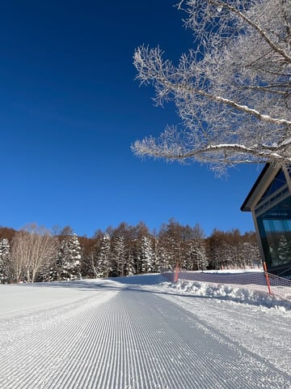

昨日降った冷え冷え雪が圧雪された

極上シマシマバーンを，最高の

晴天のもとで滑れるとは…

うらやましすぎるんですけど…！！

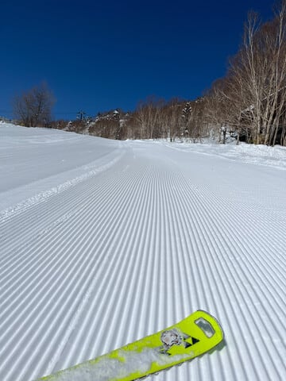

そして．

こんなコンディションの中，

人も少なくガラガラなコースを

思う存分滑れたみたいで…

うらやましい，うらやましすぎる…！！

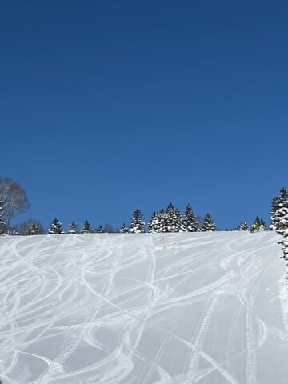

第3高速が動かず，SGSコース

経由でないと滑れないイーストコースは

午後になってもシマシマが残ってた

みたいで…

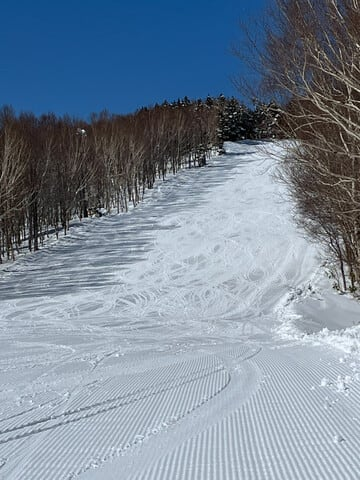

ちょいと気温が高めで，0℃近くまで

上がっちゃったようなので．

日差しが当たるバーンはちょっと

雪が緩んだみたいですが…

でも，日差しが当たらないバーンは

終日いいバーン状況だったみたいで…

うらやましい…

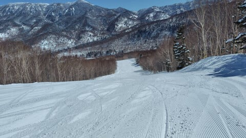

とりあえず．

志賀高原は明日12日火曜の午後から

13日水曜にかけて，さらにかなりの

積雪の積み増しがありそうです…！！

今週末は残念ながら，ちょいと気温が

上がりそうだけど．

でも，そこそこいいコンディションで

滑れるんじゃないかな？？

ってなことで，本題へ．

昨日の志賀高原の詳細レポートです！！

まず．

前日の土曜夜からの積雪は，

湯田中近辺でも20cm以上積もった

感じで…

朝，志賀高原に登る道路は完全本格

雪道でした…

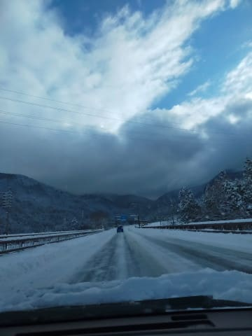

ただ，湯田中は雲の合間から日も射す

天気だったのに．

志賀高原へ到着するころには，

かなりの降りの本格的な雪に

なっており…

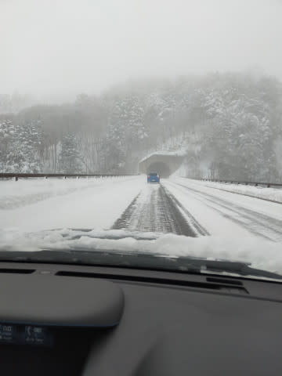

8:30の通常営業開始前の焼額山は，

結構な雪降り！！

あさイチのゴンドラ待ちはそれほど

長くなく，今日は混まなさそう…

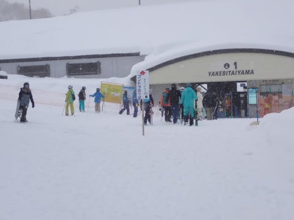

そして．

山頂に着くと…気温は-12℃と冷え冷えで，

昨日からの積雪は30～50㎝程度と，

かなり積もった感じ！！

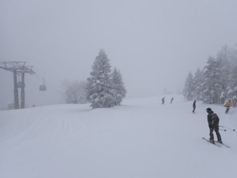

圧雪コースも，圧雪の上に10cm程度の

雪が積もってますよ！！

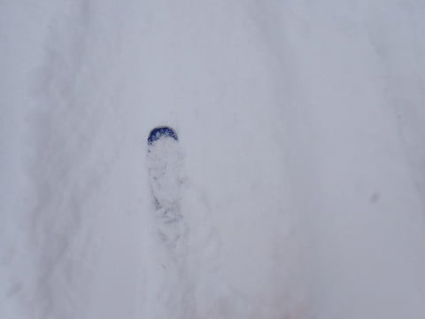

あさイチは，どこを滑ってもモフモフ

パフパフ！！

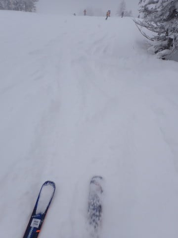

いや…

2月は全然積雪がなかったので．

パフパフ雪を滑るのは久しぶり…！！

っていうか，本来一番冷える2月が

春雪やら雨で融けたゲレンデ，

そして硬いバーンが多かったのに…

3月も半ばになって，やっと冷え冷え

新雪が滑れるというのはどういう

ことだ？？

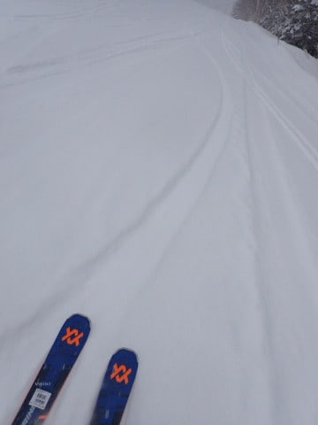

でも，朝のうちはガン降りの雪で，

視界があんまり良くなくて…

パフパフモサモサの足元が見にくく，

バーン状況がつかみにくい時も

あったけど．

まぁ，雪はそこまで重くなかったから

楽しく滑れる状況で．

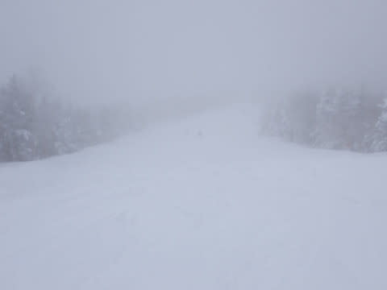

3月半ばになって，-10℃を下回る

冷え冷え雪の新雪で滑れるヨロコビを

噛みしめながら滑っていると…

10時過ぎには雪が弱まり，

空も明るくなり始めてきました…！！

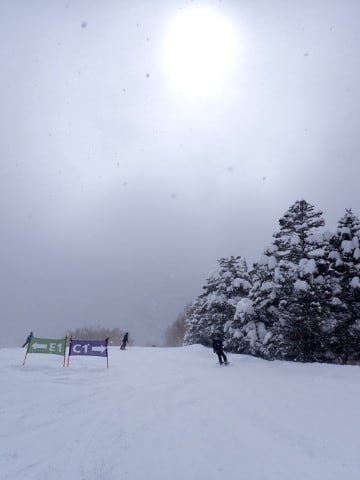

ただ，そのまますっきり晴れるかというと

そうではなく．

曇ったり，雪がぱらついたり…

という感じの天気が昼近くまで続き．

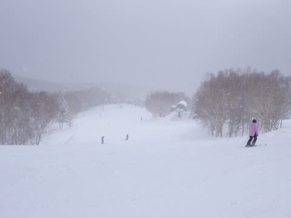

そして，昼頃になると…

青空が顔を出してきました！！

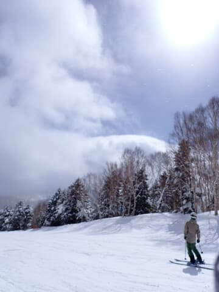

…このまますっきり晴れてくれるかな…？

と期待したけど．

青空が見えたり，うっすら雲がかかって

雪が舞ったり…

という天気が，午後の間ずっと続き

ました…

ここまで来たら，すっきり晴れてほしい…

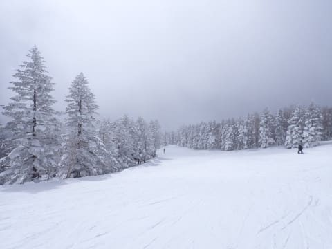

とりあえず，すっきり晴れないけど．

最高気温はせいぜい+3℃くらいまでしか

上がらず．

さらに日差しも弱いので，雪質は

終日良いまま！！

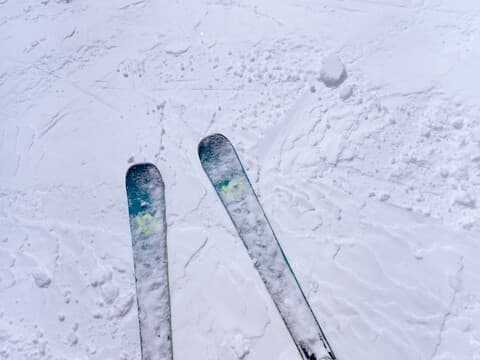

そして，今日はゲレンデの人も少なめで，

日曜と思えないガラガラっぷり！

バーンもほとんど人を気にせず

滑れるレベル…！！

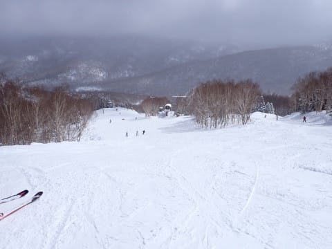

第1ゴンドラの待ちも，リフト待ちも，

終日ゲートを越えることはなく．

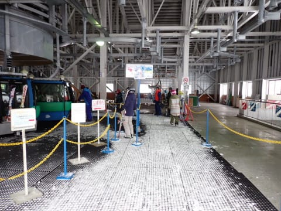

雪も冷え冷えのうえに，

ガラガラでいいなぁ…！！！

…と思っていたところ．

やはり，朝のうちに圧雪バーンに

載っていた雪が蹴散らされて，

だんだん凸凹になっていき…

午後はスキー場全体がかなり

凸凹してきた感じになりました(涙)

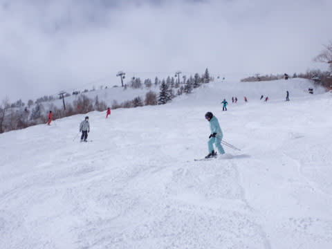

まぁ，トップシーズンで柔らかい雪が

積もった日って，こんな感じで

午後は凸凹になるもんだったなぁ…

ということを思い出しつつ．

結構凸凹はしたものの，

それでも人が少なめだったので，

せいぜいこの程度の荒れで，

深いコブコブバーンにならずに

済みました…

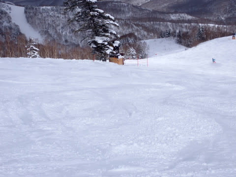

とりあえず，雪質はラストまで冷え冷えの

いい感じのトップシーズン雪をキープ

してくれたし．

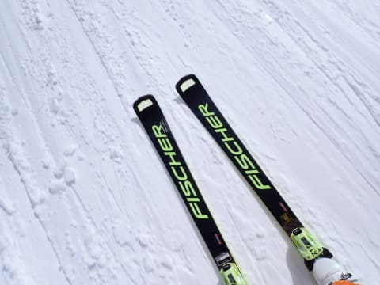

最後はかなりボコボコになったとはいえ，

午後3時ごろには，雲も減って

ほぼ晴れの天気になってくれたし．

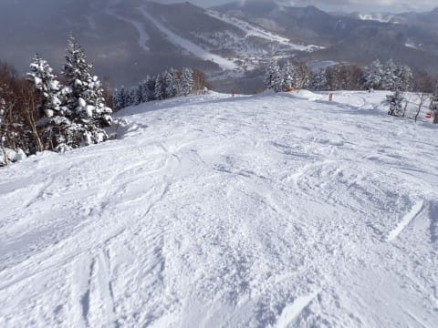

日曜というのにガラガラで人がいない

冷え冷え雪のバーンを，日が傾く

営業終了の16:15まで，凸凹に飛ばされ

ながらも楽しく滑れたのでした…

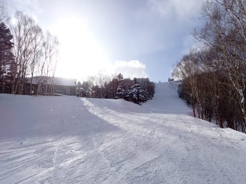

いやーー．

しかし，この週末は冷えたし，

雪も積もったし．

トップシーズンの2月より2月らしい

3月の週末だったなぁ…

このまま，2月より3月が冷えて，

3月より4月が冷えてくれると

うれしいんだけど…←ありえないから

…でも．

2月が22日ごろまで，ずっと異常高温が

続いていたのに比べ．

2月の終わり，25日ごろから3月にかけて

そこそこの冷え冷え期間が続いたのが，

下のグラフから読み取れますが…

このあと，さらに3月19日以降，水色矢印で

示したように，かなり冷えそうな予想…！！

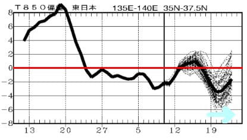

これは，今週も明日からかなりの積雪が

ありそうで，今週末も安泰だけど．

来週の19日以降も，また雪が積もり，

来週末も良くなる可能性が…！！

このまま，奇跡の冷え冷え積雪マシマシ

3月になることを祈るばかり…！！！

というか，その可能性が見えてきましたよ～！！

## 💬 コメント一覧

### 💬 コメント by (レインボー76)
**タイトル**: Unknown
**投稿日**: 2024-03-12 16:27:15

火曜日の志賀高原情報

今日があまりに充実していたために、朝の気温やらぜーんぶ記憶から消えてしまいました。それくらい満足感で一杯です。

状態があまりにいいので、今日はヤケビオンリー。オリンピックを主に、滑りまくりました。と言っても昼までですが。

白樺と三高閉鎖のせいもあってか、今日のやけびは閑古鳥が鳴いていました。白樺は雪出ししてるので仕方ないですが、乗る人がほとんどいない四ロマを動かすくらいなら、三高わ動かしてほしいですよね。人員のせいとのことですが、皆様からもやけびに要望をしていただけると助かります。こんな状態が続くと、この素晴らしいやけびからスキーヤー&ボーダーが、他へ流出してしまうでしょう。その挙げ句は衰退。

今日は強風でニゴンは減速していましたが、ゲレンデは荒れることなく、気持ちよく練習できました。実は数日前に友人(プロ)に映像を撮ってもらい、自分が思っているより動きが少ないことがわかり、さらにそのすぐあとにすごい人からレッスンを受けて、いいタイミングで滑り方改革に着手。目からウロコで楽しくて楽しくて。

湯田中では13時から雨、16時には雪です。今夜は積もりそうだけど、明日は強風だから、多分休場かなあ。明後日からに期待です。

### 💬 コメント by (Skier_S)
**タイトル**: ＞レインボー76さま
**投稿日**: 2024-03-13 01:52:55

今日も良かったみたいですね～…

週明けに良くなるってうらやましすぎます…

しかし，3高はぜひ動かしてほしいですよね．

週末は動いてくれるのかなぁ…

明日は奥志賀ゴンドラはヤバいかもしれませんが，焼額はたぶん

ゴンドラ動くんじゃないでしょうか…

明日朝はかなり重い雪ですが，新雪が40cm以上積もりますよ～！！

