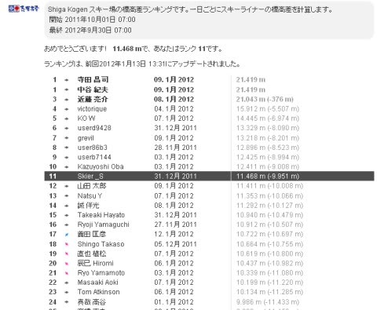

# この週末も焼額

📅 投稿日時: 2012-01-14 00:00:24

🏷️ カテゴリ: [日記](cc4b5682fb7b8b144980957a978653fb0.md)

ということで．あと3時間ほどで焼額へ出発します．

天気図を見たところ．

今晩から明日にかけては，志賀高原でもちょっと積もりそうな感じに

なってきましたね．明日の朝イチはそこそこのパウダーが楽しめるかな？

で．

[ここ](eb2a0029115b8205c8168295e2d9d49ef.md)で紹介した，志賀高原のリフト券番号をWebで入力することで，滑走標高差を確認できるSKILINE.

この機能として，志賀高原で一日で滑った標高差のランキングが出るんですが．

私はしばらくは一桁をキープしていたところ．

本日気づくと11位に落ちていました…

うーむ．今週末，また一桁へ復帰を目指すか？
