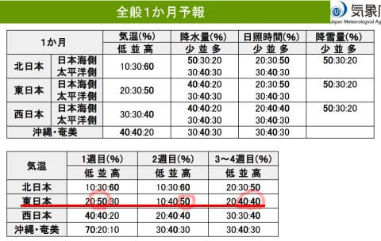

# 焼額山スキー場新コースYakebi Coast，今週土曜1/11 9:30オープン！…そして気象庁1か月予報を見ると，来週以降気温がちょっと上がりそう…

📅 投稿日時: 2025-01-10 12:28:01

🏷️ カテゴリ: [日記](cc4b5682fb7b8b144980957a978653fb0.md)

ということで．

昨日の夜は，Blogの更新をせず倒れた

ように寝てしまったので…

今日は昼休みに更新！！

…ただ，

昨日は床で寝ず，ちゃんと布団で寝たのが

偉い…！！←それが普通だから．そこは褒めるところじゃないから

ということで，10日金曜日本日．

朝までに予想通り30cm程度の

積雪になり…

（[焼額山スキー場ライブカメラページ](https://www.princehotels.co.jp/ski/shiga/livecamera/)より)

ここも予想通り，今も激冷えで雪が

降り続く，根性の無いスキーヤーふるい

落としデーになっているようです…

で．

積雪が順調に増えていっていることもあり．

ほぼ全コースオープンの焼額で，

これまで唯一オープンしていなかったコースで

ある，今シーズンからの新コースの

Yakebi Coastが，明日土曜9:30にオープン

するようです…！！

（[焼額山スキー場Facebook](https://www.facebook.com/yakebitaiyama/posts/pfbid0vKfe6WGU1dARfhit6kfKrGQBrpPi4NbuGFD1sxpdLHpqEvLBBS63tqAspNN3Y85Zl)より）

いやー．

ついに新コースオープンですね…！！

土曜は朝まで雪が降るので，結構

コンディションいいかも？

そして，昨日木曜は気象庁の1か月予報の

発表日なので，いつも通りこいつを見てみる

わけですが…

うーん．１週目（1/11～1/17）は平年より

冷えそうだけど…

2週目（1/17～1/23）は平年より気温が

上がりそうで．

それ以降，2/7までは大体平年並みか

それよりちょっと高いくらいで．

そして，降雪量は平年より少ない確率が

50％と，意外と降らない1月下旬に

なりそうです…（ちょい涙）

まぁ，1，2月は平年よりちょっと気温が

高いくらいでも，志賀高原なら雨になる

心配はないと思いますし，

これまでにも十分雪が降ってくれたから，

問題ないかな～…

と思いつつも．

今週末を逃すと，そのあとしばらく

バフバフパウダーの可能性は低いのかも…

という悲しさが…

とりあえず，今週末は3連休．

今秋までは冷えると思いますよ～！！

…ただ，日曜夜から月曜朝にかけての

南岸低気圧っぽい気圧配置で，雪は

重そうですが…

また今晩，3連休の天気詳細予想します！

## 💬 コメント一覧

### 💬 コメント by (レインボー77)
**タイトル**: Unknown
**投稿日**: 2025-01-10 13:32:05

金曜日の志賀高原情報

湯田中は朝から重い雪が降り始めました。上林-6℃、蓮池-11℃。高天-12℃。

ニゴン一番機ゲットするも、故障で出遅れ。よくあることで慣れました。パノラマ上部は新雪10。視界が悪く怖いので、積雪20の白樺では三回ほど途中休憩。

唐松も新雪20で最高だけど、フェイスマスクが凍ってくる。。あとは新雪25の三高でリハビリして2時間で終了。新雪30のGSとGSサイドは更に楽しかったようで、なかなかやめられなかったようです。

### 💬 コメント by (レインボー77)
**タイトル**: Unknown
**投稿日**: 2025-01-10 13:33:33

そうそう、強風のためニゴンは10時過ぎから運休になりました。多分今日中はダメだろうということでした。

### 💬 コメント by (Skier_S)
**タイトル**: ＞レインボー77さま
**投稿日**: 2025-01-10 22:16:27

GS側はコース上もかなりの新雪だったみたいですね…

今日の雪のコンディションはうらやましいけど，やはり根性の無いスキーヤーは

ふるい落とされた感じでしょうか．

明日からは天気が回復していきますよ~！

### 💬 コメント by (レインボー77)
**タイトル**: Unknown
**投稿日**: 2025-01-11 07:02:01

＞ Skier_S さんへ

＞ ＞レインボー77さま... への返信

わたし、ふるい落とされてます、

### 💬 コメント by (Skier_S)
**タイトル**: ＞レインボー77さま
**投稿日**: 2025-01-11 23:47:16

根性のないスキーヤーに認定されちゃいますよ(笑)

