# もうすぐ11月！11月の1か月予報を読み解いてみる…果たして11月のスキー場は冷えるのか？積雪は多いのか！？？

📅 投稿日時: 2021-10-29 04:21:51

🏷️ カテゴリ: [スキー天気予想](c6554f5c3c106093b511a8daae23757e8.md)

えー．

前回の3か月予想．

ごく数人だけですが．

「面白かった」

とコメントをもらったのに気を良くして．

今回は毎週木曜発表になる1か月予報を

読み解いてみるのだ…！

…いつもは，1か月予報は，この

[QXVV14](https://www.sunny-spot.net/chart/QXVV14.pdf)の東日本の気温傾向だけを

載せることが多いですが．

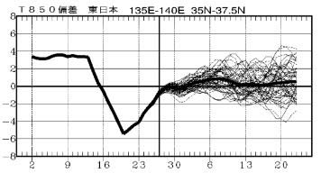

実は，1か月予報も[FCCX92](https://www.sunny-spot.net/chart/FCXX92.pdf)という

こんな感じの詳細解説資料があって．

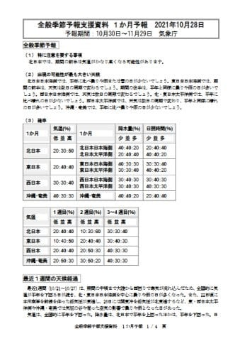

今回はこいつを詳しく解説するという．

一般読者を振り切って置き去りにしていく

ディープな記事を書くのだ…！

とりあえず．

FCCX92の一番最初の，各種確率の表を見ると…

うむ．

1か月平均の降水量，東日本太平洋側は

水色で記したように，降水量が少ない

確率が40％と一番高く．

そして，赤く印した東日本の気温は…

1週目(10/30-11/5)の期間は気温が

高くなる確率50％(涙)

2週目(11/6-11/12)は気温が高くなる確率と

平年並みの確率がどちらも40％．

そして，3-4週目(11/13-11/26)は平年

並みの確率が40％

ということで．

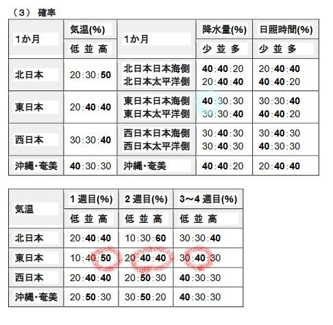

…この1か月，気温が平年より冷える確率は

低く．

前半はどちらかというと気温が高め，

後半は平年並みくらい…という予想(泣）

あぁ…激冷えでドサドサ雪が積もる

11月になる可能性は低そうです（涙）

って．

ここまでは多くの人がついて来れると

思いますが．

ここからは，

読者振り切り独走モード

に入りますよ～！

さて．

1週目の詳細解説を読み解くと．

赤線部分には，

850hpa気温は…北日本を中心に正偏差，

寒気の流れ込みは弱い

…寒気の影響を受けにくくい東日本は

高温傾向

ということが書かれてます．

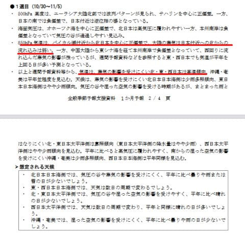

だもんで．

[QXVV12](https://www.sunny-spot.net/chart/QXVV12.pdf)から850hpa気温を見ると．

赤く印したように，確かにバイカル湖から

北日本は白抜きの正偏差…

つまり，気温が平年より高めである

ことを記してます．

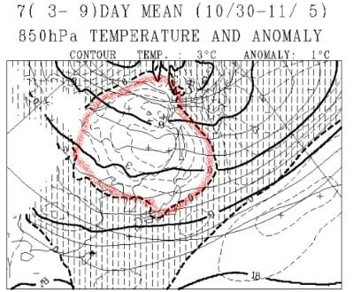

この第1週の予想は，この850hpa図から

「まぁ，正偏差の北日本は気温高くなるよね…」

と，素直に予想してます．

で．次は第2週の予想ですが…

赤線部分．850hpa気温図から，

東日本では日本の北を通る低気圧に向かって

暖かい空気が流れ込みやすく，寒気の影響を

受けにくい

と書かれてます．

水色線部分は，

東日本日本海側は少雨傾向

と書かれていて．

第2週も，気温が高めで，雪も降らなさ

そうです．

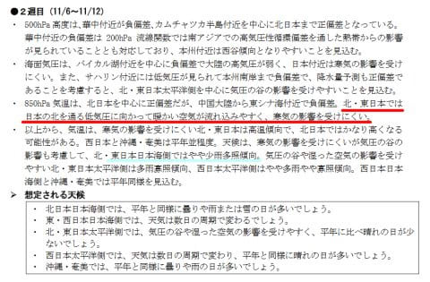

日本の北を通る低気圧に向かって

暖かい空気が流れ込みそう…というのは，

[QXVV12](https://www.sunny-spot.net/chart/QXVV12.pdf)の海面気圧を見ると分かります．

この図，網掛けに目が行っちゃいますが．

赤く囲った線の中に低気圧があるのが

分かるかと．

この低気圧に向かって，水色矢印の

南風が吹き込みます…

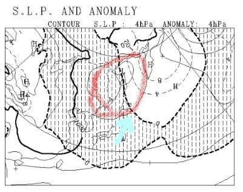

冬になると，低気圧はもっと南を通る

ようになるんですが．

第2週はまだ低気圧は日本の北を通り，

それに向かって南風が吹くので

気温が上がる…と予想しています．

あぁ…2週目もダメか…(涙）

そして，最後の3-4週目の解説を見ると．

最初の水色下線部．

熱帯の対流活動は…インドネシア付近を

中心に活発となる予想となっているが

インドネシア付近まで対流活発位相が

進んで…可能性を考える

と書かれてます．

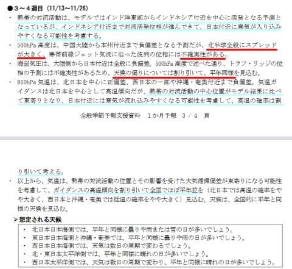

これは，[QXVV15](https://www.sunny-spot.net/chart/QXVV15.pdf)から200hpa速度ポテンシャルを見ると．

対流活動が活発な部分が，赤く示した

ようにインド東～インドネシア西くらいに

広がってるのが分かりますが．

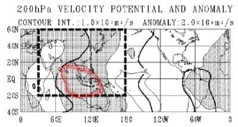

ただ．

気象庁の人は，このコンピューター予想を

そのまま信じず，

「これ，もっと東にずれるよね…多分」

と思っているようです．

だもんで．こいつの水色線の2カ所目，

3カ所目にあるように，

高温の確率は割り引いて考える

高温傾向を割り引いて全国でほぼ平年並み

と，職人修正が入ってます…

さらに，この文章の赤線部分の最初のところに，

北半球全般にスプレッドが大きく…

と書かれてます．

これはどういうことかというと．

[QVXX13](https://www.sunny-spot.net/chart/QXVV13.pdf)の500hpaスプレッド図を見ると，

第3-4週の予想図，スプレッドが大きい領域を

示す網掛けだらけになっています…

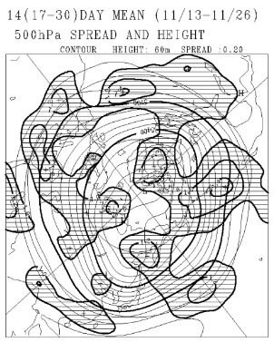

ちなみに，第2週の予想図ではこんな感じで，

スプレッドが大きいことを示す網掛け

部分はほとんどありません．

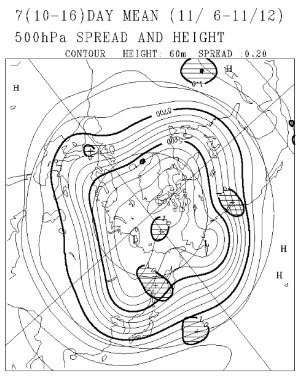

スプレッドが大きいというのは…

コンピュータで複数パターンの予想を

行ったときのばらつきが大きい

ということで．

このあたりの計算による予想精度が

低いことを示します．

だもんで．この網掛けだらけのスプレッド図から，

3-4週の500hpa予想図は，正確さが低い

ということが読み取れます…

ちなみに，500hpa線が南に垂れ下がった

部分(トラフという）が，地上では低気圧に

なるので（厳密には，トラフのわずかに東が

低気圧中心になるんだけど…)．

分かりにくいけど，この500hpa図．

5400hpa線が，赤く示したように日本

付近でちょっと南に垂れ下がってます…

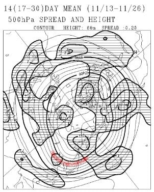

それに対応して，[QXVX12](https://www.sunny-spot.net/chart/QXVV12.pdf)の海面気圧を

見ると．

日本付近は，平年より気圧が低いことを

示す網掛けに覆われており…

この図によると，日本は低気圧に覆われ

気味であることが予想されるんだけど．

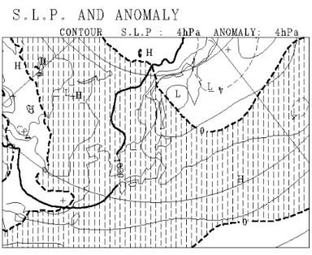

これも，気象庁の職人補正が入って．

この赤線部分のように，

スプレッドが大きいから不確実性がある．

だもんで，天候の偏り(低気圧に覆われて悪天候に

なり気味)というのは割り引いて考えて，

大体平年並みだよ

…と，なっているのです…

ってな感じで．

この1か月予報にも，3-4週目には

職人による見事な修正

が入っていましたが．

…どちらかというと，

『スプレッドがでかいし，なんか循環中心も

いつもよりずれててるから，平年並みにしとくか…』

という感じに読み取れます(笑)．

で．

ここまで詳しく解説しても．

結局のところ．

11月はせいぜい平年並み．

そんなに冷えない

という，スキーヤーにとってあまり

励みにならない結果で．

ちょっとがっくり来ているSkier_Sだったの

でした…

まぁ，気温が異常に高いってよりは救いは

あるから，良しとしておきましょうか．←だからなんでいつもそんなに上から目線？？

…そして．

いつもは1か月予報は，読み解いて一人納得

してるだけで記事にしないんだけど…

今回も睡眠時間を削り，2時間近くかけて

ディープな解説記事にしてみましたが．

果たして今回．

これを何人が最後まで読んでくれたんだろうか…

## 💬 コメント一覧

### 💬 コメント by (koi)
**タイトル**: Unknown
**投稿日**: 2021-10-29 08:34:56

もちろん読んでます！

面白いです。これからも勉強させてください

### 💬 コメント by (m&t m)
**タイトル**: Unknown
**投稿日**: 2021-10-29 10:10:11

ちゃんと最後まで読みましたよ

でもこの職人技が吉と出るか凶と出るか・・・

### 💬 コメント by (副院長)
**タイトル**: Unknown
**投稿日**: 2021-10-29 11:12:28

読みました。お忙しいところ2時間も時間を割いていただき、ありがとうございました。勉強になります。

### 💬 コメント by (新米パパ)
**タイトル**: Unknown
**投稿日**: 2021-10-29 12:10:52

読みました

最初と最後だけサクッと。

すぐ読めました。　ありがとうございます。

### 💬 コメント by (スシネコ)
**タイトル**: Unknown
**投稿日**: 2021-10-29 12:57:52

ｷｬ━━━━(ﾟ∀ﾟ)━━━━!!

し・び・れ・るぅ~

QVXX13のスプレッド図を印刷したものを見ながら、昼休みに記事を読んでました。いつも面白く楽しみにしていますよ。

### 💬 コメント by (まーくん)
**タイトル**: Unknown
**投稿日**: 2021-10-29 13:34:30

すばらしい！もっと私達を置いてきぼりにしてください！

### 💬 コメント by (ダウンヒル)
**タイトル**: Unknown
**投稿日**: 2021-10-29 17:31:07

わんだほぉ～!!

頼りにしてます!!

Ｓさんの天気予報!!

### 💬 コメント by (yumi)
**タイトル**: Unknown
**投稿日**: 2021-10-29 18:44:39

Ｓさぁ～ん🎉❓️🙄

ちんぷんかんぷん❓️🙄

だけど・・・

いつも 読んでるよー😃

✌️🥰✌️

### 💬 コメント by (Skier_S)
**タイトル**: 意外とマニアックな記事に応援が！
**投稿日**: 2021-10-30 01:53:45

＞koiさま

面白いと思ってもらえてよかったです…

なにぶん書くのに時間がかかる記事なので，応援がないと書く気が失せます（笑）

＞m&t mさま

私は意外とコンピュータの予想のクラスター平均あたりに落ち着くんじゃないか…

と思ってるんですが．

だとすると，11月下旬は…高温？

＞副院長さま

久しぶりのコメント，ありがとうございます．

こんなマニアックな記事を読んでいただけるとは…

＞新米パパさま

最初と最後だけ…一番賢い読み方かも（笑）

＞スシネコさま

職場でこんなもの印刷して読んでいたら，

「なにそれ？」

って言われませんか？？

＞まーくんさま

了解！思いっきり置いてきぼりにします！！←それでいいのか？？

＞ダウンヒルさま

頼りにしてください！！（ちょくちょく外すけど）

＞yumiさま

分からなくていいです…今回の記事は理解できなくて大丈夫です！

### 💬 コメント by (カンタロス)
**タイトル**: Unknown
**投稿日**: 2021-10-30 06:23:05

Sさま、こんにちは。

Sさまの影響でスキーに行く前に850hp(でしたっけ？)天気図をみて気温、降水量、ゲレンデコンディションを予測。

これを昨シーズンより始めました(笑)

Sさまの詳細解説と天気図を見て、これはこう読み解くのか！と勉強してます。

これからも体力の許す限りよろしくお願いします。

### 💬 コメント by (Skier_S)
**タイトル**: ＞カンタロスさま
**投稿日**: 2021-10-31 01:34:14

ここにも天気図を読み始めた方がいらっしゃいましたか．

意外と天気図のネタ，楽しみにしている人がいるんですね…

今後，毎週の予想もちょっと詳し目に解説書こうかな？？

### 💬 コメント by (おおすぎ)
**タイトル**: Unknown
**投稿日**: 2021-11-01 09:51:51

もちろん、一時一句逃さず読んでますよ（ウソ）

毎回思う事なのですが・・・

ここ20年間、気象庁の長期予想って当たった試が無いですよね・・・

よほど、農家のお祖母ちゃんの方が信憑性が高いような・・・

温暖化も（実際のところ）どうなんでしょうかね？

### 💬 コメント by (Skier_S)
**タイトル**: ＞おおすぎさま
**投稿日**: 2021-11-03 00:56:51

うーん．

気象庁の長期予想，私のイメージだと外すこともあるけど，

時々は当ててる気がします…

でも，確かに農家のお祖母ちゃんの方がよく分かってるかも(笑)．

これからも一字一句逃さず読み続けてくださいね～！（プレッシャーをかけてみる）

