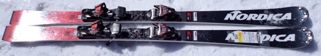
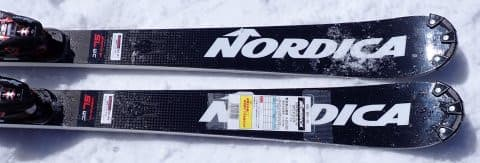
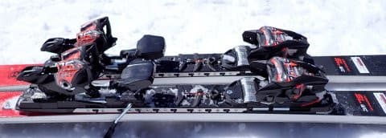
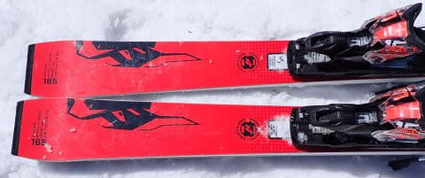
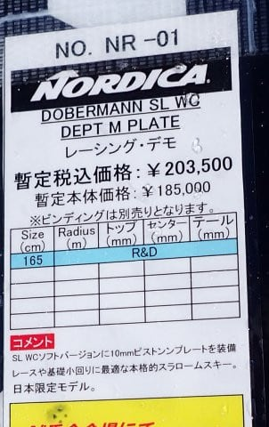

# 2024シーズンモデルのスキー板，試乗レポートその28…NORDICA DOBERMANN SL WC

📅 投稿日時: 2023-07-15 02:02:36

🏷️ カテゴリ: [スキー板試乗](c0bd8048615710cee890e403a36cc9a2b.md)

明日から3連休ですね…

3連休…遠い言葉だ…

とりあえず，明日は朝イチだけまた山を

歩いてこようかと思ってますが，

あと2日間は家で仕事をしなくては…(涙)

でも．

さっき仕事から帰ってきて，もう午後2時

なんですが…

明日午前4時に出発して山を3時間半ほど

歩いてくる予定だけど，

あと2時間しか寝られない（涙）

かといって，のんびり出かけると駐車場に

車を止められないだろうし，混むし，

昼近いと暑くて死ぬし…

やっぱりこれから睡眠2時間で出かける

しかなさそう．

ってなことで，

あと2時間後に出発を控えておきながら．

本日も2024シーズンのスキー板の試乗レポート．

今回はノルディカ編です．

では，どうぞ～！

〇NORDICA DOBERMANN SL WC　165㎝

SL競技用

前回，FISCHERのSL競技用をレポートして，

結構気に入りましたが…

いや．この板もいい！！

この板を試乗したのは，4月の一ノ瀬の2日目．

[4月としてはベストに近いコンディション](ec974584cab019e31370ab94a4e1f6568.md)で，

この時期としては珍しい，きれいに締まった

硬めの整地で試乗できたという，

トップシーズンに近い感じで試乗

できましたが…

とりあえず，履いた感じは重い．

どっしり重くて，しっかり硬い感じがあります．

硬い斜面ではどっしりガッツリ食いつき，

微塵もずれる気配がありません…

重さ・グリップの強さから，ずらすには

かなり脚力がいりますし，あんまりずらして

滑ろうとは思わない板ですね．

当然SL板でサイドカーブがきつめってのも

ありますが，わずかに角付けしたところから

板がサイドカーブに乗って曲がろうとして

いき，旋回性は高いです．

さらに返りも早く鋭いので，踏まないで

縦目に落とそうとしても，

割と小さめの半径で回っていく板．

中回りまでは行けますが，大回りは無理ですね…

スピードが出てくればさらにたわみが出て，

エッジにのったままより小さい半径で

キュインと回ってきてくれて，

早い返りを利用して切り換えてやれば，

谷回りのかなり早い段階から板をグリップ

させることができて，

切り換え直後から，板をかなり谷側に倒し

こんで行く鋭い谷回りができます．

それでいてどっしり安定感があり，

グリップも強いので，アイスバーンみたいな

かなり硬めの斜面でも重戦車のように

斜面を切り裂いて滑って行けるし．

バーンコンディションが良かったので，

かなりのハイスピードで攻めてみたけど…

私のトップスピードではまだまだ板に

余裕があり，私程度ではこの板の神髄を

使いきれない感じ…

とりあえず，試乗したSL板の中では

最もポテンシャルが高そうで，

逆に言えば最も手ごわい板といえます．

ブーツもかなり強めの，フレックス150

くらいが欲しい感じで，ゲレンデでこの板を

履きこなせる人は少なそうだけど，

過激な小回り板が欲しい方は，この板を

一度試乗してみるといいかも…
