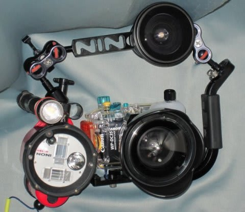
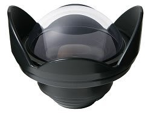
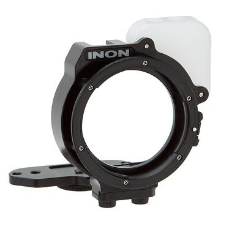
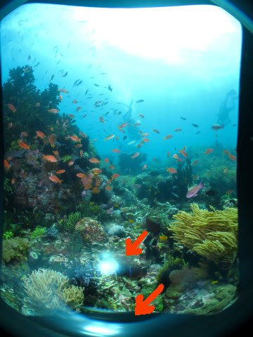
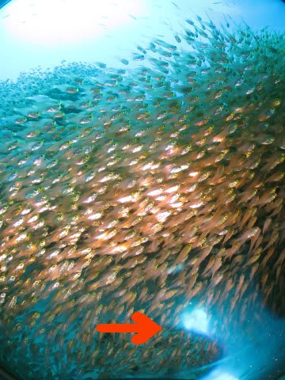
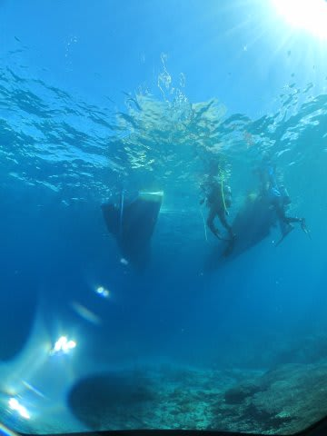
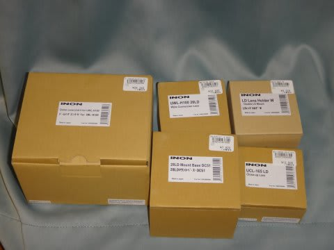
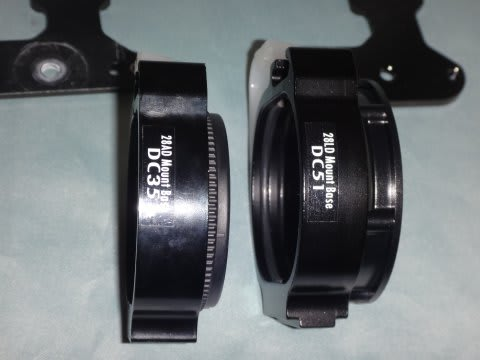
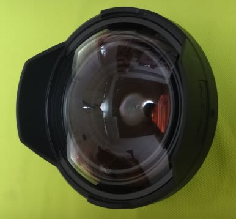

# 水中カメラ買い替え計画…安く上げるはずが，物欲に負けて超散財（涙）

📅 投稿日時: 2015-08-07 01:31:31

🏷️ カテゴリ: [PC,カメラ&小物](c0d8caed13e597efe97b661a8ae56bed0.md)

ということで．

現在，フィリピンへ来ていますが…

記事を書いている時間がないので．

書きためておいた，カメラ買い替えネタを行くのだ．

--

いやーー．

普通に妻用の新品カメラとハウジング，

予備バッテリーを買うより2万円近く安く上がった…！

と，喜んでいたのもつかの間．

「S120，出た当初から買いたかったんだよな…

　本気でS90から買い替える気でいたくらいなんだよな…

　このカメラ，自分が使いたいよな…」

モノは壊れるまで使い倒す，というポリシーの私．

まだ問題なく使えるS90を買い替えることはできず．

S120乗り換え計画は実行しなかったけど．

…今回，妻の水没カメラ買い替えでGetしたS120．

これ，自分が使えばいいじゃん．

妻がS90使えばいいじゃん．

はっはっは．

簡単な話だ…

とは，行かない．

残念ながら，そうはいかない．

…[私がこれまで使っていた，S90の水中カメラシステム](ecac4daf837c5bc842d148e0d8217e221.md)で．

S90に使っているINONのフィッシュアイレンズと，

コンバージョンレンズのマウント．

これが，なんと．

S120では使えないのだっ…（涙）

…フィッシュアイがほしければ，

S120に使える新しいマウントと，

新しいフィッシュアイレンズとを

買わねばならないのだ…

水中では．

フィッシュアイレンズがないと，写真にならないのだ．

こういう写真は，フィッシュアイレンズだからこそ

撮れるのだ！

フィッシュアイレンズがない水中カメラは，

お肉が乗っていない牛丼のようなものなのだ！（よくわからない例えだ）

でも．

新しいフィッシュアイレンズとマウントを買うと…

…

…

今回買ったカメラとハウジング．

2セット買えるお値段ですな（泣）．

…

うーーむ．

……

どうしようかなぁ…

S120，動画もハイビジョンになったし．

性能もいろいろ上がったし．

やっぱり，私が使いたい…

…さらに．S120用のフィッシュアイレンズ．

お値段は，高いけど．

S90で使っていたこれまでのフィッシュアイみたいに，

プラスチックレンズじゃなくて，

ガラスレンズになったから．

これまですごい悩まされていたレンズゴースト．

これとか…

これとかの，矢印部分．

こんな感じで悩まされたゴーストに，

悩まされずに済むようになるんだよな～．

（これも，すさまじいゴーストが出てるなぁ…）

これまで，ゴーストが写らないように，フレーミングとか

すごい苦労してたけど．

S120＆新しいフィッシュアイレンズがあれば．

…こういう苦労もいらなくなるんだなぁ…

…

S120，妻に使わせるの，勿体ないなぁ…

ゴーストの出ないフィッシュアイで，写真撮ってみたいなぁ…

…

…

（しばらく意識消失）

………

あれ？？

あれれれれ？？

なんだ，これはっ！？？？

…そして，手元にある，計，●×万円のレシートは…

な，なんなんだ！？？

また，気を失っているうちに，

買い物をしてしまったらしい…

…ということで．

極力安く上げよう…

と，思ったカメラ買い替え計画．

なぜか．

S120をすごく安く買えた！

ということが．

最終的に，全く逆の結果を導くことになり．

安く上がるどころか．

こんなすさまじい散財に結びつくとは…（涙）．

…物欲に，負けた…

## 💬 コメント一覧

### 💬 コメント by (伽羅。)
**タイトル**: Unknown
**投稿日**: 2015-08-07 07:06:53

さすが！付属品までとは想像以上のオチでした（笑）

新しいカメラでのフィリピンの写真、期待してます(^^)

### 💬 コメント by (Skier_S)
**タイトル**: 伽羅さま
**投稿日**: 2015-08-07 22:49:32

想像以上でしたか（笑）．

昨日到着，今日潜ってきましたが…．

台風のすごい波で潜りに行けるかどうか

微妙な感じだったのが，何とか潜りに

行けましたが．

ポイントはかなり限られています…（涙）

まさか，台風の影響がフィリピンまでこんな

すごい影響を与えるとは…

