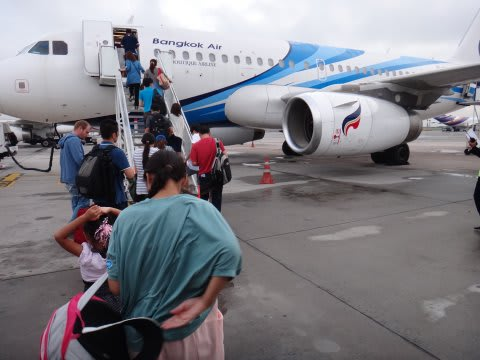
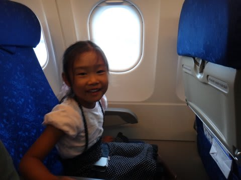
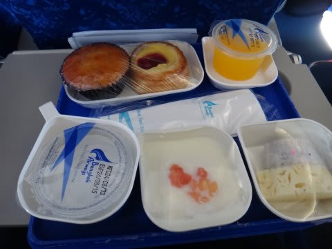
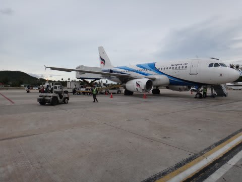
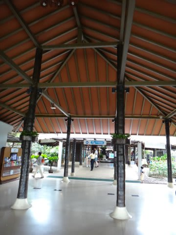
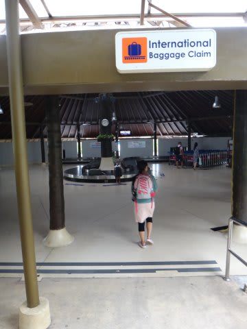
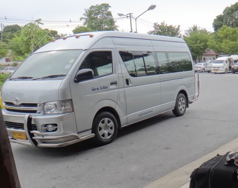
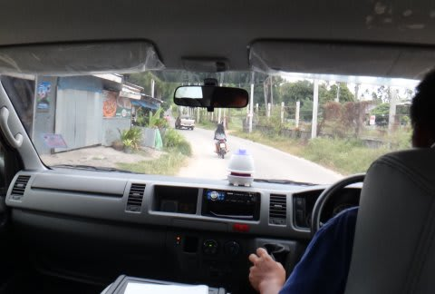
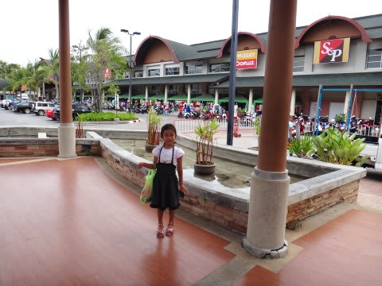

# 2013年9月　子連れタイ・タオ島ダイビング旅行記　その3…そしてサムイ島到着

📅 投稿日時: 2013-10-04 01:14:20

えー．

ケーキが大好きなSkier_Sです．

昨日は一日，中休みを入れましたが．

本日はまたタオ島ダイビングレポート，再開です…

--

って感じで．

バンコクで1時間ほど乗り継ぎ待ちの後．

朝早く，6:30にサムイ行きの飛行機に乗り込みます．

うむ．A319ではないか！

珍しい…

で．

相変わらず，飛行機に乗って喜んでいる娘…

あんまり寝てない早朝というのに，ハイテンションですな．

サムイまではわずか1時間のフライト．

…なのに．

驚くことに，こんな食事が出るとはっ！

でも，フライト時間がわずか1時間．

娘が食事を食べ終わらないうちに，

シートベルトサインが点灯．

あっという間にサムイ到着…

早っ！

サムイ空港は，結構おしゃれな感じですね～．

んで．

国際線から乗り継ぎ(まだ税関を通過してない）の人と，

そうじゃない人で手荷物受け取り場所が全く違うので，間違えないように！

乗継じゃない人の列についていくと，遠く離れた普通のバゲッジクレームに

行っちゃいます．

間違えずに，国際線乗り継ぎ専用バゲッジクレームへ行きましょう…

荷物を受け取って，税関を通過したら．

次は，船でタオ島に向かうわけですが．

…船の出港は13:30．

で，今は，8時．

…

なんだか．

船に乗るまで，5時間半も待たねばならないんですが…

ってことで．

船に乗るまでの5時間，空港そばのショッピングセンターで

時間をつぶしましょう…

妻が旅行前に申し込みしてあったらしい，

空港→ショッピングセンター

への送迎サービスの車が迎えに来るので．

これに乗って走ること約10分ほど．

サムイ島で比較的大きいらしい，BigCというショッピングセンターに到着です．

