# 2017年8月，小学生の子連れで座間味でダイビングその6…ダイビング初日のお昼

📅 投稿日時: 2018-07-03 01:56:49

ということで．

夏モードに切り替わったこのBlog.

「徒然ダイバー日記」←そんなものは無い

として，ダイビング日記が再開するわけですが…

…

…

あー．

いつものシーズン切り替えの時の，

いつものお決まりパターンと化してますが．

一体，昨シーズン終わりはどこまで書いてたんだっけ…

…ってか，そもそもいつの旅行のレポート書いてたんだっけ？？

と．

過去を振り返るところから始まるわけで…

…ってか．

真面目に覚えてない…（涙）．

とりあえず，過去記事をひっくり返すと…

ありゃ．

昨年の最初のダイビング旅行の，座間味レポートの

途中じゃないですか！

それも，ダイビング1日目の途中という，まだ

始まったばかりのことを書いてるよ…

…このペースだと．

ホントに，3年後くらいには．

2年遅れで記事を書いてるかも…（涙）

ってことで．

今から11か月近く前という，かなり今さら感

あふれる感じの記事ではありますが．

[座間味レポートプロローグ](efc945483e0b83c270256b049ea40e4ae.md)

[座間味レポート1](e8fae6f940860010c0df0739e1178b0f7.md)

[座間味レポート2](e967a613000bc73aa3a0876b2d2fd3138.md)

[座間味レポート3](e331a26a1edd61e31a10026b6b279b13a.md)

[座間味レポート4](e16a591663b668a6e76bba8c275430ea1.md)

[座間味レポート5](eb58ea46e4efab79131afed4c1ae478db.md)

の続き．

座間味レポート，その6です…！

ってな感じで．

娘の生まれて初めての体験ダイビングが終わって．

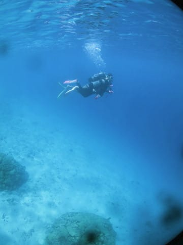

船に上がると…

もう，お昼時間なので．

お弁当タイム！

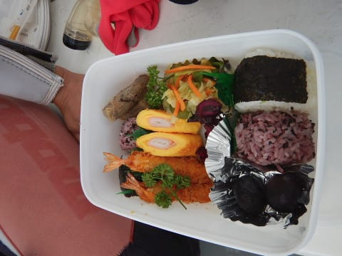

…泊まった宿の星砂さんが，

一人分500円で作ってくれるのですが…

見た目よりかなりボリュームがあって，

結構おいしいお弁当．

このお弁当を，こんないい景色を眺めながら食べられるんですから…

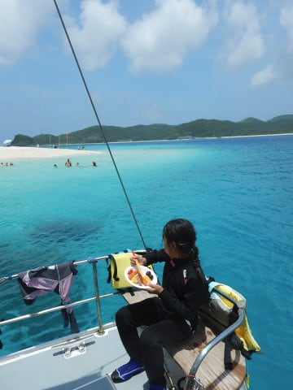

…幸せですね～！

お弁当のあとは，しばらく休憩時間ですが．

…子供たちがいっぱい乗っている今回．

みんなで海に泳ぎ出して…

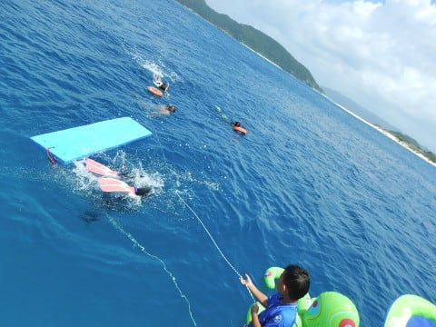

目の前にある無人島，安慶名敷島へ向かいます．

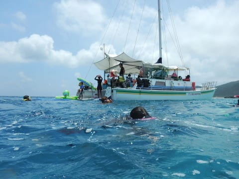

ボートから数10mほど泳いで…

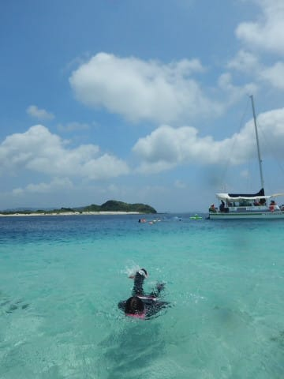

上陸！

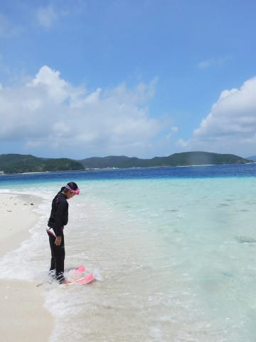

いやー．

毎年来てるけど．

このビーチ，きれいで写真映え

しますねぇ…

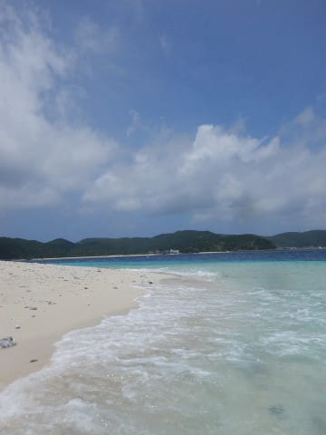

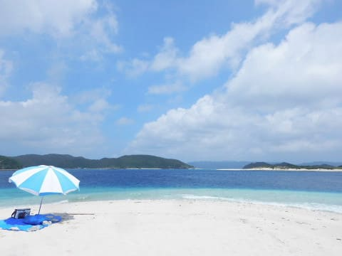

ってことで．

子供たちはさっそく砂浜で砂遊び．

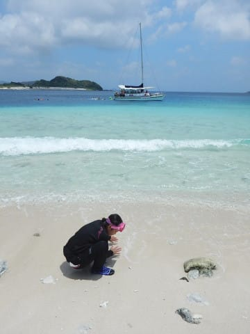

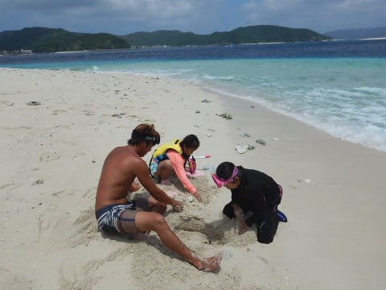

…君たちは何を作っているのかね？？

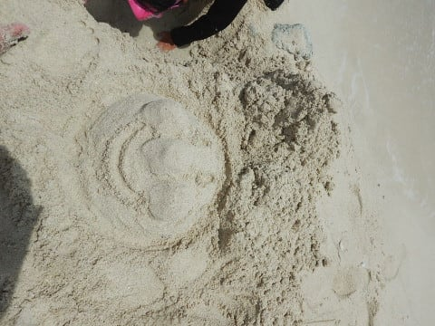

ってな感じで，30分ほど砂遊びしたり，

ビーチの景色を眺めたり，

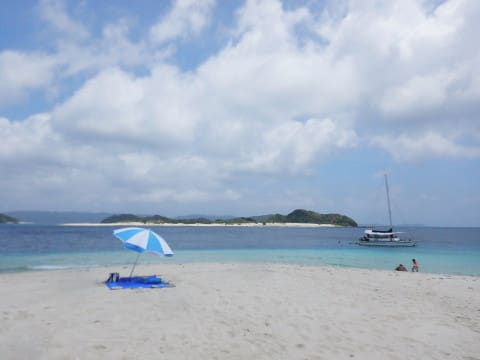

泳いだりして過ごします…

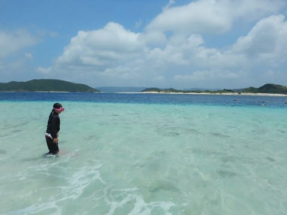

…あぁ…

ここはこの世の天国に違いない…←あなたは雪景色の方が天国を感じるのでは？？
