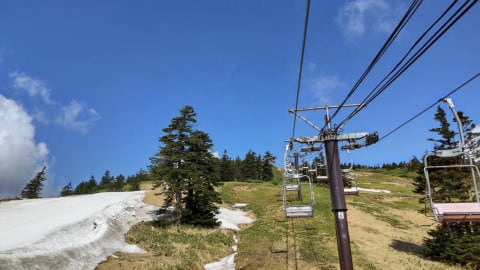
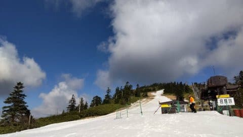
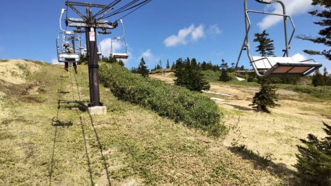
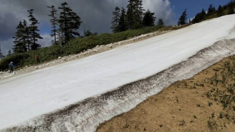
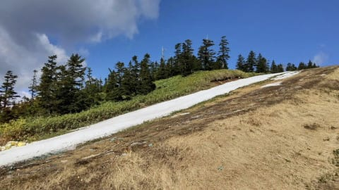
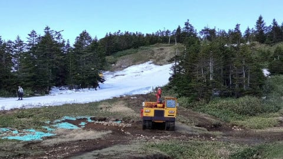
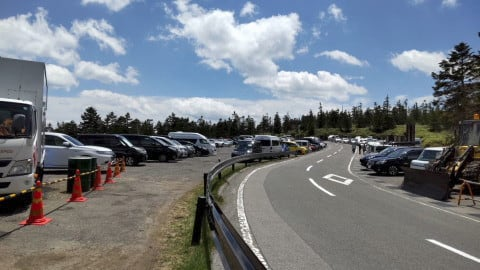

# 2021/5/29(土)の志賀高原渋峠スキー場コース状況！…特派員からの動画を見ると，廊下ですね…

📅 投稿日時: 2021-05-30 03:59:53

🏷️ カテゴリ: [日記](cc4b5682fb7b8b144980957a978653fb0.md)

ということで．

木，金の2日間営業をやめて，コース整備に

徹した渋峠スキー場．

3日ぶりに，コース整備を終えてオープン

したわけですが…

また今日も，特派員が写真＆動画を送って

くれました～！

天気は雲が多めですが，晴れてたみたい

です！

…今日は早朝営業が無かったようですが．

朝から雪は緩んでるみたいに見えますね…

この雨のおかげで，先週火曜までは

なんとかオープンしていたウエイバー

コース．

完全に雪が無くなってます(涙)

でも，ゲミュートコースは，2日間の

雪出しのおかげで，コースはかなり

復活したみたいに見えますが…

けど．

どうも，雪は結構薄くて，コース幅も

かなり狭そう…(泣）

結構頑張って滑れる状態まで整備して

くれたけど…

これは，もって日曜までがギリギリ

っぽい感じ（涙）

で．駐車場の車の台数からも分かるように，

今日は結構人が多くて．

リフトは最大7分ほど待ったようです…

ってなことで．

土曜の渋峠のコース状況の動画はこちら！

…なんだか．

オープン直後のイエティを思い出させる

コース幅ですね…

ただ，リフトがペアリフト1本なので，

コース上の混雑はイエティよりずっと

マシですが…

そして，コース上にスタッフが何人も

はりつき，コースを維持しようと必死に

整備をしているのが素晴らしい…！

ということで．

おそらく明日の日曜がラストになるんじゃ

ないかと思われる，渋峠．

残るはあと1日！
