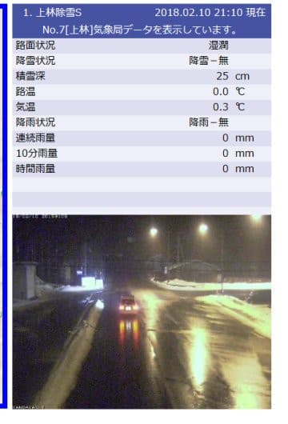
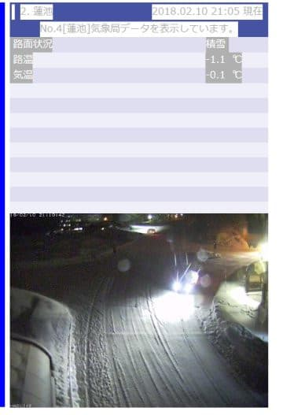

# 皆さんの冷え冷え踊りの効果で，10日夜は無事雪になってくれたようで…私は明日から志賀高原へ！

📅 投稿日時: 2018-02-10 21:20:44

🏷️ カテゴリ: [日記](cc4b5682fb7b8b144980957a978653fb0.md)

えー．

雨が危惧された今晩，

志賀高原の登り口，上林では雨になっているようですが…

志賀高原の蓮池近辺では．

気温も氷点下で，無事雪になったようです！！

…これで大丈夫．

今晩は，志賀高原は雨になることなく，

雪のまま過ぎそうです…

これもひとえに，

このブログ読者の，濃厚な願い（呪い？）がこもった

冷え冷え踊りが効いたからです！！！

素晴らしい，冷え冷え踊りっ！！←なんのこっちゃ

他のスキーヤーは，このブログ読者に感謝しなくては

いけないところですね…←違うから

しかし．

今日の志賀高原はちょっと混んだものの．

水曜に予想した通り，[昼間のコンディションは良かった](http://red.ap.teacup.com/gokurakuskier/865.html)ようですね．

うーん．

こんな日に滑れないなんて，悔しい…（涙）．

でも．

明日から志賀高原へ復活です～！

明日の朝は，そこそこの積雪がありそうですね…

今日は早めに家にいるので，

今日はゆっくり寝られそう…

あと6時間半後に出発です！

では，また明日～！
