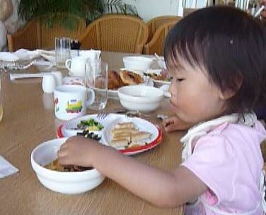

# 初の子連れダイビング旅行記＠2009年　その8　子供が生まれて初めての…

📅 投稿日時: 2012-07-19 00:56:34

ということで．

初子連れダイビング旅行2日目の朝…

晴天の日差しに照らされたエメラルドグリーンの海が

ホテルの部屋のバルコニーから望めます．

娘は夜にぐずったりすることもなく，

家と同じ感じでぐっすり寝て，すっきりお目覚め．

…そしてまたひとつ．心配事がクリアされていく…

朝食後，のんびりくつろいでから（ああ！宿とダイビングショップが近い

このゼイタク…），ダイビングへ向かいます．

なんと．

なんと．

今日の午前1本目は，おばあちゃんが娘の面倒を見てくれることに！

ということは…

実に，実に久しぶり．

2年と9ヶ月ぶりに，夫婦バディで潜る1本だぁ～

ひさしぶりに夫婦そろって船に乗り込み，

娘にお見送りしてもらって出航です．

うーん．

娘を置いて二人きりで行動するのは，

もしかすると子供が生まれてから初めてなのではっ…

で，向かった1本目のポイントは「恩名ポイント」

ボートで10分ほどです．

クレバス状の岩の割れ目がそこかしこに走っており，

トンネルなどもある地形ポイント．

このエリア，比較的透明度がいいなぁ．20mオーバー．

水底がきれいに見える…

ポイントに到着して．

いざ．夫婦そろってエントリー．

うおおお．

久しぶりに見た！

潜る嫁さん．いやー．久しぶり．

とりあえず，ログブックの「見た生き物」に

「妻」と太字で書いておこう．

しかし，2分も一緒にいると久しぶり感が全く

なくなりましたが…．

ほぼ3年ぶりというのに，なんかいつも一緒に潜ってたみたいな感じに

なりましたね．

さて．

潜ったポイントはいろいろな割れ目やら隙間，オーバヘッド

やらをくぐっていきます．

透明度が高く，白くきれいに輝くクレバスの底の砂に

ダイバーの影がくっきりと映ってますね～．

地形は面白いなぁ．

…地形は．

……地形だけは．

…でも…魚がいないのですが…

これまで見た魚，10匹程度しかいないんじゃないかな…

まぁ，地形は十分楽しめた，久しぶりの妻との1本でした．

エグジット後，ホテルへ戻ると，娘はおばあちゃんに

連れられて，またプールを浮き輪で漂ってます．

…プールが好きだのお．

1時間ほどプールに入っていた娘を，プールから

かっさらってご飯タイム．

いつもどおり，プールに向かって両腕を伸ばし，

半泣きの声で「バシャバシャ～！！！！」と

訴えかけますが，無視してレストランへ．

ホテルのレストランの昼食はバイキングだったので，

娘も食べられるものがたくさんあって満足．

…でも，フルーツとかを見ちゃうとおかずを

食べずに「すいか！めろん！」とかいって

フルーツしか食わないんだよな… 

昼食後，ホテルの部屋に戻って，娘は日課のお昼寝．

そのままぐっすり寝ちゃったので，

今度は妻が留守番で，私が2本目のダイビングへ向かいます…
