# 2018シーズンついにスタートっ！10月7日（土）オープン翌日のYetiは…曇り時々雨（涙），かなり空いてたよ

📅 投稿日時: 2017-10-08 01:09:16

🏷️ カテゴリ: [2018スキー滑走日記](c11b88dc181f34079ab41db74a3587646.md)

ということで．

はいはいはいはい．

行ってきましたよ～！！

…そうです．

例年より2週間ほど早くオープンした

イエティへ…っ！！

まぁ．

先日書いた通り．

本日のオープンはゲレンデ整備のため，

（というか，雨避けシート外しのため）

10時に遅くなりましたが．

…だのに．

私は，東名の事故渋滞に巻き込まれてしまい，

ゲレンデ到着が10時半過ぎ…（涙）．

ゲレンデオープン時間に間に合わなかったよ（泣）．

でも．

天気が悪い予報だったからか．

駐車場は空いてましたね～！

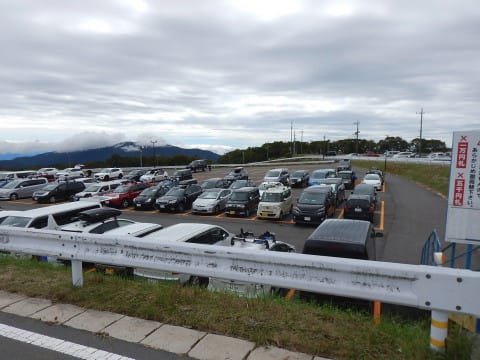

そして，雨も降っておらず．

…これは，雨が降ってないのにがら空きという，

かなり恵まれたパターンでは！？？？

リフト券売り場には．

「ゲレンデ最下部の雪は昨日の雨で薄くなってる」

という，ちょっとドキドキの案内がかかれてましたが…

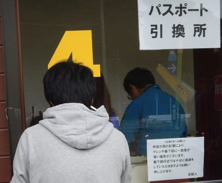

とりあえず，久々の．

約10か月ぶりのYetiです！

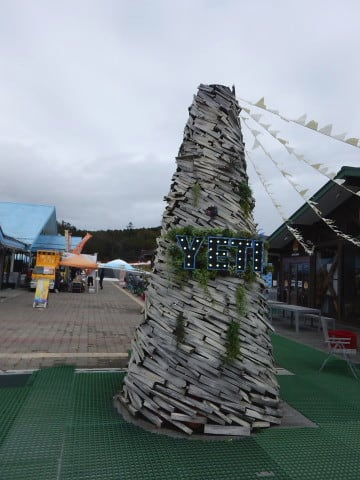

…これは，オープニングセレモニーで使ったんだろうか…？

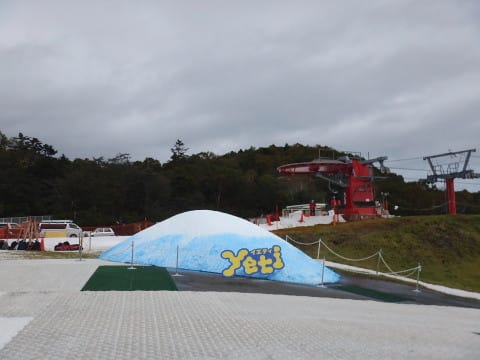

謎の雪山が…

ってことで．

やってきましたよ～，

ゲレンデへ！！！！

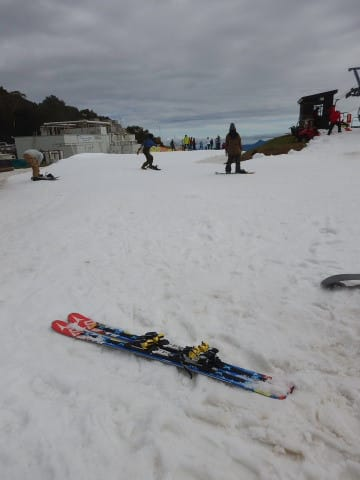

あぁ…

実に…

実に，3か月ぶりの雪の感触ですっ！！！

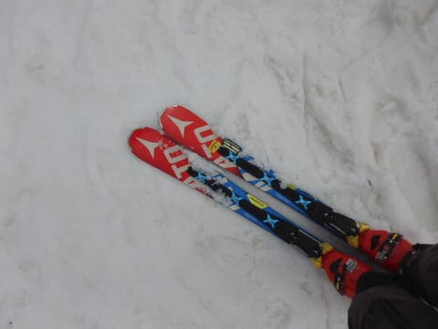

うははははははは！！！

3か月のオフシーズンの間，

待ちに待ったゲレンデに，

戻ってきたぞ～っ！！！

…

…

って．

昨シーズンは7月まで月山滑れたし．

今シーズンのYetiは，例年より

半月以上早いオープンだし．

…今回のオフシーズン．

わずか3か月しかなかったんだよな…

…例年なら，3か月半～4か月に渡るオフシーズン．

昨シーズンは，例年より長めで，4か月半も

スキー板を履かなかったというのに…

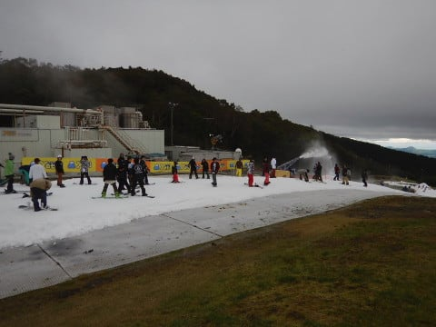

このオフシーズンは，例年より一か月以上

短いよ…

わずか3か月，史上最短のオフシーズンですね…

でも．

私にとっては，

禁断症状に耐え，

スキーの夢を見るような3か月…←ホントはそんな夢見てないけど

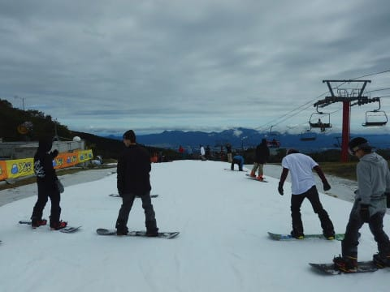

3か月ぶりのゲレンデへ，突撃っ！！

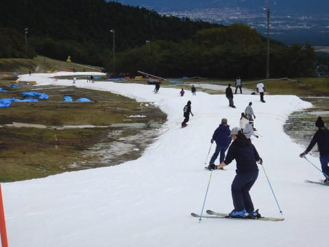

うはーー！

雪だ，雪だ！！←雪じゃなくて，アイスクラッシュの氷ですけど…（冷静なツッコミ）

コース幅は…

例年より早いオープンにも関わらず．

例年のオープン時期と同じ程度はありますね～！

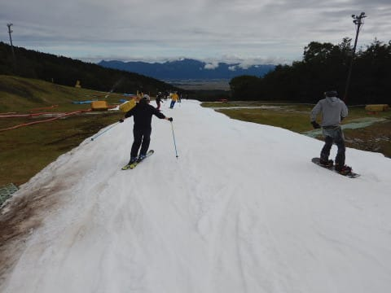

そして…

人は少なめで，時々こんなクリアラップが取れます！！

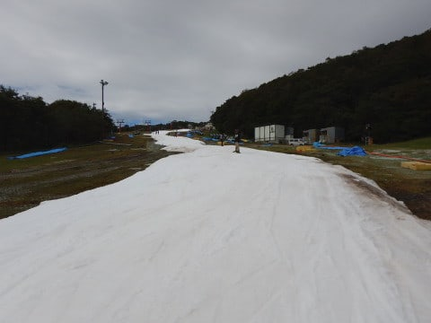

いや…

思ったより人が少ないよ！！

だもんで．

リフト待ちは…

午前11時の段階では，ほぼ待ちなし．

ガラガラですっ！！！

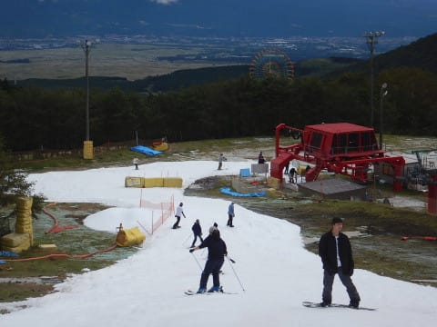

昼を過ぎても，コースはいつもより人が

少なめで．

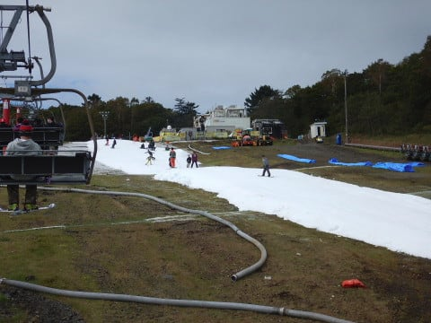

コース上も，ガラガラとまでは行かないまでも，

いつもの

「ここは，どこかの都会の駅でしたっけ？？」

という感じの人口密度で，人の隙間を縫いつつ進む

状況では無くて．

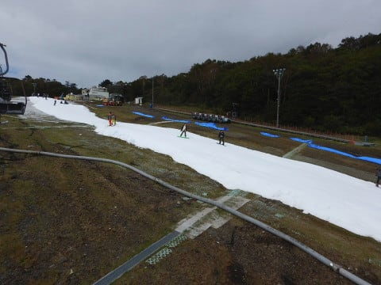

思ったよりコース幅も雪の厚みもあるし．

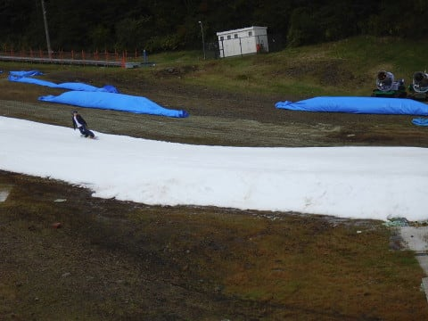

これは…

結構いいんでないかい？？

と思ったら．

さらに昼ごろ，日が射してきました！！

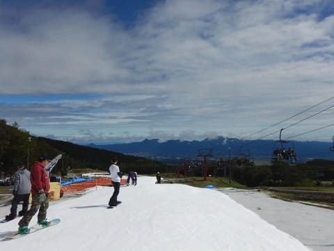

うーん．

普通なら，晴れると喜ぶところだけど…

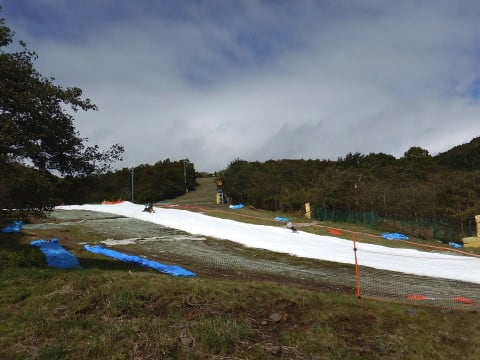

正直言って，この時期．

日が射すとTシャツ一丁になりたいくらい暑くなるし．

雪の滑りも悪くなるから，

曇ってくれた方がいいなぁ…

なんて考えてたのが，神様に伝わったのか．

またすぐ，曇ってきました…

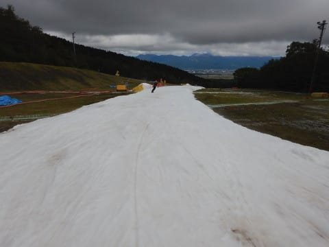

しかし．

午後になってもリフトは結構ガラガラで…

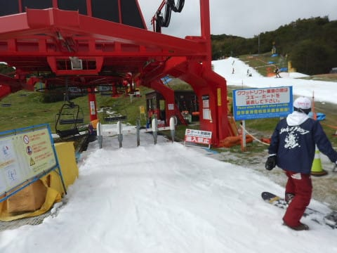

コースの人も少なめ．

ただ，ちょっと雪は汚れてきたかな…

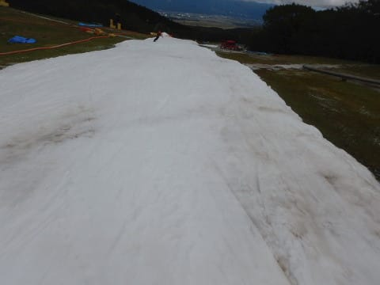

とはいえ，

リフト待ちも，あってもせいぜい1-2分だし．

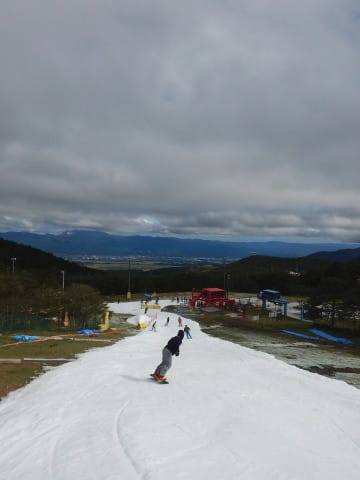

まさか，こんなに人が少ないとは…！

いやー．

快適，快適…

…

…と，滑ってたら．

午後3時ごろ．

ふむ？？？？

なんだ，これは…？？

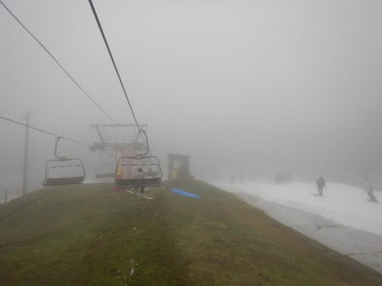

って，ガス？？

午後は天気が良くなる予想だったのに，

いまさらガス？？

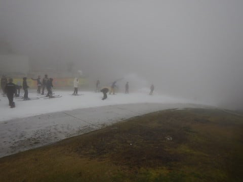

まぁ，じき晴れるだろう…

と，タカをくくってたら．

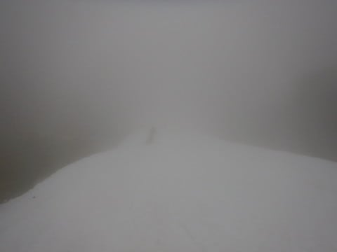

晴れるどころか．

濃くなる一方…（涙）

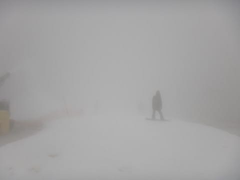

10メートル先も見えない…

夕方で，雪もガタガタになってきて．

見えないところで飛ばされて，ちと怖いかも…

…ガーン．

晴れなくていいよ…って願いが，

効きすぎたかっ！！？？←違うから．あなたの願いでYetiの天気決まってるわけじゃないから

…でも．

ゲレンデの人が全くいなくなって，リフトも

飛び乗りになったから，いいかな！！←よくない．無理やり自分に言い聞かせている

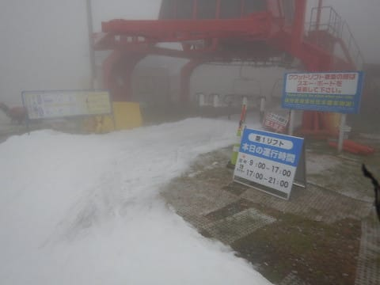

ってことで．

16時になると．

圧雪車が出てきて，17時までの1時間，

コース整備タイムになります．

（霧の向こうで，圧雪車が見えない…）

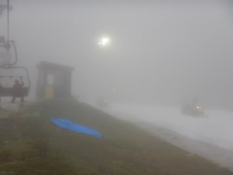

…今シーズンは，ナイター営業時間が

一時間短くなったので，コース整備やらないかと

思ったけど，やっぱりやるんだ…

で．

コース整備が始まるころには．

なんだか．

ガスってより，雨になってきたんですが（涙）．

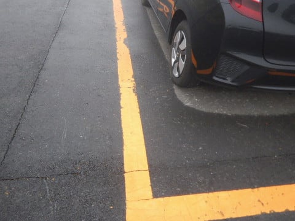

そして，

ゲレンデ整備後，ナイターオープンの時も…

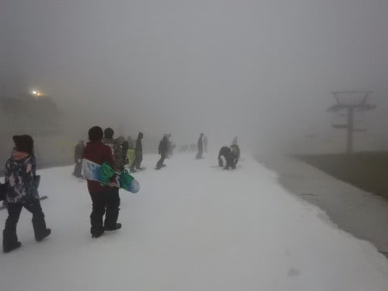

Oh…これは，霧雨が降り続いてますね（涙）

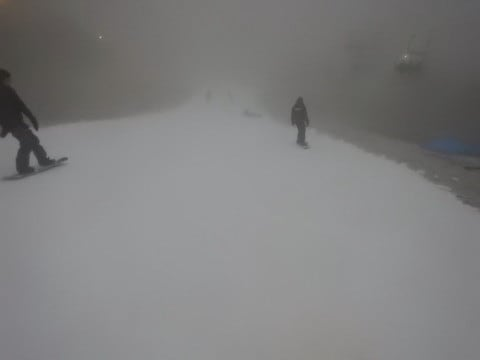

そして，リフト搬器も濡れてますね（泣）．

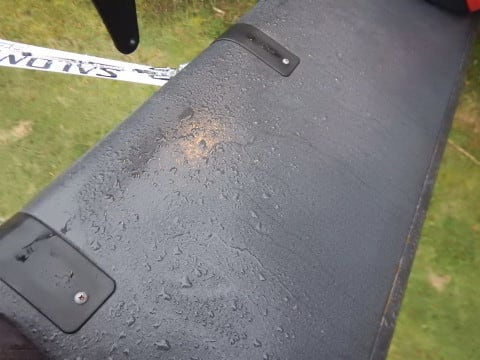

…いいんだ．

それでも，いいんだ．

天気が悪いからリフトがガラガラだし，

許す！←許す・許さないじゃなくて，帰るという選択肢はなかったのか？？

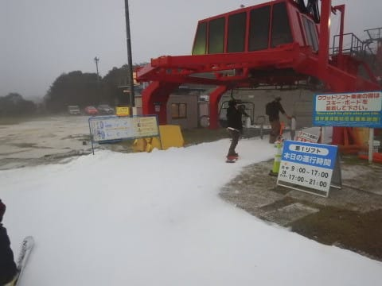

ちょっと人が多いタイミングもあったけど．

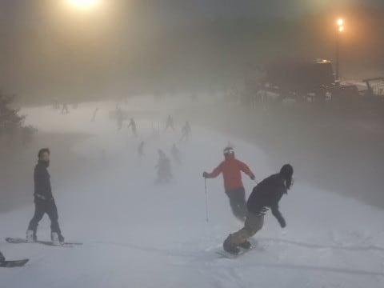

圧雪したてのゲレンデは，気持ちいのだ！！

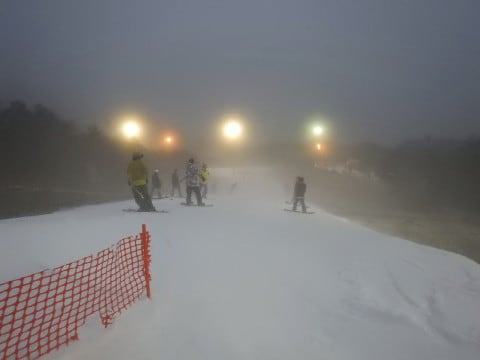

…と，滑っていたら．

午後6時過ぎには．

雨も上がり，ガスも晴れ始めてきましたね～！

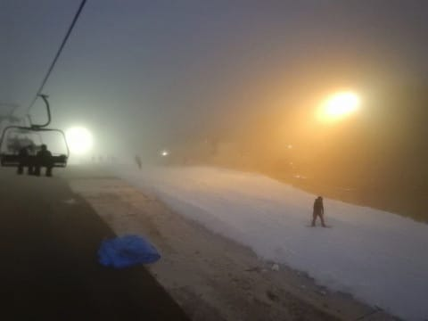

7時前には，すっきり晴れました！！

…となると．

ガンガン滑るしかありませんね！！

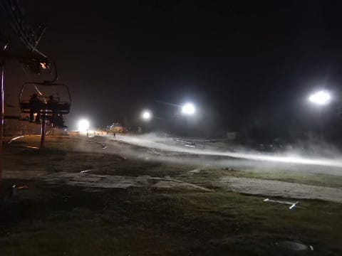

いや…

天気も悪いし，ちょっと早めに帰ろうと思ってたんだけど…

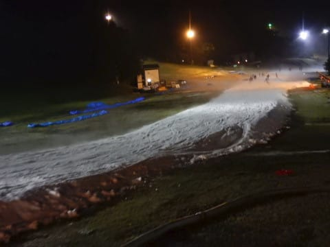

ゲレンデがすっきり見えるようになってきたし，

人も少ないし．

こんなに楽しかったら，帰れないじゃ

ないか！！←いや，混んでても天気悪くても帰らないでしょ

…タイミングによっては，コース上に人が溜まって．

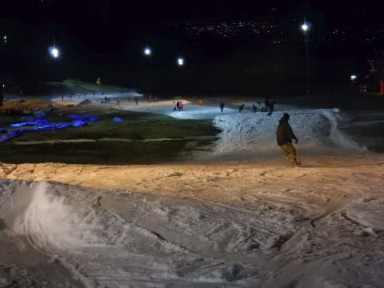

リフト待ちがちょっと発生する時もあったけど

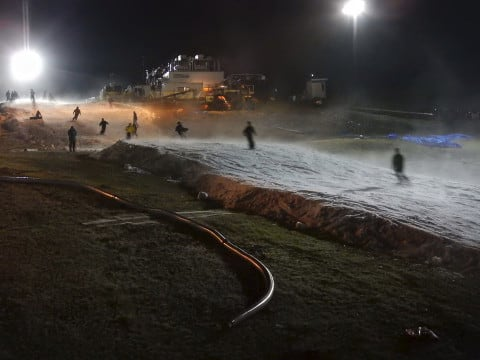

でも．

午後8時を過ぎるとコース上はほぼクリアラップだし．

いかん…帰れないじゃないか！！！

…ということで．

いや．想定外．

全くの想定外に，ナイターストップまで

滑り切っちゃいました…←読者の皆さんには，十分想定の範囲だから

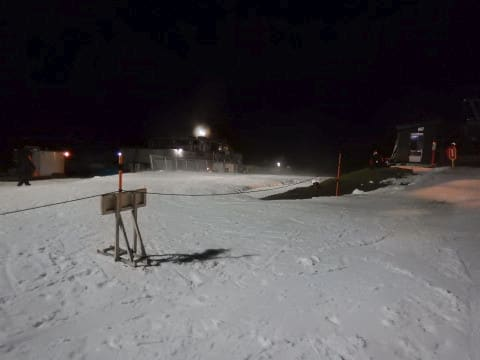

うーむ．

シーズン初日だし，早く帰るつもりだったけど…

まぁ，滑り始めが昼近かったし．

良しとしておこう．←全然良く無いから

ということで．

時折ガスやら小雨に祟られたものの．

気温はトレーナーでも十分なほど暖かく．

オープンが早かったにも関わらず，

コース幅も，まぁ例年のオープン時期くらいはあったし．

雪も十分厚く，土が出てきたのはリフト乗り場

手前だけだったし．

人は少なく，リフト待ちがほとんどなく，

いっぱい滑れたし．

シーズン初日としては，結構楽しめた一日でした～！！！

ってな感じで．

私の2018シーズン，ついに始動です…！

## 💬 コメント一覧

### 💬 コメント by (いか)
**タイトル**: Unknown
**投稿日**: 2017-10-08 08:29:22

ついに始まってしまいましたか… 明けましておめでとうございます〜。西日本はカメムシが大量発生しているところもあるので、今年も大雪に期待でしょうか…？

私は西伊豆某所で釣りをしながらイエティナイターの明かりを眺めておりましたよ〜

### 💬 コメント by (ほっぽ)
**タイトル**: シーズンイン
**投稿日**: 2017-10-08 09:29:18

シーズンインおめでとうございます。

金曜ナイター出撃する気マンマンだったのに雨で中止。

この３連休は混雑するだろうなぁと行くつもりはなかったのですが、Ｓさんの投稿見て今夜行ってみようかと思っています。

例年より早すぎて準備が出来ていない人が多いのか、まだスキー／スノボというイメージじゃないのか、空いているといいんですが。。。

先週末、とある用事で茶水に行きましたが、ＩＣＩのコンペカンに１６ＳＸ、１７ＳＸともに在庫ありました。

特に１６ＳＸは金具付きでも結構お値打ちだった気がします。

ここらで先々見越して纏め買いしておくのもよろしいかと。

### 💬 コメント by (しんちゃん)
**タイトル**: シーズンスタート
**投稿日**: 2017-10-08 11:34:48

シーズンスタートおめでとうございます。

裾の破れたスキーパンツで滑っていたかと思うと、切ない気がしますが、いきなり初日からリフトストップまで滑っていたとは、今シーズンも神ってますね。

### 💬 コメント by (Goku)
**タイトル**: 祝！シーズンイン
**投稿日**: 2017-10-08 18:04:57

シーズンオフが３ヵ月しかないって凄いですね～！

７か月近くある私とは大違いだ。

そうだ！そろそろ私も神田にウェア買いに行かなきゃ。

### 💬 コメント by (Skier_S)
**タイトル**: 始まりました！
**投稿日**: 2017-10-08 23:29:26

＞いかさま

あれ？

西伊豆までいらしてたんですか？？

だったら，Yetiまですぐじゃないですか…

シーズン始まりましたから，

海じゃなく，山へ行かないと！

…って，普通はこの時期のYetiに行きませんか（笑）

＞ほっぽさま

無事シーズンインしました～！

金曜のナイター中止は痛かったですね…

今日は混んだのでしょうか．

しかし，わざわざ神田までいらしてたのですね…

で，16SXがまだあるのですか？？？？

うーむ．少なくとも165cmは神田界隈では

売り切れたイメージがあるのですが…

今度スキーズボン買う時に探しに行っちゃいそうです．

＞しんちゃんさま

いやー．

シーズンインしちゃいましたよ．

それも，初日からリフトストップまで…

ぜひ一度，この時期のYetiで滑ってみてください～！

＞Gokuさま

さすがの私も，ザウスが無い時期では

3か月のオフは最短記録です．

…私の場合，7か月も板を履かなかったら

たぶん死んじゃいます．

神田にウェア買いに行くのですか？？

ウェアだけで済めばいいですね…

あの街は，物欲大魔王からの悪魔のささやきが

聞こえますよ（笑）

### 💬 コメント by (マルハバ)
**タイトル**: 昨日私も神田に行きましたが・・
**投稿日**: 2017-10-11 11:23:37

’17モノのSX165cmは

ICI神田本館に大量に並んでましたよ。

ただ値段は35%offと渋いですが・・・

NewModelの嗜好が合わないお客さんを狙って

「掻き集めた？」みたいな感じでしたよ（笑）

### 💬 コメント by (Skier_S)
**タイトル**: マルハバさま
**投稿日**: 2017-10-12 11:14:38

あ，大量に余ってるんですね…17SX．

でも，35％OFFは高すぎますね…

やはり，今シーズンのATOMICが合わないと

思った人が多かったってことでしょうか．

もう少し安くなれば，魅力的な選択肢ですね～

