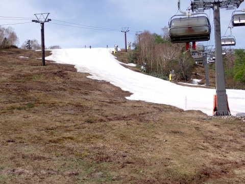
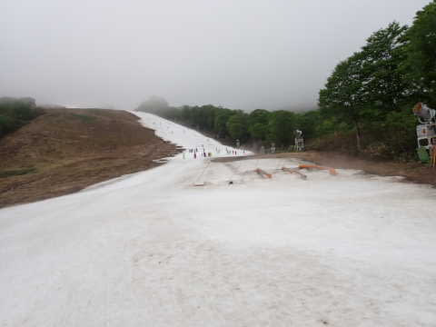

# 2023/5/21(日)かぐらスキー場ファイナル，速報レポート！…かぐら営業最終日はリフトは混まなかったけど，ゲレンデはかなりひどい状況だったよ(泣)

📅 投稿日時: 2023-05-22 01:30:32

🏷️ カテゴリ: [2023スキー滑走日記](cd943df30cfcc3d0896469e2ff98720cd.md)

ということで．

今日はかぐら営業最終日だったわけですが…

予告通り，かぐらファイナルデーを滑って

きました～！！

で．

いつも通り今日も帰宅が夜遅かったので，

本日のかぐら，速報モードにて…

まず．

今日はそれほどあさイチのロープウェイも

混んでおらず…

営業開始時に並んでいた人は，ロープウェイ

3-4便までに全員乗れる程度の人数．

あさイチのゲレンデは…

晴れてガラガラ！！

ただ…

コース幅は先週に比べ，かなり狭く

なりましたね（涙）

でも，まだこれだけの幅があるだけ

マシかな？…と思いつつ．

うーん．

でも，雪が薄そう…

これ，午後になったらヤバいかも？

あさイチはまだフラットなので，

この幅でもまだそこそこ気持ちよく

滑れました…

リフト待ちは終日ほぼこんな感じで，リフトは

ガラガラだったけど．

高速クワッドリフトで幅の狭いコースに

人を送り込むので…

午前10時前には，ゲレンデはかなりの

人口密度に（涙）

この人口密度で掘削が行われた

ゲレンデは…

昼前にはすでに，すごいことになり始めて

きました…（涙）

当然，午後に向けてはさらにひどくなって

いく一方で…

1時過ぎには，コース幅いっぱいにブッシュやら

小石やらが出るようになってきちゃって．

どこを通ればいいのやら，という状態に（泣）

その上，午後2時半ごろにはガスも出始めて

きて…（涙）

スキーを楽しむというより，

ガスで見にくい中，土と泥を避けて

なんとかリフト乗り場にたどり着く

という営みを繰り返す状態に…←それでも滑るのね

それでも，今日がかぐらファイナル．

これで，あと残るは月山のみ．

これからは，そうそう簡単には滑りに

行けないことを考えると…

こんな中でも，今日のうちに滑っておかねば…

と．

ついついラストまで滑り続けてしまった

のでした…

ってなことで．

本日にて，かぐらスキー場も営業終了です！

いやー．

最後はかなり厳しかったけど．

よくもまぁ，営業終了予定日まで

ちゃんとコースを維持したもんだ…

かぐらスタッフの皆様，お疲れ様でした！

…気力があれば，かぐらファイナルデーの

詳細レポート，明日の記事で書きます…

## 💬 コメント一覧

### 💬 コメント by (mhojo_2007)
**タイトル**: Unknown
**投稿日**: 2023-05-22 02:00:50

月山夏スキ～リポートを待ってます。

### 💬 コメント by (Skier_S)
**タイトル**: >mhojoi_2007さま
**投稿日**: 2023-05-24 01:39:47

コメント回答遅れました～！

ちょっといろいろバタバタしているので，月山に行けるのは6月2週目以降になりそうですが，

月山も雪がものすごい勢いで減っていて，もうそろそろ沢コースも終わりそうという

噂なので…

うーん．月山，今シーズンは行けても1回だけかも？？

