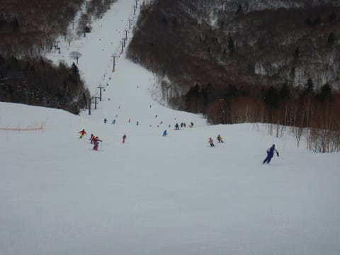

# 2020/3/8(日)の志賀高原スキー場，速報モード！…朝は雪降り，昼前から曇り空．気温は高かったけど，雪はそんなに悪くならなかったよ！

📅 投稿日時: 2020-03-09 01:00:07

🏷️ カテゴリ: [2020スキー滑走日記](c282e9230de179e245c7334eabeb0a3b3.md)

ということで．

今日もラストリフトまで滑った後に帰宅して．

また，洗車やら片づけやらでこんな時間に…（涙）

金曜夜は1時間しか布団で寝れなかったのに，

昨日も夜遅くまで飲んでしまったために

睡眠5時間と，2日合わせても布団では

6時間しか寝てないという，いつもの

睡眠不足状態なので．

さすがに眠いです…（泣）．

だもんで，日曜深夜恒例，

本日の志賀高原レポート，速報モード！

…まず．

パラパラと雪が降る天気で

始まった本日．

あさイチのゲレンデは…

そうです．

シマシマっ！！

それも，結構締まった感じなれど

硬すぎず．

スピードが乗るのに，いい感じに

エッジが食い込む，いい感じのバーン！！

いやーー！！

いいよ！

これはかなり楽しい感じのシマシマバーンだよ！！

…と，ウホウホ言いながら滑ってたけど．

やはり，8人乗りの第1ゴンドラが，

コロナウイルス対策で4人乗りに

制限されている影響により．

…朝9時過ぎに，早くもゴンドラに

列が…（涙）

一見，列が短いのでそんなに待ち時間が

無いように見えますが．

輸送力が半分に落ちているので，

列の進みは遅いです…（涙）

そして．

コース上の人口密度もちょっと上がって

きてしまいました（泣）

さらに，朝10時前に，焼額のゴンドラ

待ちが10分程度に伸びてしまったもので…

今日も奥志賀へ脱出！

今日は昼間の気温がプラスにまで

上がっちゃったけど．

曇り空で日が射さなかったので．

奥志賀のリフト沿い，エキスパート

コースは，昼を過ぎても結構

いい雪質のまま！

気温が高いにもかかわらず，

予想以上にいい雪質のエキスパート

コースを，喜んで滑っていたけど．

…しかし．焼額のゴンドラ混雑から

逃げてきた人が多かったのか，

奥志賀は普段より人が多めの感じで．

時折コース上の人口密度が

高くなることも…（涙）

だもんで．

午後1時ごろに，ホームゲレンデの

焼額に戻りますが…

…なんだ！

午後の焼額，ゴンドラはガラガラじゃ

ないですか！！

もっと早くに戻ってくれば

良かった…（ちょっと残念）

そして．

第1ゴンドラが4人乗車に制限されて，

いつもよりコースに送り込まれる

人が少なかったからか．

しっかり締まった圧雪バーンの

GSコースはそれほど荒れず，

午後までフラットなんですが！！

いや，午後の焼額．

コロナウイルス騒ぎでもともと

人が少な目というのもあるのか．

ホントにガラガラ！！！

ってなことで．

今日の午後は，

気温は高かったものの．

日が射さなかったおかげで，

いい感じの雪質をキープした，

ガラガラゲレンデを，

思う存分，思うがままに

満喫したのでした…！

いやーー．

良かった．

この週末，ゴンドラが混んだのは

残念だったけど．

結構楽しめた週末だったかな．

ってことで．

詳細レポートは，また明日！

PS.月曜は予想通り高温の晴れで，

　雪は4月並みのザブザブになりそう（涙）

　そして火曜は…やっぱり液体が降る

　一日になりそう（泣）

## 💬 コメント一覧

### 💬 コメント by (m&t)
**タイトル**: Unknown
**投稿日**: 2020-03-09 16:31:31

昨日は奥志賀にメンバー大集合でしたね!1ゴン終礼も楽しかったです。志賀高原に行く時の定番になりました。（3高終礼も）

Sさん程使い込んで無いにも関わらず、家に帰ったらスキーウェアに穴が空いていました!物欲選手権参戦か?

また、土曜日に行く予定です。（最近東館某所でお会いする事が多い気が・・・。）

### 💬 コメント by (レインボー)
**タイトル**: Unknown
**投稿日**: 2020-03-09 19:25:52

皆様、土日はプチにご参加、ありがとうございました。面白かったですねえ。なおちゃんがカッコ良すぎる。年中の子にもやさしかったし。

それでは本日月曜日の志賀高原情報です。

朝一のパノラマ、カラマツは、柔らかめだけど、勿体ないくらい快適。次のオリンピックも然り。すぐにＧＳから奥志賀へ。山頂気温はすぐに5度。やばい。急がなくては。

緩む前にとエキスパート。良すぎて空いてて桃源郷。

でも、10時20分に緩斜面で初ブレーキ。三高で遊んでからのダウンヒルが信じられない。強力な妖怪足つかみが上から下まで出現。挙げ句は頼みのカップ麺が売り切れ。

その後、三高で遊んでの帰路、サウスがまたひどかった。

高天の温度が8度。蓮池が10度。

午後4時の湯田中は19度。

明日はてるてる坊主が必要かと。

### 💬 コメント by (Skier_S)
**タイトル**: 9，10日は超高温（涙）
**投稿日**: 2020-03-10 10:09:49

＞m&tさま

駐車場終礼までご参加お疲れ様でした～！

大体終了後はあんな感じなので，ぜひ今後もご参加を．

スタートも1ゴンなら，朝礼にも参加できますよ(笑)．

しかし，ウェアに穴？？

パンツじゃなくジャケットですか…？

それは直ちに物欲発動ですね(笑)．

また焼額（の東館某所？）でお会いしましょう～！

＞レインボーさま

土日はお世話になりました～！！

いろいろありがとうございました．

…でも，月曜志賀高原，10時過ぎからは予想通り，

悲惨だったのですね…

今日もダメダメな雨の天気ですが，水曜は吹雪（ゴンドラ止まるかも…）で，

冷えた雪が積もります！

木曜以降に期待！

