# 2018年8月，モアルボアルで小5の娘をダイバー化！その17…ダイビング最終日，スタート！

📅 投稿日時: 2019-08-02 01:21:48

普段であれば．

スキーシーズンが終わった夏は，

運動量が下がって，スキーシーズンに

落ちすぎた体重がもとに戻っていく時期なのに．

なぜかこの夏．

スキーシーズンが終わった夏に，

さらに体重が下がっていくという

危険な事態に陥ってます…！！

週2～3で飲み会をやっているので，

太りそうなものなのですが．

普段の平日は．

ご無体仕事のせいか，食事をゆっくりとれない

日が多いので．

夏なのに，だんだん痩せていくという

ヤバい状況です（涙）

ヤバい．

来シーズンのスキーシーズンインまでに，

何とか体重を増やさなければ！！

…と，ダイエットを必死にやっている人から

恨みビームを浴かねない状況ですが．

とりあえず，[スキーダイエット](edd0452732278bcfc87b9419cd5bf3f1e.md)以外にも．

仕事ダイエットってのがあるんじゃないか…？？

と思う今日このごろ．

とりあえず，今日もダイビング日記です．

では，どうぞ～！

ーーー

ということで．

ダイビング3日目の朝が来ましたが…

…今日がダイビング最終日．

早い．時のたつのが早すぎる…

で．

朝起きて．

部屋から外を見ると…

…今日も天気が悪いよ…（涙）

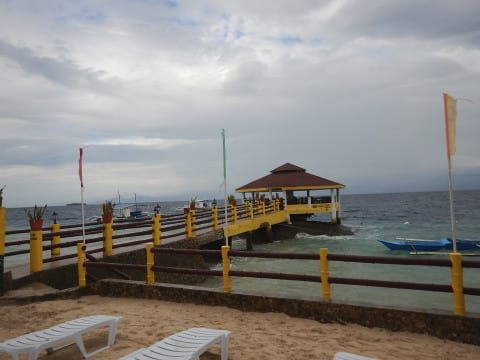

曇り空で，風も強いので．

今日も朝ごはんは，テラス席ではなく

レストランの中で食べます…

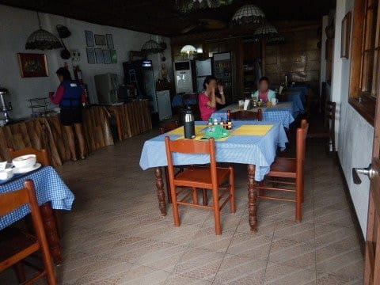

今日もアメリカンブレックファーストですが．

いつもの目玉焼きじゃなく，

スクランブルエッグにして，

ちょっと目先を変えてみました…

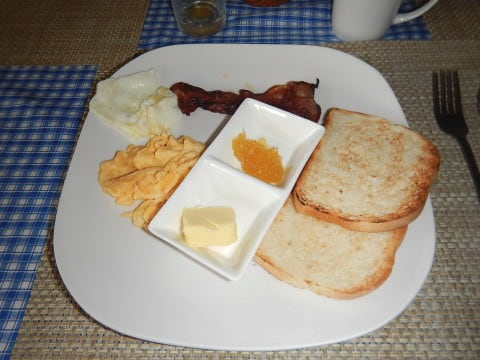

しかし．

今回は，

せっかく海が目の前に見える

部屋に泊まれたというのに…

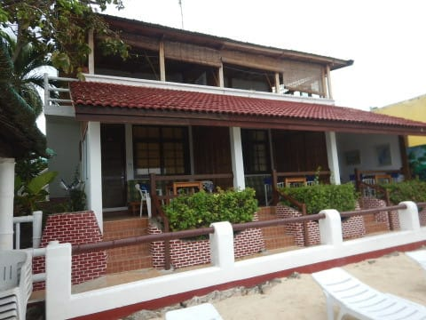

曇り空で，風が強く．

あんまりきれいな海が見れないのが

残念…

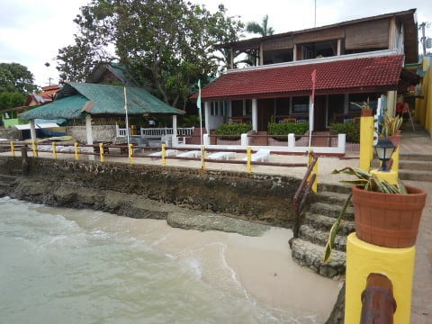

ってなことで．

いつも通り，朝ごはんを食べ終わったら．

いつものホテルの前の道を歩いて…

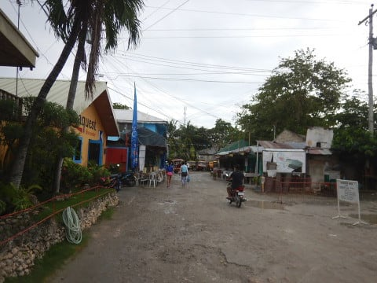

朝8:15にダイビングショップに集合！

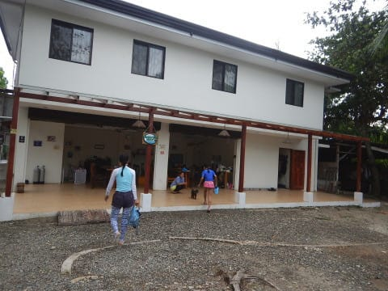

そして，ウェットスーツを着こんだら，

ボートに乗り込みますが…

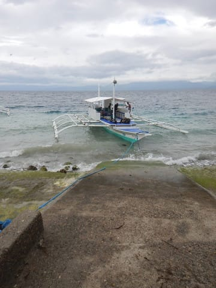

…どんより曇った，今にも雨に

なりそうな天気ですね…（涙）

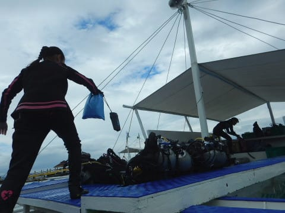

ということで，ボートはショップ前を

出発しますが，

数10m動いただけで，すぐボートは

止まります…

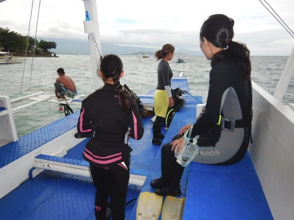

つまり．

今回のポイントは，ショップ目の前，

ハウスリーフ．

そうです．イワシポイントです！

ってなことで．

今回は娘にとって，初のファンダイブ！

娘もファンダイブ組に混ざって，

ブリーフィングを聴いてますね…

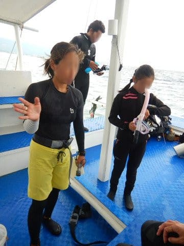

で．

今回．

ジュニアオープンウォーターの娘は，

最大深度11mという制限があるので，

昨日まで娘の実習をしてくれた

アサミさんをガイドとして，

我が家の3人を特別に1チームに

してくれました～！

なので，他のファンダイブ組の

メンバーのエントリーを見送って．

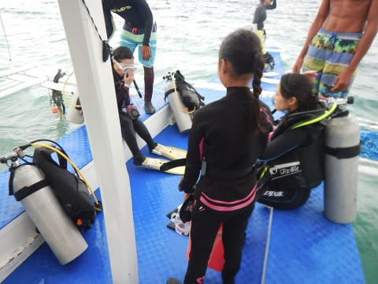

そして，その後．

我が家3人チームで，

イワシポイントへエントリーです！！

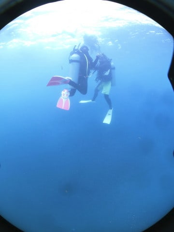
