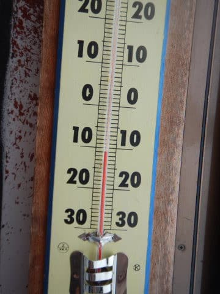

# 2022/2/11(金・祝)の志賀高原スキー場は…曇り～雪降りで結構寒かった一日．ゴンドラ30分待ちとかなり混んだよ(涙)

📅 投稿日時: 2022-02-12 00:43:00

ってなことで．

本日，朝遅め出発してスキー場に向かった人は，

横川SAとかの高速チェーンチェック渋滞で

数10分かかったようですね…

そして，志賀高原の登りの積雪はいつもと

変わらないレベルだったけど，車が多めで

いつもより時間がかかったようです…

でも，朝かなり早めに出てきた私は，いつもの

所要時間とそれほど変わらず到着できました～！

ってな感じで．

しっかりマージンを見て出てきたため，

7時半ごろに焼額についてしまった私．

うーむ．

…このまま通常営業開始まで1時間待つのも

もったいない！

と，大枚1500円を払って，朝7:50からの

ファーストトラックに参加しちゃいました～！

さすがファーストトラック，人がいないんだけど…

今日は山頂付近がガスっていて視界がちょっと

イマイチ…（涙）

でも，あさイチの気温は-11℃とかなり低めで…

見事な冷え冷え，シマシマ！！

今朝まで降り続けていた雪が圧雪された，

かなりやわらかめだけど…

ヤケビクオリティーのシマシマ！！！

今日は3連休で混むはずだから…

ファーストトラックのうちに，思いっきり

このシマシマを楽しむのだ！！

朝のうちは一瞬天気が明るくなることが

あったものの…

でも，今日は基本的にうす曇り～

雪降りの天気の一日．

だけど，かなり冷えていて，最高気温も

-5℃程度までしか上がらなかったので，

終日雪質はやわらかくて良かったですよ～！！

…なんだけど．

本日，スキー場スタッフのコロナ感染疑いにより，

焼額は第2ゴンドラ，第3高速，第4ロマンスが運休（涙）

動いているのは，第1ゴンドラと第2高速の

2本のみという状況（泣）

（第2ゴンドラに続くコースはクローズ中）

だもんで，朝9時前からゴンドラが早くも

ゲートを越えて並び始め…

さらに，第2高速リフトもかなりの列になって

きたかと思うと…

うげげげげーーー！！！

10時になったら，第1ゴンドラがすごい列っ！！！

なんだこりゃ！！！

うむ．

フル乗車できるなら20分待ちってところだけど．

基本，相乗りOKの人以外はグループ限定乗車で，

1人や2人しか乗ってないゴンドラもある

状態では…

この列だと，40分以上待ちそう…

だもんで．

1ゴンの待ち時間が10分を越えると焼額の

呪いが解けるという設定の私は，

何のためらいもなく一の瀬へワーーープ！！

…ただ．

志賀高原中央エリアも，濃厚接触疑いや何やらで

人員不足が続いているらしく．

寺小屋は営業していなかったり，

朝に圧雪がかかってなかったりで…

ダイヤも一の瀬ファミリーも，大変残念な

ボコボコバーン（涙）

そして，ゲレンデの人も多めで…

リフトの列も結構長めでした（泣）

高天ヶ原は，それほど混んでなかったけど…

でも，圧雪が朝ではなく，昨晩のうちに

やったのか，昨晩から積もった10㎝ほどの

新雪がぼこぼこになったバーン（泣）

あ，上の写真は晴れてるように見えますが，

日が一瞬射しただけで．

その直後は，こんな感じで雪がぱらついて

ました…

ってな感じで．

圧雪がいまいちで，大変残念ながら全面

ボコボコだった中央エリアより，

多少リフト待ちがあっても，フラットバーンの

焼額の方がいいよね…と．

やっぱり焼額に戻ってきました．

浮気してごめんね…っ！！

やっぱり，焼額の圧雪クオリティー，

中央エリアより圧倒的にいいですね～！

雪もいい感じ！

残念ながら，午後になっても，焼額第1ゴンドラの

列は伸びてましたが…

これで10分くらい．

このくらいなら，まだ待てるかな…

ゲレンデの人も，先週までと比べれば

多めとはいえ…

第2ゴンドラと第1ゴンドラが両方満員で

人を送り込むのに比べれば，混んでないかな．

まぁ，まだ許せるレベル．

そして，うれしいことに．

本来なら15:45までの第1ゴンドラの営業時間が，

混んでたからか，16:00までに延長されました！

最後はちょっと雪の降りが強くなったりも

しましたが，今日もしっかりラストの

16時まで滑ったのでした…

うーん．

この3連休，思ったより混みそうだなぁ…

明日は3連休中日だし，絶対今日より混むよなぁ…

…

…そんな時は．

混まないナイターで滑っておきましょう！！

焼額の2ndシーズン券を買ってしまったので，

ナイターも滑り放題！

うはははははは！

あさイチのファーストトラックに次いで，

今日2回目のシマシマを堪能するのだ！！

…ナイターも普段より人は多めだったものの．

搬器1-2台待つ程度．

雪質も冷え冷え最高で，ナイターもしっかり

ラストの8時まで滑り倒してきたのでした…

ってな感じで．

今日はかなり混みましたが…

がらがらのファーストトラックと

ナイターの両方をたっぷり満喫したから，

昼間が混んでても我慢できたのだ！←ファーストトラックからナイターまで滑り続けた，「終わった人」ということなのでは？？

でも…

明日は天気もよさそうだし．

3連休中日ってこともあって，

もっと混みそう…（涙）

明日は第2ゴンドラが運転再開して

くれるようですが．

第3高速や第4ロマンスは止まったままなので．

うーん．

かなりリフト・ゴンドラ待ちを

覚悟した方がよさそう（涙）

## 💬 コメント一覧

### 💬 コメント by (新米パパ)
**タイトル**: Unknown
**投稿日**: 2022-02-12 05:06:09

コロナによる人員欠員でリフト、ゴンドラ運休とは。。

来週末は金曜から行きますんで、ファストラックも初体験できるかも。

本日はたんばらでしたが、気温はあがらなかったものの晴天で重めの雪が午後にはモッサモサで退散しました。

ヤケビの雪質と圧雪の素晴らしさを再確認した1日でした。

### 💬 コメント by (テッピー)
**タイトル**: 教えて下さい
**投稿日**: 2022-02-12 13:55:47

いつも楽しく拝見しております。この連休はSさんと同じく志賀高原に来ています！昨日は当方、横浜を5時に出発し、友人を拾ってから向かったのですが、関越の事故渋滞と横川のタイヤチェックにドハマりし、1時間以上はロスしました。Sさんは、どの辺りから何時頃出発されているのですか？次回、回避の参考にご教授下さい。

### 💬 コメント by (レインボー74)
**タイトル**: Unknown
**投稿日**: 2022-02-12 14:56:32

土曜日の志賀高原情報

朝の上林-5℃　蓮池-10℃。天気はいい。

奥ゴンが週末は8時開始。すぐにエキスパに行くと、そこはまさにパラダイス。夢中でエキスパ回し。そのうち少し荒れてきたので移動。三高上では、太陽の周りに円形の虹が！

珍しいです。

ダウンヒルもすでに荒れてた。

そ、し、て、奥ゴンには長蛇の列！

速攻で帰宅しました。なんという根性のないメンバーでしょうか！

### 💬 コメント by (Skier_S)
**タイトル**: 今日は混んだよ…
**投稿日**: 2022-02-12 23:55:54

＞新米パパさま

来週は金曜からですか…

ファーストトラックもチャレンジしてみてください…

ヤケビの圧雪はやっぱりクオリティ高いです．

＞テッピーさま

我が家は，神奈川県の圏央道のインターから15分ほどですが…

家は3時から4時の間に出ています．

志賀まで4時間半ほどです~！！

＞レインボー74さま

今日もお疲れさまでした．

土日は奥志賀スタートが正解かも…

また明日，よろしくお願いします！

### 💬 コメント by (ikkun)
**タイトル**: Unknown
**投稿日**: 2022-02-17 03:55:26

お話ししたか？クリスマスからの年始に掛けて五日間のリフト係員アルバイトでした  やはり人が足りない？とか？コロナでまたと要請が来たよと 一週間分位出したら……二人程アルバイト来たので と中止になりました  お金になるから大変だけどなのでした

### 💬 コメント by (Skier_S)
**タイトル**: ＞ikkunさま
**投稿日**: 2022-02-18 02:38:22

最近コロナでスタッフ不足のスキー場が多いようですが．

リフト係員のアルバイトも大変そうですよね…

