# 2015シーズンモデルの試乗レポート，第2弾スタート！

📅 投稿日時: 2014-04-16 01:41:44

🏷️ カテゴリ: [スキー板試乗](c0bd8048615710cee890e403a36cc9a2b.md)

えー．

実はですね～．

…4月5，6日の志賀高原で．

また，試乗会に参加してきてたのでした～！

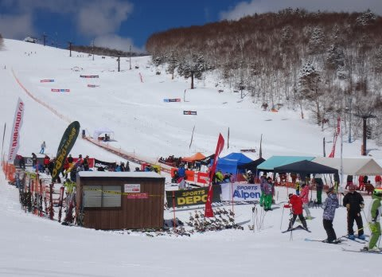

…先週は，赤い靴のレポートがあったので，

試乗会のレポートが1週間遅れてしまいましたが．

先週，赤い靴のレポートを必死に詳細に書いたわけは，

前回の試乗はSALOMONブーツでやったけど．

今回の試乗は[ATOMICブーツ](e49ba60ca83abf037c6421d52c585d288.md)でやってますよ～，

試乗ブーツが変わったよ～，

ブーツによって，板の印象は変わってるかもよ～，

…ということを，お知らせするためでも

あったわけなんです…．

個人的にも．

ATOMICブーツになって，評価が良くなる板・悪くなる板の

傾向は変わってしまうのか…？

…

…ってのは，興味津々であり．

今回，あえて前回と同じ板に乗ったりもしています．

…って感じで．

試乗コンディションは…

[土曜は晴天](ea38761b84f06485d49df8d6a52e965bb.md)，

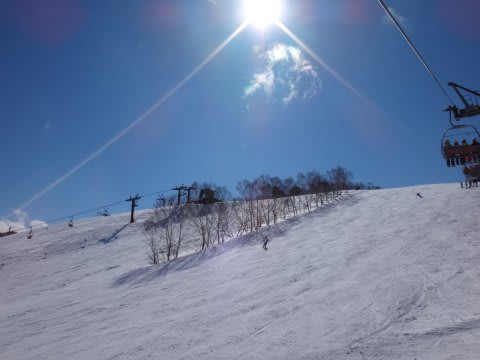

4月にしてはいい雪なれど．

午後はちょっと柔らかいぼこぼこ雪で，

下地がアイスバーンという難しめの状況．

[日曜は曇り～雪](ea5fd77e4ebf604e6328fdb3a568eafb1.md)，

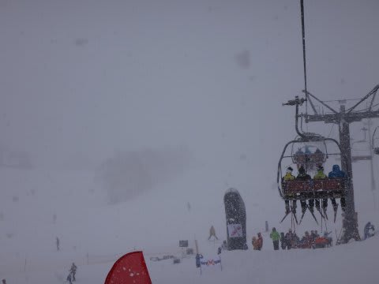

4月と思えない新雪がばふばふ積もっていく…

というコンディションの中での試乗でした．

というわけで．

土日の2日間続けて，

乗りに乗ったり19種類！

ATOMIC BLUESTER DOUBLEDECK 3.0 SC 165cm

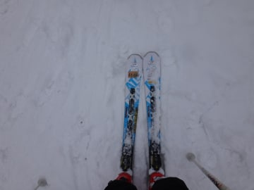

ATOMIC BLUESTER DOUBLEDECK 3.0 SX X12TL 165cm

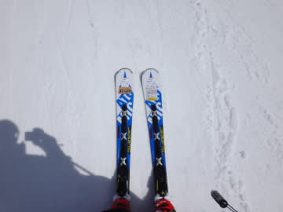

OGASAKA TC-MZ (RC600FL) 172cm

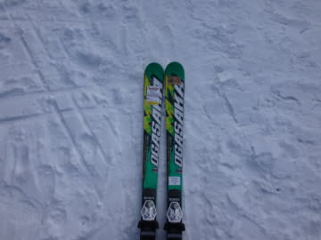

OGASAKA TRIUN SL (RC600GR) 165cm 

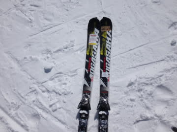

NORDICA DOBERMANN SLR 165cm

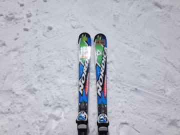

NORDICA DOBERMANN SPITFIRE EDT 168cm

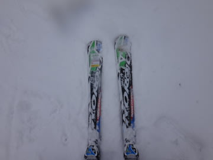

BLIZZARD SRC RACING S 165cm

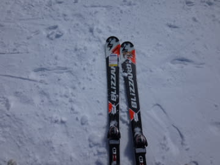

VOLKL PLATINUM GD SPEEDWALL 175cm

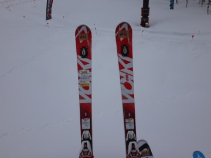

VOLKL PLATINUM SD SPEEDWALL 160cm

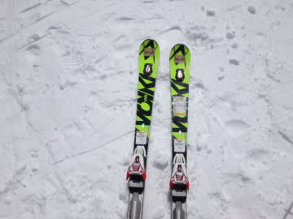

VOLKL PLATINUM SW SPEEDWALL 173cm

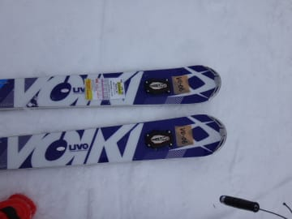

SALOMON X-RACE X16 165cm

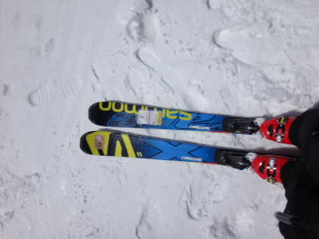

SALOMON X-RACE Z12 170cm

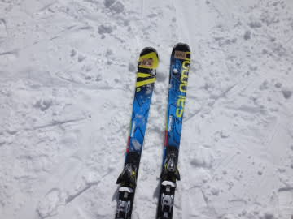

SALOMON X-Kart Max 164cm

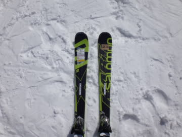

HART C9.2MT 168cm

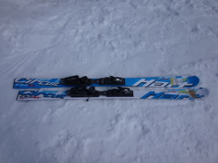

HEAD i.Supershape Magnum

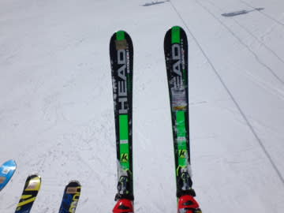

ROSSIGNOL DEMO ALPHA SOFT TPX 162cm

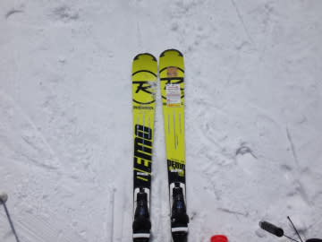

FISCHER RC4 WC RC PRO RACE BOOSTER 180cm

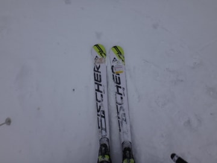

ELAN GSX FUSION 176cm

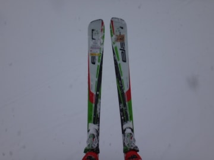

DYNASTAR CR DEMO 65 R20 RACING 165cm

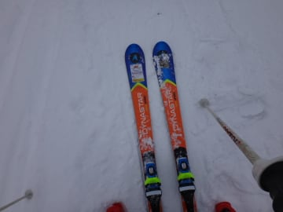

って感じで．

テク・クラも，指導員資格も何も持っていない，

単なるレジャースキーヤーの，無責任な個人的

インプレッション．

…明日以降，また続きますので，よろしく～！

## 💬 コメント一覧

### 💬 コメント by (マルハバ)
**タイトル**: アルペンの試乗会・・・
**投稿日**: 2014-04-16 10:40:14

3月末のアサマ2000で参加してきました。

私の試乗した板も何台か混ざっているみたいなんで

レポート楽しみにしております。

### 💬 コメント by (Skier_S)
**タイトル**: マルハバさま
**投稿日**: 2014-04-16 23:49:29

お，試乗会行ってきましたか．

同じ板を試乗されたんですね…

私の印象はあまりあてにならないので（笑），

私のレポートと自分の印象とは

違うかもしれません…

とりあえず，これからお楽しみに！

