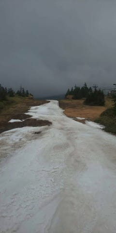
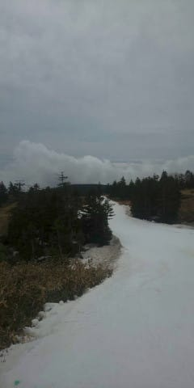
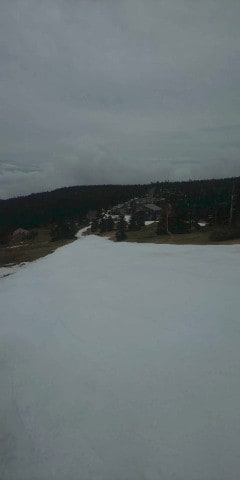
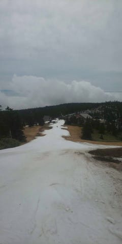
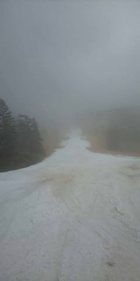
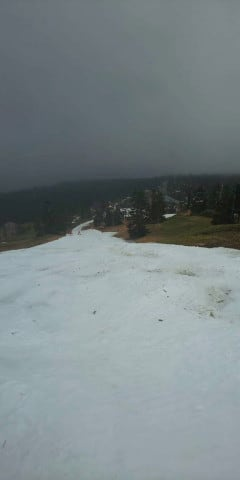
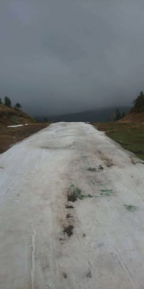
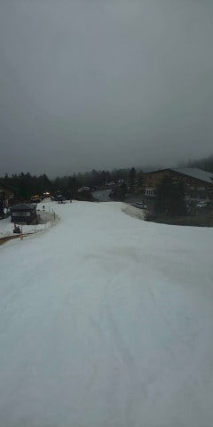

# 5月31日（日）の志賀高原，渋峠スキー場の様子を特派員の方からの写真で…そして本日で志賀高原すべて終了（涙）

📅 投稿日時: 2020-06-02 01:26:24

🏷️ カテゴリ: [日記](cc4b5682fb7b8b144980957a978653fb0.md)

えー．

この週末ですが．

土日ひたすら，SpaceXのCrew Demo2の

打ち上げからドッキングまでのライブを

見続けて終わってしまいました…

しかし．

クルーの搭乗からLaunch，その後の運用から

ISSのドッキングまで，全てをYoutubeのLIVEで

見れるなんて…

いい時代になったもんです…

この，SpaceXのロケット，ファルコン9．

1段目のロケットの再利用をするって

聞いた時は．

「無理だろ…」

と思ったけど．

1段目ロケットの，ドローン船への着地も

成功したし．

（着地の瞬間，映像が途切れたのが惜しい…）

そして，ISSとのドッキングも無事成功したし…

テスラのイーロン・マスク氏が，

ロケットの会社を作って，有人宇宙

ミッションをやる…って聞いた時は

「無理だろ～！！！」

と思ってたけど．

まさか，ホントに宇宙ステーションに

人を送り込んでしまうとは…！

Crew Dragonがドッキングしたのは，

水色の矢印で示した，ISSのハーモニー

モジュールですが．

H2Bロケットで打ち上げられ，5月26日に

ISSにドッキングしたばかりの日本のHTV9，

愛称「こうのとり9号機」が，

ハーモニーモジュールの下側，

赤矢印の先に見えてますね…

（こうのとり9号機のキャプチャーも，ライブ放映

　されてましたね…）

こんなものをライブで見られるとは．

ホントにいい時代になったものよ…

（打ち上げ前後のみ，[ここで見れます](https://www.youtube.com/watch?v=xY96v0OIcK4)）

…ってなことで，本題へ．

（いつも通り，前フリが長すぎる…）

6月1日の本日．

ついに，

志賀高原の渋峠の営業が終了

してしまいました…（涙）

いや，まぁホントに．

1日だけとはいえ．

よく6月までもったもんだ…

最終日の前日，5月30日（日）の渋峠の写真を，

特派員の方が送ってくださったので．

今シーズンラストの特派員のスキー場写真です！

…特派員の方は，早朝から参戦された

ようですが．

早朝は硫安が効いて硬かったようです…

このあたりは，まだコース幅も

そこそこあるみたいに見えますね…

朝のうちはほんのちょっとだけ

リフト待ちがあったようですが．

写真には全然人が写ってませんね…！

そして，昼前から，ガスが出てきて…

2時ごろからは，残念ながら雨に

なったようです…

ただ，その雨もじきに止んだよう

ですが．

でも，コース上の雪は，もう結構

やられちゃった感じですね…

とはいえ．

ホントによくここまでゲレンデを

維持し続けたものです…

…できれば今シーズン中に，再び志賀で

滑れることを祈っていたんですが．

それもかなわぬまま，志賀高原の

スノーシーズンが終わってしまいました…（涙）

しかし．今シーズン．

私が滑りに行っていた3月末までは，

記録的暖冬・少雪で，気温が異常に高めの

日が続いたというのに．

私が滑りに行けなくなった4月以降，

奇跡の4月

と呼ばれ，例年以上に冷えまくって，

雪が例年より長く残ることになるとは，

一体どういうことだ！？？

出来れば，

私が滑れるときは冷えてパフパフパウダーで，

私が滑れないときに暖冬小雪になって

欲しかった…←なんと自己中な…

私の日ごろの行いはすごくいいはずなのに，

なぜこんなことが起きるのか…（涙）←いや，どう考えてもあなたの日ごろの行いが悪いから

## 💬 コメント一覧

### 💬 コメント by (西館)
**タイトル**: Unknown
**投稿日**: 2020-06-04 07:00:20

宇宙！ブログ間違えたかと焦って確認してしまいましたΣ(・∀・Ⅲ)

西館sは種子島宇宙センターの横の海岸でライセンス取ったんです。懐かしいなぁ先生元気かしら。冬は漁師してるとおっしゃっていました。もしライセンス取得考えてる片面がいたらお勧めです。

志賀高原の今シーズンスキーはいよいよ終了したんですね。寂しいなぁ。特派員の皆様、本当にありがとうございました。

でもお別れはしませんよ、待ってて志賀高原、蛍見に行くからねﾌﾘﾌﾘ((ヾ(･д･｡)ﾏﾀﾈｰ♪

### 💬 コメント by (西館)
**タイトル**: Unknown
**投稿日**: 2020-06-04 07:02:45

あっ！超絶恥ずかしい書き損じ発見!!

ライセンス取得考えてる方がいたら、でした。

慣れないスマホで書いてるもんで。あはははは

### 💬 コメント by (いちと)
**タイトル**: Unknown
**投稿日**: 2020-06-04 18:00:05

今シーズンお疲れ様でした

来シーズンは、どうなるんでしょうか？

特に志賀高原は、体育会系の宿が多いので、3蜜ですよね

いつもふるさと納税で貢献しつつ、宿代を浮かす作戦でしたが、今年はギリギリ迄悩む事にします

### 💬 コメント by (Skier_S)
**タイトル**: ロケット大好き
**投稿日**: 2020-06-05 01:46:27

＞西館さま

ブログ間違えたかと思いましたか（笑）．

私は乗り物なら何でも好きなので，ロケットも大好きです…

しかし，種子島でCカードですか！

私も種子島は1回潜ったことがありますが…

ショップも少ないし，あまり初心者が潜る海ではない気が…

＞いちとさま

来シーズンは，無事コロナ騒ぎが収まって，普通に

滑れるといいのですが…

イチゴンの乗車定員制限が続いたりしたら痛いです（涙）

