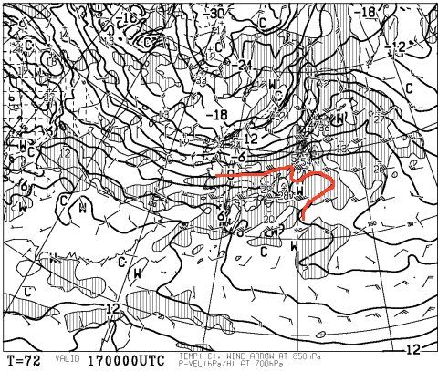
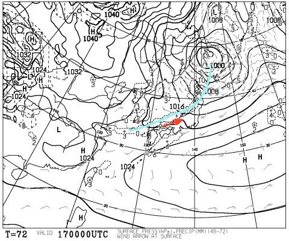
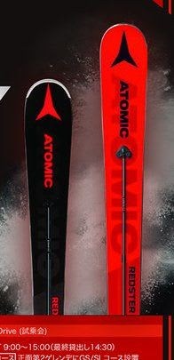
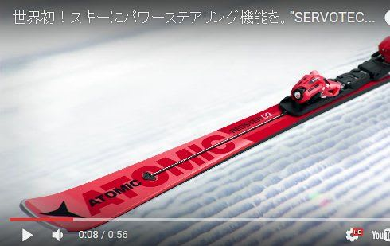

# うむ？早くも2018シーズンのATOMICのスキー板の情報が出てきたけど…完全に変わりますね…

📅 投稿日時: 2017-02-15 01:41:29

🏷️ カテゴリ: [スキー雑談](c1f9d2cb7478308da16419928ea3945e9.md)

やはり．

17日の金曜日．

850hpa図は，こんな感じで．

0℃線は志賀高原より北側に行ってしまっていて．

志賀高原でも「降れば雨」という，

危険な高温デーになりそうですが．

しかし．

地上天気図はこんな感じで…

心眼で見れば，水色の線を引いたところに

寒冷前線が見えるのですが…

寒冷前線，見事に東西に延びた形になってます．

このため，前線南側は，矢印で描いたように西風に

なりますね～．

そのため．

前線通過前に，ひどく暖かい南からの風が吹き込む

ことはなく．

志賀高原は，前線が通過して冷たい北風になってから

降り始めるパターンだと思うので．

金曜日は雨にならないだろう…と，安心している今日この頃．

皆様いかがお過ごしでしょうか．

…とりあえず．

また明日，定番の週末天気予想やりますので…

ってことで．

本題へ．

えー．

出ましたね．

出ました．

そうです．

アトミック公式サイトで，[来シーズンのスキー板の予告](http://skiblog.atomicsnow.jp/2017/01/servotec-091b.html)が出たのですが…

うむむむむ！！？？

なんだか．

エキスパート向けトップモデル．

全く変わるようですね…

トップモデルの小回り用．

Bluester DEMO SXという名称のモデルは無くなって．

Redster S9iというモデルになるようで…

この，黒いほうが国内限定のRedster iシリーズ．

赤いほうが競技用のRedsterのようです…

Bluester DEMOというシリーズが消滅してしまうのか…

これまで5シーズン愛用した，SXが消えてしまうのは

ちょっと心配ではありますが．

とりあえず，日本限定モデルらしい，「i」シリーズ．

そのなかでも小回り用のS9i，期待したいところ．

ちなみに，来シーズンのiシリーズの，

すごく目立つ変化としては．

こんな感じで，「SERVOTEC（サーボテック）」

という機構が付き…

（http://skiblog.atomicsnow.jp/2017/01/servotec-091b.htmlより引用）

10年近く続いたDouble Deck構造はおしまいになるようです．

Double Deck構造で板の上についていた，アッパーデックは無くなって．

…板の上細い棒がついた構造になってます．

この棒の先．ビンディング下に，ダンパーみたいなものがついているようですが…

これって，20年くらい前の，SALOMONのProlinkに近いかも（懐かしい…）

で．

その他の変化として．

[このページ](http://skiblog.atomicsnow.jp/2017/01/servotec-091b.html)の中身を引用すると…

★ロッカー形状を排除します！

操作性の良さを考慮し、従来スキーの主要スペックとなっていた

ロッカー形状（板の反り）スキーですが、

 SERVOTEC（サーボテック）搭載により、操作性の概念も

打ち砕きます。

SERVOTEC（サーボテック）による新たなるフルキャンバー時代の到来です！

…あ，そうですか．

ロッカーは排除されちゃうんですね（笑）

フルキャンバーですか…

…しかし．ロッカー時代，終わったんですね…

短いブームだった…

★FULL SIDEWALL（サンドウィッチ構造）を採用します！

スキー本来のしなやかさと強さを十分に発揮してくれるATOMICの

FULL SIDEWALL構造は、FISモデル、プロパーモデル、DEMOモデルの

全てに採用されます。よりたわみやすく、より効率の良い

パワー伝達を可能にしてくれる新構造になります。

…そして，サンドイッチ構造ですか…

キャップ構造のコントロールデック＋ロッカーという，

これまでのD2構造のすべてを

根底から完全に否定しましたね…（笑）

ということで．

これまでの方針を全否定大きく変更して．

スキーの原点．

フルキャンバー＋サンドイッチ

という，非常にクラシカルな構造に戻った，来シーズンのATOMIC．

どんな板なのか，早く履いてみたい…

## 💬 コメント一覧

### 💬 コメント by (びわ湖)
**タイトル**: Unknown
**投稿日**: 2017-02-15 15:22:06

S様 お疲れ様です。シーズン中盤を迎えていますね。私も完全燃焼で終わりたいものです。

SXも5年目になり購入の虫が騒ぎ出しています。

S様のレポートは今年はいつも以上に詳細に期待しています。ブーツも新しく出る様でセットで

20万コースですね。残業頑張ってください。

### 💬 コメント by (れお)
**タイトル**: おお!! 出ましたね〜
**投稿日**: 2017-02-15 15:31:59

これは、Sさんの試乗レポート楽しみですね。

期待してます〜！

VARビンディングも使えるんですかね〜

### 💬 コメント by (しんちゃん)
**タイトル**: 試乗レポートに期待
**投稿日**: 2017-02-15 22:30:19

私もスキージャーナルで知りました。

ATOMICの他、太板も含めて試乗レポート忙しくなりますね。楽しいレポート、期待しています。

### 💬 コメント by (Skier_S)
**タイトル**: 試乗会，いつ行こう…
**投稿日**: 2017-02-16 06:37:52

＞びわ湖さま

お久しぶりです！

そちらもSX5年目ですか…

ATOMIC，ブーツも変わりますね！

…20万コースはさすがに無理ですが（笑）

また，試乗レポートやると思いますので

お楽しみに！

＞れおさま

写真を見ると，TLビンディングに見えますが…

VARビンディングが使えると，ビンディングが

使いまわせるのでうれしいのですけどね～．

＞しんちゃんさま

…太板ですか（笑）

いろいろ物欲が刺激されて困っています（＾＾；

また試乗したらレポートします～！

