# 2019年8月，4度目のモアルボアル・小6の娘Cカード取得1周年！その18…ダイビング3日目，スタート！

📅 投稿日時: 2020-08-22 01:58:41

あぁ…

この週末もどこにも行けないことが

確定．

今年は海にも行ってないし．

そろそろ山か海かどっちかに行かないと

ヤバそうな感じだけど．

…おそらく来週も，週末遠出できそうな

感じじゃなさそうな予感…

というか．

9月末まで週末どころじゃないかも？？

…たしか，今年は9月にも4連休があったと

思うんだけど．

このあたりにお仕事ピークが来そうな

いろんな意味でいい感じの日程ですね…（涙）

…果たして，私の精神の安定は保たれるのか？？

乞うご期待っ！！←何に？？

ってなことで．

今日もダイビング旅行記です…

では，どうぞ～！

ーー

ということで．

明けて，ダイビング3日目の朝．

モアルボアル旅行も4日目になります…

今日も，朝からいい天気！

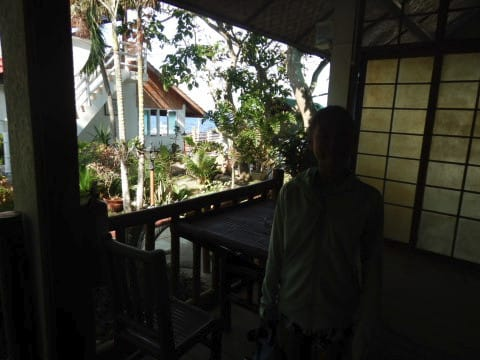

いつも通り，8時過ぎにダイビング

ショップ集合なので．

朝7時の朝食レストランオープンと

同時に，朝ごはんを食べに行きますが…

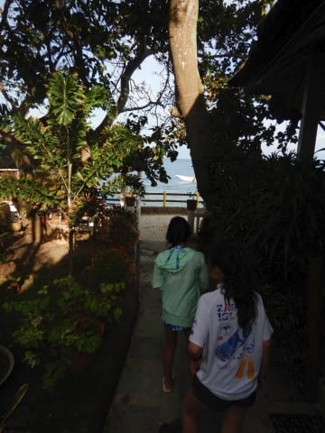

いつもの海が見えるテラスでの朝ごはん．

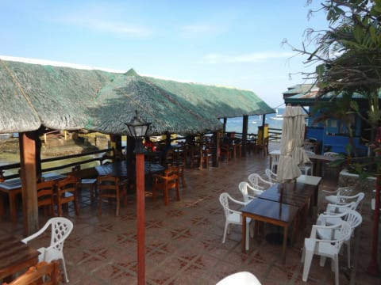

今日は天気もいいし，海も穏やかだし．

いい一日になりそう…！

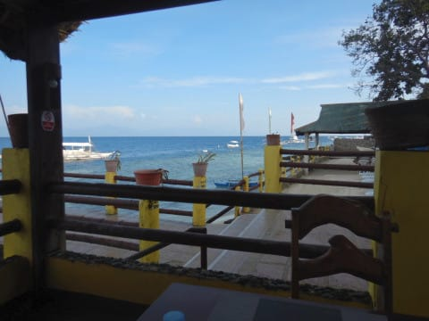

いつも通りの宿泊者向けの朝食で，

毎日同じ3種類のメニューから

選ぶしかないので，朝ごはんは

代わり映えしないですが…

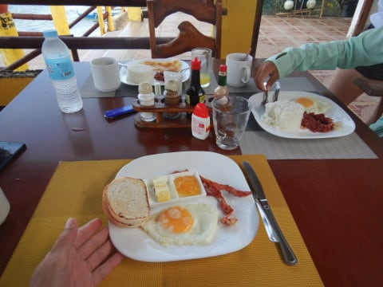

でも，こんな景色を見ながらの

朝食は，朝からいい気分になります…

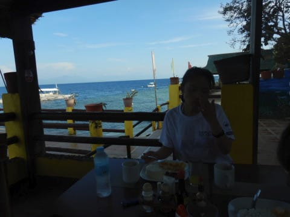

ってなことで．

朝ごはんが終わったら，

水着に着替えて，ダイビングの準備をして．

いつもの道をダイビングショップへ…

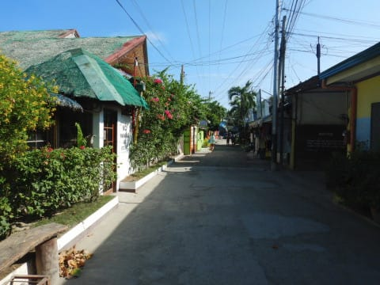

歩いて3分で，ショップへやってきますが．

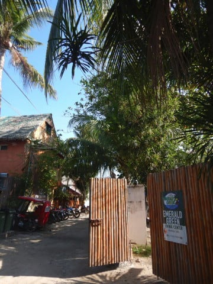

今日はホントにむっちゃいい天気です．

…でも，日本の蒸し暑い夏ほど暑くなく，

快適な気がする…

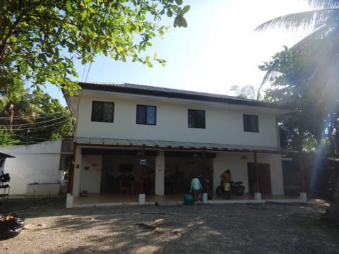

ウエットスーツを着こんだら，

器材や3点セットはスタッフが

ボートへ運んでくれているので，

カメラと身の回りの小物だけもって，

ダイビングボートへ．

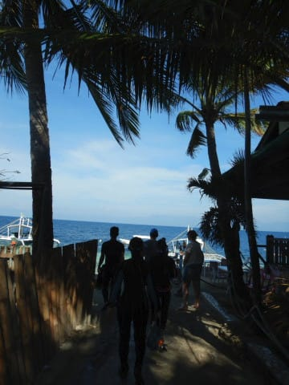

…今日は波も穏やかで．

絶好のダイビング日和…！

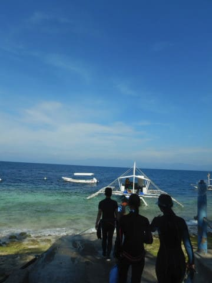

ってなことで，乗船！

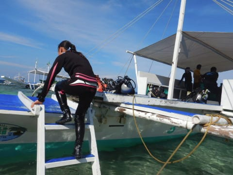

乗船した時には，すでに器材が

セットされていて，楽でいいんですが…

娘，こんならくしてたら，お前

絶対器材セッティング忘れるよね…

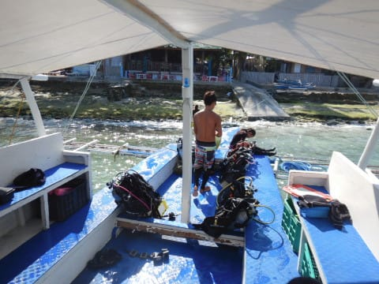

出航すると，娘はいつもの特等席で

座ってますが…

向こう側にぺスカドール島が

見えますね．

今日は1本目からぺスカドール島の

ようです…！

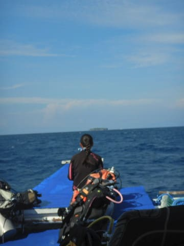

今日は海況がいいので，

ぺスカドール島までわずか20分…

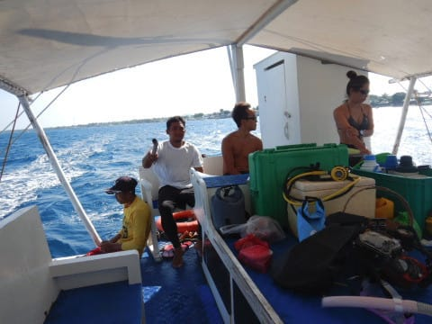

到着したら，1本目のブリーフィングですが．

今日も我が家3人で1チーム．

店長の小見山さんが昨日に引き続き

ガイドしてくれるようです…

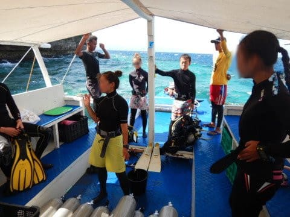

てなことで．

ブリーフィングが終わったら．

いざ，バックロールで…

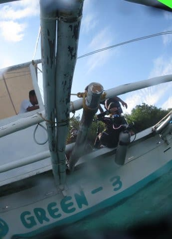

エントリー！

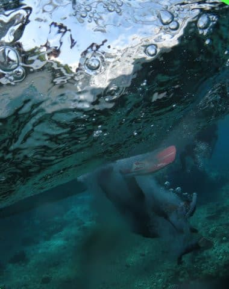

さて．

今日は何が見れるかな…？？
