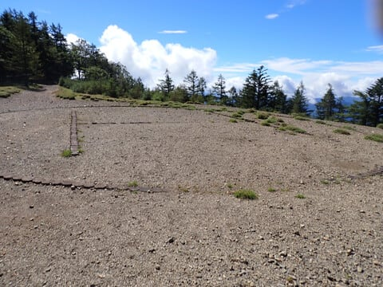

# 2023年9月，雲取山に登ってみた…その3，雲取山山頂から中間点のブナ坂までは，気持ちいいハイキングコース

📅 投稿日時: 2024-08-02 01:35:45

スキー板の試乗ネタが終わり．

ちょっと山登りBlogっぽくなってしまった

このBlog．

やはりスキーBlogなので，スキーネタを

時々入れないと…

と，昨日はちょっとスキーネタを入れて

みましたが．

…やっぱり，山歩きネタとスキーネタでは，

読者の数が全然違う…！！

スキーネタの方が圧倒的にページビューが

多い…！

ってなことで．

やっぱりこのBlogはスキーBlogだった

ということを改めて認識したわけですが．

でも，なぜかスキーBlogのはずのこのBlogで，

一番ページビューが増えるのは車ネタ

という矛盾を抱えつつ生きている今日この頃．

皆様いかがお過ごしでしょうか（時候の挨拶）

ということで．

今日はまたこのBlogにあまり期待されていない

山登りネタです…！

（それでもダイビングネタより読者が多い）

ーーー

ってなことで．

駐車場を出てから3時間18分．

朝9時前に雲取山山頂へ到着！

いやーー．

ちょっと雲は多いものの．

周りの景色がすっきり見えるのかな？

と思いつつ見てみると…

富士山方面は見えますが…

意外と山頂の周りに木々が多く．

すっきり360度の見晴らしといかないのが

残念…

うーん．

東京都最高峰なので，もう少し見晴らしを

期待したんだけどな～

こっち側も，木々で見晴らしがない感じ

だけど．

でも，天気が良くて気持ちいい！

そして．

雲取山山頂は，この明治15年設置の

「原三角点」があることで有名らしい？

のですが…

こいつがそれか…

ってなことで．

山頂で20分ほど休憩したら…

9時4分に下山スタート！

山頂下の避難小屋に向かって歩き

始めますが…

今日は雲が多く，遠くの山々がすっきり

見えないのが惜しいけど．

天気が良くて，絶好の山歩き日和！

山頂からしばらくは，視界が開けた

景色の良いコースをお散歩気分で

歩けます…

そして．

行きにも通った，小雲取山を下山開始後

10分で通過したら…

ここからは，一瞬足場の悪いところもあり．

そこからは，残念ながら木々も高く伸び，

視界も悪くなっていきますが…

時折見開きがあるところで景色を愛でつつ．

ヘリポートを山頂から25分ほどで通過！

そこからは，緩やかな歩きやすい下り道を

お散歩気分で気楽に歩け…

山頂をスタートしてから36分で．

ブナ坂へ到着！

このブナ坂をまっすぐ行くと，

行きに通った七ツ石山に行きますが…

帰りはわざわざまた100m登り返して

七ツ石山に行くのはしんどいので．

ここで右に折れ，域と違う

七ツ石小屋の下にショートカットする

ルートで下山します．

ここからは尾根筋を外れ，通る人も

少なくなるし．

のんびり景色を眺めるという散歩道

でもなくなるので．

ここからはちょっとスピードアップで

下山しましょうか…！

（[続く](e7e08f69557b86d18349f2236a2de7090.md)）

## 💬 コメント一覧

### 💬 コメント by (マルハバ)
**タイトル**: Sさんなら・・・
**投稿日**: 2024-08-02 07:42:16

スキー：20000m 俱楽部

山登り：2000m 倶楽部

ダイビング：200m 俱楽部

標高差三冠可能か？

ダイビングは命の危機絶大ですが・・（汗）

### 💬 コメント by (Skier_S)
**タイトル**: ＞マルハバさま
**投稿日**: 2024-08-03 01:28:35

ダイビング200m倶楽部は死んじゃいそうですね（笑）．

私の最大深度は40mちょい超えくらいです…

そもそも空気タンクでは200m行けませんから．完全飽和潜水しないと（笑）．

