# 2017年8月，小学生の子連れでパラオ再訪！その21…ダイビング3日目，終了！

📅 投稿日時: 2018-10-16 04:03:52

ここしばらく，プロジェクトZがらみで週末は

バタバタしてますが…

なんと．

今週末からYetiが始まるのだ！

シーズンインなのだ！

だから，あまりゆっくりしてられないのだ！！！

ということなので．

一気にことを進めようと．

この土曜は．

引っ越し先のあらゆるスペースや窓の寸法を測り倒し，

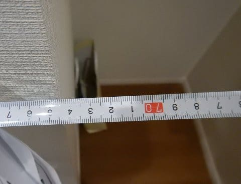

土曜のうちに各部屋＆収納スペースの

1/10の図面を作成，

置くべき家具のレイアウトをすべて決定し．

そして，その図面をもとに．

日曜に家具屋3件を巡り．

今回新たに作る娘の部屋に必要な，

机・椅子・ベッドの他．

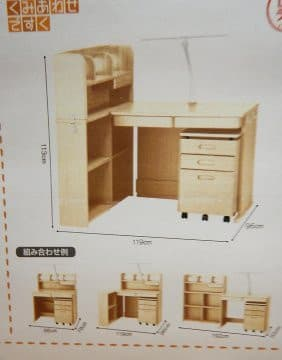

全ての部屋のカーペット，カーテンや，

収納に必要な棚類など．

転居に必要な家具を全て一日で一気に決めて買ってしまう

という．

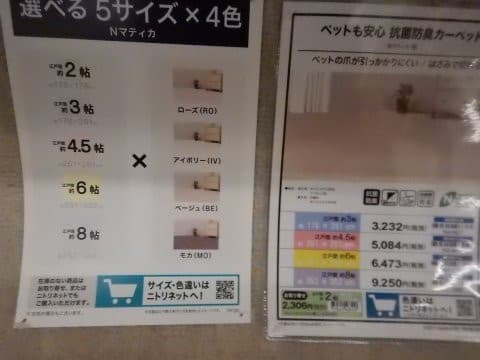

（ニトリは安い！庶民の味方っ！！）

この土日も，かなり高密度な週末を過ごしたのでした…

でも．

これでこの来週は，無事Yetiに行けそう…←いや，普通はYetiに行くより，

家具をゆっくり選ぶ方が大切なのでは？

ってなわけで．

スキーシーズンが迫ってますが．

本日はダイビング旅行記へ，Go！

-----

という感じで．

本日のエキストラダイブも終わり．

エグジットすると，もう夕暮れ…

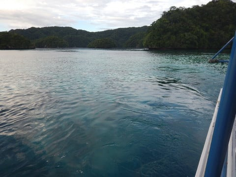

夕暮れの中を，ボートはショップに向かって

戻ります…

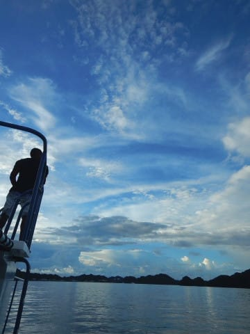

暮れ行く空が，きれいですね～．

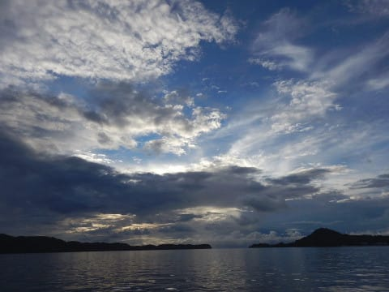

ショップに到着すると，もう午後6時近くです…

薄暗くなってきている中，器材を洗って．

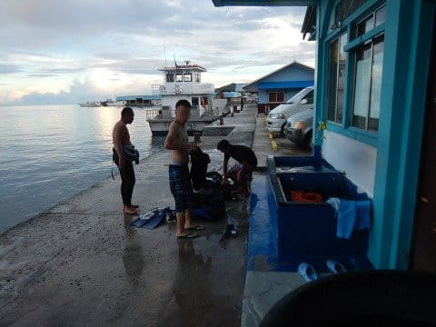

そして，ログづけをしたら．

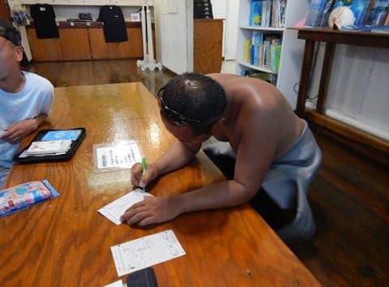

一旦ホテルに戻って．

今日も一緒に潜ったメンバーと夕食に行きました～！

行ったお店は…

ホテルのほど近く，インド料理店の

The Taj．

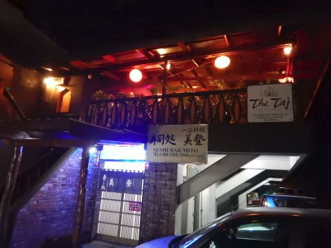

1Fはお寿司屋らしいですが…

行ったことはありません（笑）．

このお店…

本格的なインドカレーとナンのお店で．

結構イケるじゃないですか！

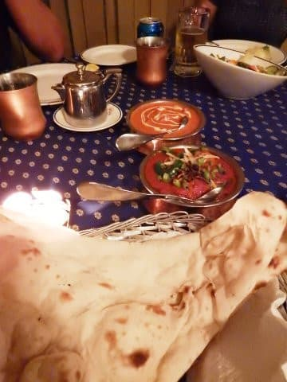

カレーも辛さを調整してもらえるので，

辛いのが苦手な子供でも，辛いのが大好きな人も

どっちでもOK！

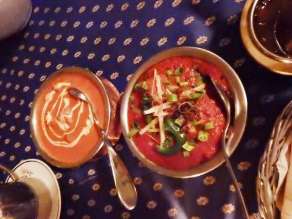

さらに，タンドーリチキンが串に刺されて

やってきます…

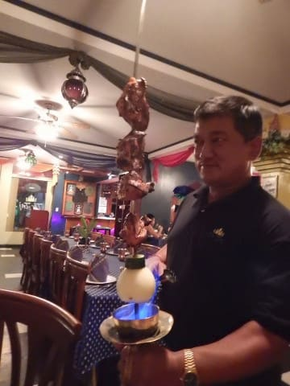

これは豪快！

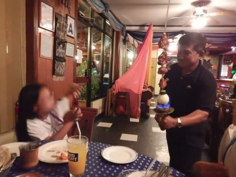

ってな感じで．

予想よりおいしいインド料理を食べながら．

今晩もダイビング談議をして過ごします…

隣に座った人の話を聞くと…

…はぁ．なるほど．

今年でパラオ4回目ですか．

1年で4回も5回もパラオに来るんですね…

…って，Cカード取ってまだ2年ちょい？

でも，もうダイビング経験本数200本近い？？

そして，そのうち100本以上パラオで潜ってる？？

…濃いぃ．

濃すぎる…

パラオに来る人，やっぱり濃すぎるよ…

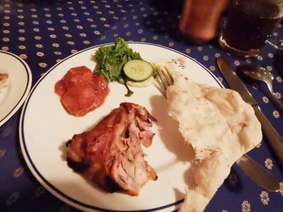

ということで．

夜10時頃まで濃厚談義（というより，我が家は完全に聞き役…）

で過ごして．

ホテルに帰ると，娘は着替えもせずに即寝．

私もダイビング疲れと，ダイビング談議で

ついついすすんだビールのおかげで．

すぐに爆沈でした…
