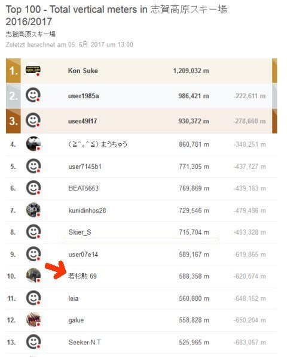
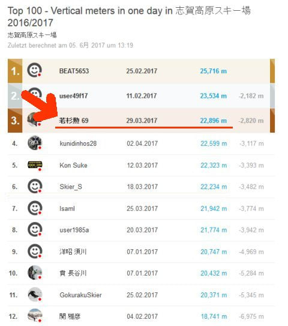
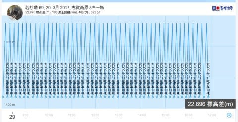

# 今シーズン，20000mクラブのメンバー内の最大の話題はこれだったかもしれない…

📅 投稿日時: 2017-06-14 04:08:33

ということで．

今シーズンの志賀高原の営業も終わってしまい．

[Skilineの総括](eb7000864a88040c158aab82451750b83.md)もやりましたが．

本日も，ちょいとまた，Skielineの記録の話題を…

えー．

…昨シーズン末に[Kon Sukeさんがステッカーを作って](e688dd723e3d1367c88701b81540a2a04.md)，

公式化(？)して以来．

志賀高原のごく一部で有名に

なりつつある，20000mクラブ．

どうやら，

これに何か勘違いして刺激を受けて，

「20000mにチャレンジしてやれ！」

…という危険な発想にチャレンジ精神にあふれる方が，

数人いらっしゃったようですが…

その中で，この方．

ここ数年，シーズン滑走標高差で

私とデッドヒートを繰り返している方で．

今シーズン，たまたま偶然に

知り合ったのですが…

この方．

「3月末に20000mにチャレンジします！」

宣言されて．

ホントにその通りに，

奥志賀で20000m超えを達成しちゃいました…！

以前は一日10000mも滑らないような方だった

らしいのですが．

今シーズン，何か勘違いされて刺激を受けて

一念発起したらしく．

まずは15000mチャレンジで体を慣らし（？）．

見事，その後のチャレンジで23000m近い記録を

達成しました…！！

…しかし．

昼間だけで23000m近くって…

かなりすさまじい記録なんですけど…！！

このニュースに，20000mクラブな方々が素早く反応して．

次の日以降，会う人会う人みんなが

「あの記録，ホントに実現可能なの？？？」

という驚きを口にしていたという…

驚きの理由は．

どのリフトが何分で1本回せて，一日最大何本乗れるのか…

というのを，限りなく正確に把握している，

20000mクラブの大御所の方々にとって．

「奥志賀ゴンドラは1本11分サイクルが限度．

　Skilineを見ると何本か10分サイクルで回ってる．

　平日は休日よりゴンドラ搬器が減らされちゃうので，

　まってる人がいない飛び乗り状態でも

　搬器待ちが数10秒伸びちゃう平日の奥志賀ゴンドラで．

　そんなこと，できるのか？？？」

「奥志賀ゴンドラは一日45本が限度．48本はありえない」

…という感じで．

志賀高原のリフトを知り尽くした

20000mクラブメンバーならではの異常に細かい知識

に基づくと．

「これは…不可能では？？？」

という疑念が沸き上がった，この記録．

しかし．

いろいろな情報を集めてみると…

・この日は平日でゴンドラ待ちは全く無かった

・この日はロイヤルファミリーが来ていた日のため，

　普段のガラガラ平日なら搬器を減らして

　待ち時間が延びるところ．

　搬器がフルピッチで入って待ち時間がなかった

・この日たまたま奥志賀を滑っていた，

　[滑走速度時速90kmオーバーを誇る](https://www.youtube.com/watch?v=V2bnKbqRB8I)GokurakuSkierさんから，

　「コース上であっさりぶち抜かれた」という証言があった

などの情報が集まり．

「これは，本物だ…」

と認めざるを得ず．

20000mクラブの大御所たちを

驚きの渦に巻き込んだわけですが．

とりあえず．

平日で雪が荒れるのが遅かったとはいえ…

それでも，奥志賀ゴンドラ48本というのは．

空前にして，絶後．

おそらく，この記録を抜く人は，今後出てこないでしょう…

というか，

・年に一回のロイヤルファミリーが来る平日で

・たまたま天気が良くて

・人も少なくて，全てのゴンドラ待ち時間0で

・雪質がザブザブにならず，夕方までコブになったり

　ひどく荒れたりしない

という条件が揃わないと，そもそも実現不可能だし．

たまたまその日に，

・すさまじい体力と持久力の持ち主が

・トイレに行く回数も減らし，食事も抜き

・朝8時から夕方4:45まで体力を切らさず

・途中で集中力が切れて，転んだり怪我したり

　することなく

・精神力を切らさず，リフト営業終了まで

　トップスピードで滑り続ける

という，

何が楽しくてそんなことをやるんだろう…と，

傍から見ると不思議に思わずにいられないような稀有な人

すさまじい精神力をもってこれをやってやろうという

稀有な人が，チャレンジしないと実現できないわけで．

…いやーーー．

すさまじすぎる…

しかし．

何よりかにより．

驚きなのは．

…この方．

年齢を私のBlogのコメントにも明記しているので．

ここに書いてもいいと思うのですが…

＃というか，登録名にも年齢が…

この方．

なんと．

…なんと．

私の父親とほぼ同じ世代なんですけど…っ！！！？？？

もうすぐ古希を迎えられる方なんですけど…っ！！？？？

それで，一日23000m滑る体力を持っているとはっ…！！

＃昼間だけで23000mは，私でも無理なんですが…（涙）

おそるべし．

恐るべし…っ！！

ということで．

60代になったからといって．

「もう歳だから，滑る体力がない」

というのは，言い訳でしかなく．

70歳になっても，20000m滑れるんだ…！！！

ということを知って．

驚くとともに．

これから先，まだまだ楽しめるんだ…！！

と，すごくうれしい気分になった，Skier_Sだったのでした．

＃しかし，これを見て「自分にもできるのでは？」と無理な

＃チャレンジをするのは，危ないのでくれぐれもご注意を…

＃周りに迷惑をかけない，安全で怪我しない範囲での

＃チャレンジをお願いします…

## 💬 コメント一覧

### 💬 コメント by (小林ともうします)
**タイトル**: Unknown
**投稿日**: 2017-06-14 08:00:28

20000ネタは色々あって楽しいですよね。

５月の一ノ瀬では金色の人、銀色の人に沢山お会いしました。

コンさんのイチミですねと声をかけたなかに面白い人がいて、知らない間に貼ってあったと言う人もいて笑ってしまいました。

首謀者に聞いたら置いてあったから貼っておいたと言ってました。

楽しい方々ですね。

### 💬 コメント by (Goku)
**タイトル**: 目撃者です
**投稿日**: 2017-06-14 21:39:43

え～確かに目撃しました。

凄まじい速さでダウンヒルを降りていく若杉さんを！

ゴンドラも一緒になりましたけど、乗り降りの所作もハンパなく素早かったですよ。（まるでヤケビ１ゴンを乗り降りするＳさんのように）

でも正直、20000ｍ達成したらやめるのかと思っていたら22896ｍって・・・

おっしゃる通りあのお歳でってのが凄すぎますよね～。

いや～凄いものを見た！

### 💬 コメント by (yumi)
**タイトル**: 証人Bです
**投稿日**: 2017-06-14 21:53:40

Sさん、お久しぶりです。

gokuさんが証人Aなら、私は証人Bです。

この日は朝からW69さんと一緒に滑っていました。

・・・ってか、私が２本滑ってる間に３回抜かれましたけど。。。

ホント、凄過ぎですよね。

もともと、konさんのファン（あまりに凄いので。。。）でもありましたが、Sさんも（いろんな意味で）ファンになり、W69さんに至っては、ただただ、ご尊敬申し上げ、感嘆申し上げます。

### 💬 コメント by (しんちゃん)
**タイトル**: 凄すぎる
**投稿日**: 2017-06-14 23:59:49

ホントにすごいですよね。

神ってます。

20000m金色の方々、みんな神がかっています(^^;

周囲に迷惑をかけず、安全に楽しく、Ｓ様Ｇｏｋｕ様に数本ついていける程度にスキーしようと思います(笑)

（遠路はるばる帰る体力が必要なので･･･）

### 💬 コメント by (Skier_S)
**タイトル**: 凄すぎます…
**投稿日**: 2017-06-15 02:03:42

＞小林さま

20000mな方々は，ネタの宝庫ですから…

ゴールドにしろシルバーにしろ，20000mの

お札を貼ってる方は，極めて個性的な方が

多い気がします(笑)

＞Gokuさま

いやーー．

20000mを超えただけじゃなく，

そのあとも攻め続けるというのがすごすぎますね．

そもそも，ゴンドラの乗り降りで走り続けたというのが

凄すぎます．

ずっと若い私が，まだ昼間20000m超えてないんですが…

どうしましょう…

＞yumiさま

お久しぶりです～！！

いや，2本滑ってる間に3回

抜かれたって，一緒に滑っていると

言えるのかどうか…(笑)

でも，ついて行くのは絶対不可能

ですよね(＾＾；

もう，私も尊敬＆感嘆するしかありません．

＞しんちゃんさま

金色のお札は，「何かを突き抜けてしまった人たち」

という印なので．

ぜひ，しんちゃんさまもGetしてください←結論がおかしい

いや，W69さんよりずっと若いしんちゃんさまが，

20000m行けないわけがないですよね！

### 💬 コメント by (beat5653)
**タイトル**: ゴールドステッカー
**投稿日**: 2017-06-16 23:31:59

しんちゃん様へ、ご無沙汰しています。煎餅の味はどうでした。自分も３シーズン前までは普通のレジャースキーヤーだったんです。ゴンドラも３５本が最高記録で、標高差15000mぐらいが限度と思っていました。S様のブログがきっかけで奥志賀ゴンドラ４３本滑ってからいろいろな人と知り合いになりました。しんちゃん様の滑りなら20000mは簡単だと思います。

### 💬 コメント by (しんちゃん)
**タイトル**: お褒めのお言葉に感謝
**投稿日**: 2017-06-16 23:48:50

>beat5653様

煎餅ありがとうございました!!めっちゃうまかったです。

あっという間に食べきってしまいました。。。

今シーズンＳｋｉｅｒ-Ｓ様Goku様とお会いして、シルバーステッカーを頂いてからというもの、神ってる方々とお会いできて、本当に充実したシーズンでした。そんな神っている方からお褒めのお言葉を頂けるなんて光栄に存じます。

昼間に20000mいくような皆様には到底近づけませんが(笑)、またお煎餅をもらえる程度に頑張ろうと思います(^^♪

### 💬 コメント by (Skier_S)
**タイトル**: beat5653さんとしんちゃんさんの会話に割り込み
**投稿日**: 2017-06-17 01:11:54

＞beat5653さま

3年前まで普通のスキーヤーだったとはとても

信じられないのですが…

今シーズンも，確か7-8回は20000m越えして

ますよね…（汗）．

＞しんちゃんさま

私も昼間20000m行ったことない仲間です．

…私はまだ神の領域には達していませんので…(笑)

### 💬 コメント by (waka69)
**タイトル**: 渦中の69歳です
**投稿日**: 2017-06-17 16:56:50

先ほど遠征先のアユ釣りから一日だけの帰宅をしたばかりです。今年はあまり釣れません。商売あがったりです。

早速メールをチェックしたらyumirinさんからSさんブログで話題になっているとのありがたいお知らせ。

途中で何度も嫌になったけれど、gokurakuさんに『今日は48本滑る』と公言してしまった手前やめられなかったんです。あほですよね。

それから食事は摂りましたよ。ゴンドラの中で手作りサンドイッチを。

また杉山渋滞にも何度か出くわしましたがロスを減らすためにそういう時までトイレは我慢しました。また並んでいるときには係員の人が私を見るや気を利かして「あと一人乗れますよ」。「はーい乗ります」と言って走ったことは言うまでもありません。

ゴンドラの乗り降りはすべて走りました。スキーよりこれがはるかに疲れました。

何本か順調に滑ると11分ペースより一分二分と貯金ができてきます。そうしたら晴れてトイレタイムがとれます。ほんとうに馬鹿ですよね。

スキーがどべたな私でもできたんです。あとは集中の持続力次第かと思います。来シーズンのゴールドワッペンを楽しみにしています。ありがとうございました。

### 💬 コメント by (waka69)
**タイトル**: 単純計算です
**投稿日**: 2017-06-17 17:34:52

奥志賀ゴンドラはファミリーほど急斜面じゃないので中級者の私でも恐怖感がゼロで滑れるのでお勧めです。

ゴンドラ477mを42本滑れば20000m達成です。

ちなみに8時から16時45分までの525分を12分ペースで滑ると43.7本。11分ペースだと47.7本です。

事前に何度か数時間だけで試してみたら12分ペースならすごく余裕があることがわかりました。

それなら気張って11分にしよう。

目標は47.7本をなぜか切り上げて48本としました。

これができれば勝利の美酒。47本以下なら敗北だと心に決め、みんなに言いました。モハメドアリの世界ですね。

私はもう世間に必要とされない人間のため毎日滑っているんですが15時にはやめています。一日平均7000mくらいの普通のスキーヤーです。

最大の敵は慣れない16時くらいからの視界でした。斜面が全く見えないんです。アイスバーンは相変わらずですが雪玉のコロコロがあって怖いんです。滑ったことのないう回路に逃げましたがこれがさらに怖い。見えないウエーブの連続で一度で懲りました。

達成した後の満足感はそれはもう格別です。20000mクラブに感謝です。まだのかたは是非ゴールドワッペンを。（足りなくなったりして）

### 💬 コメント by (Skier_S)
**タイトル**: waka69さま
**投稿日**: 2017-06-17 21:28:13

ご本人からのコメント，ありがとうございます～！

アユ釣りからの帰宅，お疲れ様です…

しかし．

20000mクラブのメンバーでも，

「奥志賀48本は目標設定としては

無謀では！？？」

と思うところです(笑)．

まさか，ホントに達成されるとは…

その夜の勝利の美酒はおいしかったことでしょう…

来シーズン，ゴールドステッカーお渡しします！

ぜひ，板やらいろんなものに貼ってください！

