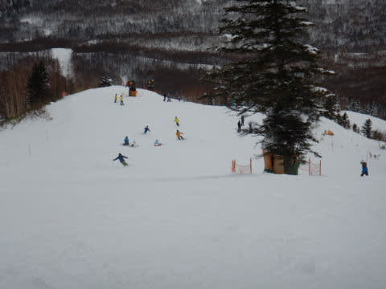
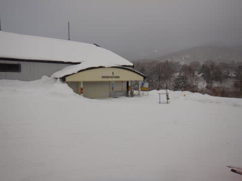

# 2020/2/10(月)，休みの谷間の志賀高原スキー場は…晴れのち曇り，時折雪がぱらつく天気．冷え冷えいい雪だけど，意外と混んだよ（涙）

📅 投稿日時: 2020-02-10 22:03:03

ということで．

平日のはずの本日．

今シーズン初の平日スキーだっ！！！

…と，楽しみにしていたのですが．

休日の谷間の本日，意外と休みを取った人が

多かったのか．

意外と混みました（涙）

まっとうなサラリーマンをしているはずの，

焼額朝礼メンバーも，なぜか結構滑っていたので．

平日に休みを取ってまでスキーをやっている

というプレミアム感が，全くなかったです(泣）

とりあえず．

ゲレンデは休日感にあふれまくってましたが．

そんな本日の志賀高原レポート，行ってみましょう…

まず．

あさイチに宿の前に出ると…

積もってます！

車の上に，冷え冷え雪が積もってます！

まぁ，10㎝程度ですが，

でも，冷え冷えの軽い雪です！

で．

いつも通り焼額に向かいますが．

今日は晴天！！

…しかし．

平日のはずの本日．

営業開始前の第1ゴンドラ，

かなりの人数が並んでいたのですが…(涙）

今日，意外と混みそう…

ってなわけで．

山頂にやってくると…

山頂の気温は，-10℃を下回るという

予想通りの-12℃！

今日も冷え冷えです！

冷え冷えなのに，太陽がゲレンデを

照らす，最高のコンディションでは

ありませんか！？？

そして．

ゲレンデは．

これは…

これは…

ザ・グレート・シマシマ！！

今シーズン一番の，完全無欠な

最高シマシマがお出迎えです！

ぐはーーー！！

最高！！

ちょっと柔らかくて板が潜っていくけど，

最高！！！！

もう，この，誰も踏み入れてない

シマシマを切り裂き，自分の

シュプールを残していく，

この悦楽．

これ以上の快楽が，果たしてこの世に

存在しうるのだろうか…！？？

これだけ志賀高原に通い続けている

私でも．

こんなにやわらかトップシーズンのシマシマ

圧雪で，かつ晴天の太陽の下滑れるってことは，

シーズン2-3回あるかどうかという

奇跡のコンディション！！

シアワセ…

あぁ，シアワセ…

と．

シアワセシマシマを滑っていたら．

雪が柔らかく．

かつ，平日というのに人も多かったので．

5-6本滑った10時ごろになると…

…早くもゲレンデが荒れてきました（涙）

早いよ…

GSコースが荒れちゃったので，

オリンピックコースを見に行きますが．

朝に圧雪がかからないこのコース．

昨晩のうちに積もった雪が，モサモサに

なっていて．

こちらも，朝イチからちょっと荒れ気味の

コンディションです…

そして．

本日は平日というのに．

午前10時半ごろには…

なぜこんなに人がいる？？

今日は平日だったはずなんだけど？？

なんだか，この混雑具合．

平日にスキーをする特権階級感，ゼロ（涙）

ゴンドラやリフトはそれほど待たなかったけど．

やはり，休日の谷間だとゲレンデは結構

混んじゃうのね…（泣）

気温は冷え冷えで，終日雪質は良かったものの．

つもりたての柔らかい雪質なので，

昼前には結構バンピーな斜面になってしまい．

さらに昼頃には，曇ってきて凸凹が

見にくくなってきました…（涙）

うーむ．

焼額，ゲレンデが荒れてきて．

かなり厳しくなって来たなぁ…

どうしようかなぁ…

と，思っていると．

…

…

あれ？

ここはどこだ？？？

焼額の呪いのため，焼額から脱出できない

私ですが．

気づかぬうちに一の瀬方面へ飛ばされて

しまったようです！！！

仕方がない．

一の瀬方面へ飛ばされてしまったなら．

やむなく一の瀬方面を偵察してみましょうか…

と，一の瀬ファミリーへやってきますが．

昼過ぎのパーフェクターコースは，

それほど凸凹はひどくないけど，

大回りをするとちょっと飛ばされて

手ごわい感じ．

一の瀬正面バーンは…

ちょいと凸凹した感じで，

ところどころ下地の硬いところが

あったり，雪が溜まったところが

あったりと，これも多少手ごわい

バーンコンディション．

高天ヶ原に移動してみますが…

山頂からの景色は良かったですね～！

バーンコンディションも，多少凸凹

してたものの．

雪はやわらかく，意外と滑りよかったかな．

そして，高天ヶ原から道路を渡って，

西館に向かいますが…

おっと．

昨年落雷で焼失したリフト小屋も，

新築ぴかぴかで直ってますね…

そして，西舘中級コースを滑ってみますが．

ご存じのように，中級コース下部は

台風の時に崩落してしまっており．

中級コース下部の入り口は，しっかり

した柵で通行止めになっていて，

初級者コースへ迂回することになってます…

あぁ…

残念．

西館といえば，中級コース下部が好きだったのに…

ってな感じで．

西館まで遠足に行ったけど．

やっぱり私は焼額が好きだよね

ということで．

某氏が本日20000mチャレンジをしている

一の瀬を通過し．

某氏の応援をした後…

焼額へ戻ってきました～！

朝は晴れていたけど．

昼前には曇り空になり．

午後には雪がぱらつく天気の

本日でしたが．

夕方は時折強く降り．

午後は結構荒れ気味のバーンコンディション

でしたが．

まぁ，やっぱり人が多かったものの，

休日に比べると少なめだったので，

夕方になってもすごい凸凹こぶ斜面って

ほどにまで荒れることはなく．

今日も，柔らかい冷え冷え雪を，

ゴンドラ終了まで滑り倒したのでした…

いやーー．

今日もトップシーズンの志賀高原らしい，

冷え冷え雪を堪能できました！！

…思ったほどガラガラじゃなかったのが

残念でしたが…

そして．

明日も朝は-10度近い冷え冷えで．

今晩から明日までに，10㎝くらい冷え冷え

雪が積もりそう！！

朝は雲が多いかもしれないけど．

明日は基本的に晴れて，冷え冷え雪を

楽しめそう！！

…ただ，昼間は気温が0℃近くまで上がり，

南向きの雪はちょっとシットリするかも…

でも，明日も志賀高原はいいコンディションで

朝イチシマシマから堪能できそうです！

…あまり考えたくないけど．

信じたくはないんだけど．

13日以降の強烈高温を考えると．

明日が，いい雪で滑れるラストチャンスかも…

ってなことで．

明日も志賀高原滑ってます～！

PS.本日20000mチャレンジをやった某氏は，

無事達成したようです．

山頂で授与式をしてくださったKonSukeさん，

ありがとうございました～！

## 💬 コメント一覧

### 💬 コメント by (naoちゃんねる)
**タイトル**: Unknown
**投稿日**: 2020-02-10 22:15:58

某氏です(笑)

今日の朝一は本当に最高でしたねっ！

で、そういう訳で 本日 20000mの聖地一の瀬ファミリーにて 20000m達成しちゃいました～！

8:30～16:40の間に

ファミリークワット 3本

第３クワット62本

計65本リフトに乗り 20446mでした…

konsuke様 直々にコツを教えて頂き、更に一日中監修して頂き達成する事が出来ました…

S様や、仲間のみんなにも応援に来て頂きもう 絶対に達成するしかありませんでした(笑)

この場をお借りしてお礼申し上げます🙇

どうしようもない…じゃなくて(汗) 素晴らしい記録を達成出来てとても嬉しいです！！

明日からは主役のnao  の保護者にもどりまぁす(笑)

また明日～

### 💬 コメント by (Skier_S)
**タイトル**: Unknown
**投稿日**: 2020-02-10 22:25:46

>naoちゃんねるさま

20000達成おめでとうございます！

KonSukeさん公認記録ですから、間違いない記録です。

見事なペース配分でしたね。

明日から、板にゴールドステッカーが輝きますね。

お疲れ様でした＆おめでとうございます！

### 💬 コメント by (KonSue)
**タイトル**: おめでとうございます。
**投稿日**: 2020-02-11 07:44:34

naoちゃんねるさま

おめでとうございます。

雪が柔らかく荒れた中での達成はさすがです。

布教活動に励んでください。

### 💬 コメント by (mae)
**タイトル**: Unknown
**投稿日**: 2020-02-11 07:55:55

naoちゃんねる様

リフト終了間近でもあのパワーで滑っていたので、

間違いなくヤケビ朝礼メンバーの中でもナンバー１の飛ばし屋であることを認識しました。

先日のISKIの野沢の大会に出られていたら負けてましたよ(^^;

次は、naoちゃんの番ですね!

S様

真の20000メートルホルダーは、一の瀬ファミリー日中時間のみで達成することだと思っています。

ここは、20000メール倶楽部会長のS様にも是非ともチャレンジして欲しいです。(笑）

### 💬 コメント by (m&t)
**タイトル**: Unknown
**投稿日**: 2020-02-11 11:58:02

Sさん。昨日は各所でお会いできて楽しかったです。

終礼後、ちょっとだけ皆さんの後をつけてみましたが、皆さん彗星の如く消えて行くました!

Tより、やっぱりSさんはサイボーグだと思います。

Mより、昨日は良い雪質でしたか、ふくらはぎ肉離れのリハビリ中にはちょっとエッジがかみ過ぎで、ふくらはぎがピキピキしながら滑っていました。

次は22日に出没しますのでよろしくお願いします。

naoちゃんねるさん！おめでとうございます。

Sさん他皆さんから挑戦中と聞いていました。3高営業終了時の終礼ではまだ結果が分からなかったので。

### 💬 コメント by (レインボー)
**タイトル**: Unknown
**投稿日**: 2020-02-11 18:41:14

脇役のナオパパさん、すご過ぎです。励ますためだけにファミリーに出掛けたゆみりんから、話をきいていました。

すごく上手いナオパパなら、絶対にできると信じていました。あとはスターであるナオ様の黒子に徹してください。

### 💬 コメント by (なるなる)
**タイトル**: Unknown
**投稿日**: 2020-02-11 21:17:39

一昨日は、寒すぎてヤケビへ行きました。こういう時はゴンドラってありがたい。

お見掛けできませんでしたが、太板には参拝しておきました。

その後、ゴンドラまで移動していると、「まだお供え物無いね」との会話が聞こえ、何だか凄いw

昨日は、昼過ぎに諸事情により山を下りて、今日の昼頃に復帰しました。

しかし、既にボコボコで、何だか凄く雪が降った雰囲気なのですが、レポート楽しみにしています。

今日の朝一が滑れなかったのは負ですか?

土曜日まで滞在しますが、やはり液体降りますか…　平日のフカフカを期待していたのですが…

### 💬 コメント by (naoちゃんねる)
**タイトル**: Unknown
**投稿日**: 2020-02-11 22:39:33

>S様

ペース配分は結果的に上手くいきました～。

前膊頑張ったお陰で 15時半以降のあのガスによるペースダウンをカバーする事が出来ました…

こんな素晴らしい世界を経験出来たのも、Sさんのおかげです～(素晴らしいのか！？笑)

>KonSuke様

ありがとうございます！ 本当にお世話になりました🙇

いつものワガママ娘の面倒を見ながらのスキーをする呪縛から解放され、ひたすら滑る！のが結構楽しかったです(笑)

今後は布教活動に勤しみたいと思います。

>mae様

いえいえいえいえいえ！とんでもありません(><)  朝礼メンバーにはもっと上手で素晴らしい滑りをする方が沢山います。それにmaeさんにはかないませんよぉ～。

はい！親父の背中(ステッカー)を見て、きっとnaoもゴールドを目指してくれるでしょう←娘にもやらせるつもりかーい(笑)

>m&t様

ありがとうございます！

全ての滑走が終わってから、標高差・滑走数をトラッキングしていたアプリの画像と共に朝礼メンバーに報告したので 遅れました…(汗)

でも、滑走終了したら まずはトイレへ向かいましたが(笑)

>レインボー様

ありがとうございます！

ゆみりんさんにも 仲間の皆さんにもわざわざ応援に来ていただいたりして…ホント励みになりました(>_<)

はい…スターにゴールドを取らせる為の前段として父親がまずゴールド取得してみました…←だから やらせるつもりなのかーい(笑)

S様、コメント欄お借りしました🙇

### 💬 コメント by (西館)
**タイトル**: (*ﾟ▽ﾟ)/ﾟ･:*【祝naoちゃんねる様】*:･ﾟ＼(ﾟ▽ﾟ*)
**投稿日**: 2020-02-11 23:13:13

>naoちゃんねる様、おめでとうございます！

必ずしも好条件では無かったように思いますし、一瀬の日中だけでの記録達成は、まさに快挙！

これからはゴールドステッカーが輝きますね！

ところでSKILINE以後で記録達成された皆様への質問なのですが、

標高差・滑走数をトラッキングするアプリはSKI TRACKSでしょうか、ISKIでしょうか。

SKI TRACKSだと我が家の今日の垂直下降が、リフトの標高計算に比べ５％少なくなってしまって、これが20000mだと1000ｍの差になって、第３クワット３本以上の距離は挽回不可能なのではと思いまして。

ISKIでも誤差が生じるような記事が過去のgokuraku様のブログにあったように思います。

GPSを利用しているが故なのでSKILINEの方が厳密で良いなぁと思いました。

そしてこれが20000m達成への壁の１つだなぁと。

>S様

本日1ゴン下で青四郎君がお留守番をしているなぁと思ったら太板をちゃちゃっと外してささっとゴンドラへ向かうS様を見守りました。

皆様がおっしゃるとおり、あっという間でした。

今日のレポートも楽しみです！

### 💬 コメント by (Skier_S)
**タイトル**: いい4連休だった…
**投稿日**: 2020-02-12 01:22:48

＞KonSukeさま

記録公認ありがとうございます．

そして，山頂での授与式というなかなかの演出も，いい記念になったかと思います．

naoちゃんねるさんが布教活動しているかどうかは，

私が監視しておきます(笑)．

＞maeさま

いや…

私は昼間だけで20000mは無理です…

まだ修行が足りません．

＞m＆tさま

今回は何度もお会いできましたね～！

肉離れの中，お疲れ様でした(笑)．

ちなみに，私は古参20000mクラブのKonSukeさんやmaeさんと違って，

赤い血が流れている人間です…

＞レインボーさま

確かに，普段は「naoちゃんパパ」ですから…

今回は明らかにパパが主役でしたね(笑)

＞なるなるさま

あら．

焼額にいらしてたんですね！

残念ながら，お会いできませんでしたね…．

今日の朝イチが滑れなかったのは，勿体ない！！！！

シーズンに1-2度あるかないかの，激烈パウダーでしたよ！！

＞naoちゃんねるさま

ようこそ，素晴らしい世界へ！！

（危ない世界，と言った方が正しいかも…）

＞西館さま

今回のnaoちゃんねるさんの記録は，リフトの乗車本数を正確に

数え，それをもとに標高差を計算してました．

やはり，スマホ記録はあまり正しくなかったようです．

リフト本数をカウントするのが一番正確な方法です．

今回はKonSukeさんもリフト本数をカウントしていたようなので，

公認記録員付きの正式記録です(笑)．

…しかし，1ゴンの前にいらっしゃいましたか？？

全く気付きませんでした…

### 💬 コメント by (naoちゃんねる)
**タイトル**: Unknown
**投稿日**: 2020-02-12 06:42:20

>西舘さま

ありがとうございます！

私はSKI TRACKSを使いました。ISKIより電池の減りが少なく 大幅にずれないと思いまして…

https://blog.goo.ne.jp/tsakamot2001/e/88a135f694d88ef49cb5ab33e5bcee51

で、結果は…

垂直下降:22726m

垂直上昇:23324m

滑走数:130 

…そんなに 乗ってませんから～(笑)

でも、アプリ画面下部の「プロファイル」のギザギザは形は完璧じゃ無いながらも 正確でその山を数えるとちゃんと65個ありました～

私の場合は、KonSukeさんのいらっしゃる日で さらにはS夫妻や朝礼メンバーの皆さんに、止まらず休まずハイペースで滑り続けているのが目撃されているので、良かったですが…

奥志賀ゴンドラ等でひっそり挑戦する場合や、誰も目撃者がいない場合は、アプリだけではちょっと信用性に欠けるかもしれませんね…

標高差図れる時計と併用するとか…

うーん、SKILINEが無くなったのは本当に痛いですね…(涙)

### 💬 コメント by (mae)
**タイトル**: Unknown
**投稿日**: 2020-02-12 17:01:27

>>西舘さま

皆さん言うようにリフト乗車本数を数えるのが一番です。iskiでもSKI TRACKSでも本数はカウントされます。

そして、20000メールに挑戦する時は一の瀬をお勧めしておきます。

naoちゃんねるさんも言うように、奥志賀ゴンドラ等で挑戦する場合は信用性に欠けると思います。

以前のSKILINEでは、ゲートを通過してカウントだけしてゴンドラには乗車せず１回転、休憩所で休むことも出来たと思いますが、一の瀬ではこのようなゴマカシは使えませんので。

一の瀬では毎週土日月の３日間、KonSukeさんがゲレンデに張り付いていらっしゃいますので、一日を通して丁寧なアドバイスを受けながら挑戦することができますよ。(^^)

そして達成者には、KonSukeさんより粋な授与式もあります。(^^;

ちなみに昔、私が達成した時も、KonSukeさんに終日監視されてました。(^^;

当時はまだ20000メートルクラブができる前でした。

（ステッカーもありませんでした）

### 💬 コメント by (西館)
**タイトル**: Sさま、naoちゃんねるさま、maeさま、アドバイスありがとうございます。
**投稿日**: 2020-02-13 00:58:30

そう、お察しのとおり、ただいま挑戦検討中です。

やっぱり本数カウントですよねー

naoちゃんねるさんがご紹介くださった記事は爆笑ものでしたが、まさにこの記事と同じように我が家はSKI TRACKS利用でどんどん空へ打ち上げられていきました。

でも、誤差は５％だったので横手山山頂から槍ヶ岳山頂に不時着できるレベルなので、iSKI利用で日本海溝の底まで潜ったSさんとご友人さんよりはマシでしょうか。

そうそう、2月10日の月曜日に1ゴンでＳさんから直にアドバイスをいただいたのですが、友人ご当人様もご一緒で、このお話もお聞きできたのでした。その際はありがとうございました。

で、マラソン完走よりも厳しかったとのことで、ちょっとびびっております。

いや私、フルマラソンとトライアスロンは素人にしては（←ここ大事）ですが、まずまずのタイムで完走歴があるものですから。

そしてＳさんご一行様と別れた後、15:30頃にnaoちゃんねるさん挑戦中の一瀬で3本測ってみたのですが、ジャンプ用のやわ板でですが8分弱/本でした。

(動くパイロンと化して大変ご迷惑をお掛けし、申し訳ありませんでした。)

これをスピードの出る板に履き替えてナイター込みなら可能性が見えてくるのですが、一瀬は通行量が半端無く、あの環境を8時間超滑り続けることができるのであろうかというのが最大の課題だなぁと実感しております。

因みに1ゴン周回のタイムアタックは2月2日(日)と10日(月)とにしてみて13分/本でした。

ですからnaoちゃんねるさんの今回の成功は快挙だと実感しております。

（４日間の柔雪でぴょんぴょんし続けた報いで今日は少し腰が痛い｡｡｡これもびびりの原因の１つになっております。）

当初は来年の挑戦として今年度は準備期間と考えておりましたが、皆様もお感じのとおり、早朝営業が無くなりナイターが減り、どんどん挑戦が厳しくなってきておりまして、更にはトイレ問題や、少しでも一瀬が長く動いて日照時間も長くなる時期と考えると2月下旬以降の方が条件が良いであろうと考えると、今シーズン強行しちゃう方が良かったりして、と思ったりしております。

で、電卓上ですが、私のようなダメダメスキーヤーでも達成見込みのある方法を見つけたのです。

当然信用性に欠けるので審議のランプが点灯することでしょう。

まずは審判員を勤める諸先輩方に滑降計画書を提出、達成後にSKI TRACKSデータを提出して本数をカウントしていただき、電卓を叩いて頂くことでどうかなぁと思ったりしています。

>以前のSKILINEでは、ゲートを通過してカウントだけしてゴンドラには乗車せず１回転、休憩所で休むことも出来た！

おおおおおお、出来ますね、出来ます出来ます出来ちゃいました！。なるほどこれは信用性無いわ。

皆様ありがとうございます、どうぞこれからも、よろしくお願い致します。

どんなことでもいいのでアドバイス頂きたいです、ご迷惑おかけ致しますが、お願い致します！。

それにしてもKonSukeさん、つまり毎週土日月の３日間、20000m達成していらっしゃるのですね｡｡｡やっぱりサイボー･･･

### 💬 コメント by (Skier_S)
**タイトル**: 明日から16日まで，高温危険（涙）
**投稿日**: 2020-02-13 02:15:50

＞naoちゃんねるさま

滑走数130本って…

とりあえず，滑走標高グラフから本数を数えるのが確実

ですよね．

KonSukeさんという公式記録員（？）の監視下での

達成が，

客観的な立場からも確実かも．

＞maeさま

今は，奥志賀ゴンドラが混むようになったので，

奥志賀での達成はかなり困難になりましたよね…

混まない平日で，搬器がフルに出る機会はもうほとんど

ないですから…

そして，一の瀬ファミリーも，リフトが減速になったので

チャレンジが難しくなってきている気がします．

＞西館さま

いきなり20000mチャレンジをやらずに，

10000m，15000m，17000m…と，徐々に滑走量を増やして

身体をペースに慣らしていくことをお勧めします．

無理に20000mを突破するのでなく，いつの間にか20000mを

超えていた…

というのが理想の超え方だと，KonSukeさんもおっしゃってます．

一発で超えようとすると無理しちゃうので，無理せず20000m行けるよう，

普段から鍛える（？）ことが良いのかと．

一の瀬ファミリー，7.5分で1本ペースを2時間続けられたとしても，

それをいきなり8時間続けるのはやっぱり厳しいですので，

徐々に増やしていくのが良い気がしています…

