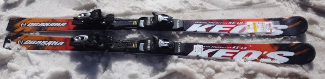
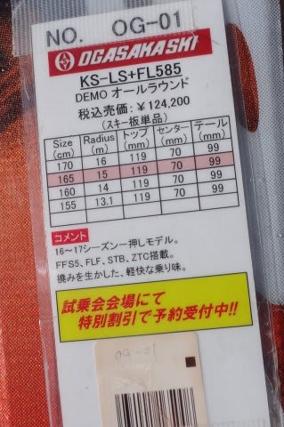
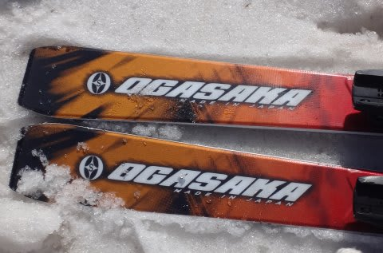
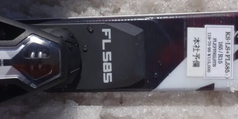

# 2017シーズンモデル，スキー試乗レポート第11回…OGASAKA編その2

📅 投稿日時: 2016-06-03 03:08:35

🏷️ カテゴリ: [スキー板試乗](c0bd8048615710cee890e403a36cc9a2b.md)

えー．

まだ続く，2017シーズンモデルのスキー板，

試乗インプレッション．

これで，一の瀬で試乗した板は終わりです．

本日は，オガサカ編．

ケオッズのトップモデルです．

では，どうぞ～！

○OGASAKA Keo's LS FL585 165cm

基礎オールラウンド．

来シーズンのKeo'sのトップモデル．

プレートは，FLプレートとFMプレートの2種類が選べるようですが…

今回履いたのは，強いほうのFLプレート付きの

モデルです．

長さが165なのにRが15mと，比較的緩めのサイドカーブのこの板．

FLプレートが重いのかな？

あるいはビンディングが重いのか…

履いた瞬間重い感じを受けます．

板自体は，しっかりエッジグリップ系．

エッジグリップさせるとよく切れて，

エッジに乗って切れていく感じの板です．

エッジホールドが比較的強く感じたので，

この日の重い雪ではずらすより切っていく方が

気持ち良かったですね～．

今回のKeo'sは，割とカービングよりになった感．

そのエッジグリップも，トップテールが頑張るのではなく，

足元付近がしっかりとらえる感じ．

切っていくと，15mという大きめのラディウスが効いて，

165cmという小回り用っぽい長さの割には，

比較的ゆったりと曲がっていきます．

エッジに乗ってキュンキュン曲がる感じの板ではありません．

小回りの際には，板を動かしていく感じになります．

強めのFLプレートというのもあり，板の張りも

比較的しっかりしており，高速耐性はありそうなので，

165cmって長さだけども，ロングもそこそこ行けるのでは

ないかな～．

165cmって割には安定感もあり，妙に小回りを

強制する板でもないので．

短めの板だけどもショート限定じゃない，

オールラウンド性を求める人にはいいかも．

## 💬 コメント一覧

### 💬 コメント by (オヤジスキーヤー)
**タイトル**: 今日の月山
**投稿日**: 2016-06-03 19:34:29

いつも楽しく拝読させて頂いてます。特に今時期のスキー試乗記参考になります！そろそろ月山にいらっしゃる予定との事。先日もコメントさせて頂きましたが、本日月山行って来ました。先週から一段と雪が…。リフトでまわせますが是非早めに起こし下さい。沢コース降りてこれますが下は薮が…。大斜面へのトラバースも薮さんが…。例年より２～３週間は雪溶けが早い状態ですよ。

### 💬 コメント by (Skier_S)
**タイトル**: オヤジスキーヤーさま
**投稿日**: 2016-06-04 03:05:53

あ，本日月山行かれましたか…

来週まで藪漕ぎ無く月山滑れそうでしょうか？

今週末は予定が埋まっていて，

来週も行けて日帰りなんですよ…

本来，再来週に行く予定だったんですが．

藪漕ぎせずにリフト滑れるのは来週くらいが

リミットっぽいですか？

やっぱり，もう再来週にはリフト滑るには

厳しい感じでしょうか…

うーむ．

雪解けが早すぎますね（涙）

### 💬 コメント by (オヤジスキーヤー)
**タイトル**: 月山U+2461
**投稿日**: 2016-06-04 06:50:35

大斜面へのトラバースも切れつつあり、少し登る形でした、沢コースからリフト乗り場の手前迄スキー履いたまま行けましたが、夕方には沢コースから乗り場の入口の所に岩が出て来つつ有りました。再来週は…厳しいかも…朝行けた所も夕方には薮や岩が…。いずれにせよ早目にいらっしゃるのが良いと思いますよ！

### 💬 コメント by (Skier_S)
**タイトル**: オヤジスキーヤーさま
**投稿日**: 2016-06-05 08:06:08

あ，トラバースももう切れそうですか…！

沢コースもそろそろ終わりそうな感じですね…

うーむ．今週もバタバタしていたので，

何とか来週末に行くことを検討します…

除法ありがとうございました！

