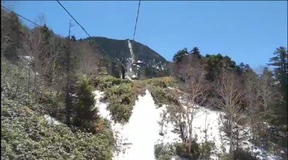
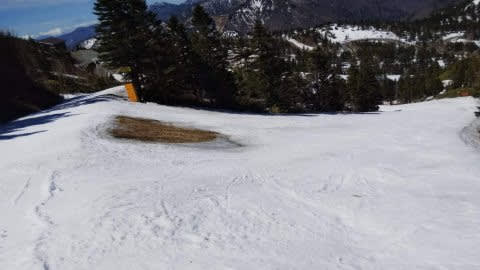
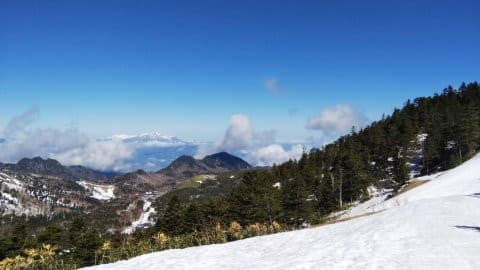
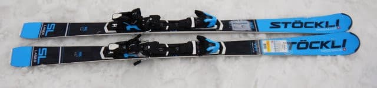
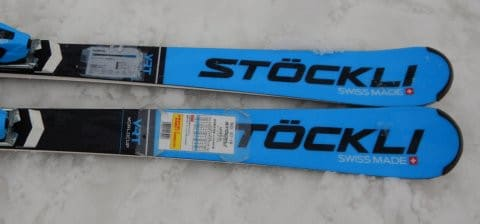
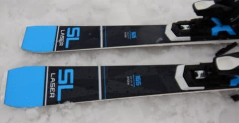
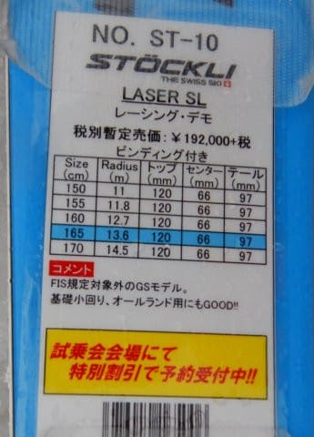
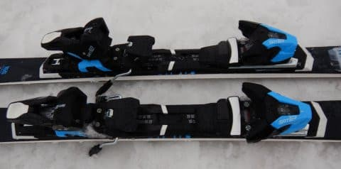

# 2021シーズンモデルのスキー板，試乗レポート…STOCKLI LASER SL

📅 投稿日時: 2020-05-12 00:32:26

えー．

本日の志賀高原，

すっきり晴天で朝から+10℃程度と，

かなり気温が上がっちゃったようですね…

おかげで朝から雪は滑らない雪で，

さらに雪解けも進んでいるようです…

渋峠は明日から15日までコース整備のため

運休とのことですが，5月末まで何とか営業

できるよう，雪寄せするんでしょうか…

ちなみに，今日営業したのは，

渋のペアリフトと横手第2スカイのみ．

横手第3が動かなかったので，

渋峠と横手山は行き来できなかったようですが…

明日営業するのは，横手第2スカイのみ

ですかね．

とりあえず．

1か月以上スキーに行けてない私にとって．

スキー場の毎日の景色を見るのが，

今の癒しです…

今日も特派員の方，ありがとうございました～！

ってなことで．

本日の本題の，2021シーズンモデルのスキー板の試乗レポート．

今回は，私が今まで一度も履いたことがない板，

STOCKLIを試してみました…

わが人生初めてSTOCLIを履いてみたので，そのレポートです．

では，どうぞ～！

○STOCKLI LASER SL 165cm

SL競技セカンドモデル，基礎小回り用

生まれて初めて乗る，STOCKLIの板です．

板+ビンディングで20万円ですっ！！！

絶対自分では買わない価格帯の板ですが，

試乗に出ていたので，乗ってみました…

とりあえず，この上にLASER SL FISっていう

FIS対応モデルがあるようですが．

この板はFIS非対応のセカンドモデル．

…ビンディングは，今シーズンのSALOMONの

X-MAXとかに乗ってる，現行型のZ12ビンディングと

同じ，ワンタッチでソールサイズが調整できる

SALOMONのビンディングですね…

履いてみた感じ…

おぉ！？春の雪では取り扱いやすい，

いい感じの板ですね…

結構軽快で，張りもそれほど強すぎず，

すっとたわんで，サイドカーブに乗って

気持ちよく回って行けます．

トップとテールのエッジグリップが

比較的強い感じで，トップからテールまでの

長いエッジがきちんと効いて，

エッジに沿ってオートマチックにターンが

できる感じ．

で，すっとたわみが出るけど，たわんだ分だけ

板にしっかり圧が溜まって，ちゃんと板に

返りが戻ってくるので，スピードが出ても

板が負けちゃう感じが無く，ちゃんと

足元に板が戻ってきます．

ばね感のある板の返りを使って，

かなりオートマチックに次のターンの

始動ができます．

…これ，ホントにサンドイッチの板？

あまりサンドイッチっぽくない，キャップスキー的な

トップとテールのグリップの強さとオートマチック感…

自分でたわみを作っていく動きをすることなく，

勝手に捉えて勝手にたわんで，勝手に

エッジに沿ってするする回ってくれます．

足元も重くないし，かなり軽快です…

谷回りでたわみの出し方を変えてやれば

ターン弧の自由度もあり，そこそこの

スピードまではいい感じの切れたターンが

できますが…

ちょいとフレックスが優し目なので，

トップスピードを出していくとたわみが

出すぎて，だんだん小回りになっていきます．

ただ，フレックスに対してトーションが十分に

強いようで，フレックスが優し目でも，グリップは

しっかりしてます．

スピードを出して小回りになっても，グリップが

ずるずる抜けていくことは無く，トップとテールが

しっかり捉えた感じの小回りで滑って行けます．

とはいえ，ガチガチに強い板ではないので，

板を動かしてターン弧を作っていく自由度は

高いです．

ターンの途中で，板にちょっとズラシを入れて

スピードやターン弧を操作することも

簡単にできます．

ただ，ホントのガチガチバーンは滑ってないので，

ガチガチバーンで本気のトップスピードを出したら，

ちょっと板が逃げちゃうのかも…

このあたり，試してないので分かりません．

でも．

ミドルスピード程度で，オートマチックに

カービング小回りに入れてしまうグリップの

強さがありながら，板を自由に動かせる

高い操作性があるので．

そこそこの技術レベルをもった人が，

カービング小回りでガンガン掘っていきたいし，

気楽にゲレンデも滑りたい…

っていう小回りベースの板とするには良いかも…

…と，思いながら．

「20万あったら，ガンガン小回り用と，お気楽

　オールラウンドと2セット買えるな…」

と考えてしまう，Skier_Sなのだった…

## 💬 コメント一覧

### 💬 コメント by (しんちゃん)
**タイトル**: 高価な板
**投稿日**: 2020-05-12 22:32:23

スイスメイドは、時計もスキー板も精密で高価なんですね。

前年モデルの板なら３台ぐらい買えちゃう、と考えてしまうしんちゃんなのだった・・・

### 💬 コメント by (naoちゃんねる)
**タイトル**: Unknown
**投稿日**: 2020-05-12 22:58:27

STOCKLI 興味がありましたので、Sさんのレポートに登場して興味深く読みました～

いやー お値段高い分 お気楽も、ガンガンも いけちゃうんですね～

でも…20万をワンシーズンでヘタらせてしまうのは…😱

私はこの1/3のお値段の値下がりした板の中から選びます😅

### 💬 コメント by (Skier_S)
**タイトル**: STOCKLIは高すぎる…
**投稿日**: 2020-05-13 02:14:56

＞しんちゃんさま

いやー．

ホントに古いモデルなら何台も買えますからね～…

私は型落ちとなったSXをビンディング抜きで安く買い続けたので，

20万あればSX一郎君から四朗君まで揃えられる…

と思っちゃいました（笑）

＞naoチャンネルさま

20万の板，1シーズンもたなかったら再起不能になりますね…

でも，仮に3シーズン長持ちしたとしても，同じ値段なら

3セット板買っちゃいますよね（笑）

### 💬 コメント by (Goku)
**タイトル**: Unknown
**投稿日**: 2020-05-13 06:25:25

かれこれ10年、板はネットで買ってます。

今シーズン買った3台の合計がまさにこの金額でした。

しかも一台は今シーズンモデル‼

### 💬 コメント by (yumi)
**タイトル**: Unknown
**投稿日**: 2020-05-13 06:55:22

Ｓさぁ～ん⛷️💨🎵

ビィンディング付き19800円の 子供用の板の私は 10台買えますぅ～⤴️

しかも❗️

「板、へたってるよー❗️」って、

yamaさんに 教えてもらうまで 気が付かないのでしたぁ～😅😅😅

### 💬 コメント by (Skier_S)
**タイトル**: やはりお値段が…
**投稿日**: 2020-05-14 00:24:26

＞Gokuさま

おっと．STOCKLI1台で，今シーズンの3台が買えますか！

…だとすると，やっぱり3台買っちゃいますよね（笑）．

＞yumiさま

ええええ～！？？19800円？？

あれだけ滑っているから，一日あたりのお値段にしたら，

ものすごい激安ですね（笑）．

で．

普通は初級・中級者用板って，上級者用みたいにギリギリの

極限を突いた設計じゃないから，なかなかヘタらないものなんですが…

それをヘタらすとは…

恐るべし！

