# 4月2日，日曜の志賀高原速報モード…朝からすっきり晴天！なのに雪質はGood！これ，ホントに4月？最高の一日

📅 投稿日時: 2017-04-03 02:06:55

えー．

本日も，シアワセでした…

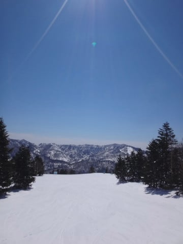

4月で，こんな晴天なのに，

こんな雪質が良くていいんだろうか…？？？

という一日だったのですが．

本日．帰宅後に天気図を見ていると…

…えええ！！？

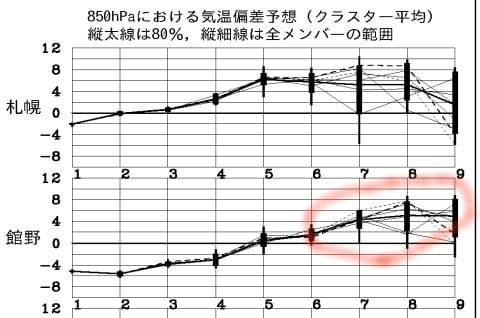

来週後半…

かなり気温が上がりそうなんですが（涙）．

そして…

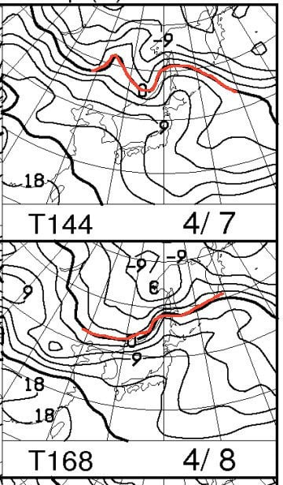

なに？？

4月8日…

志賀高原には+12℃線が…！？？

そして．

4月8日は…このままの天気図だと降りますよ？？

それも，液体が…（涙）．

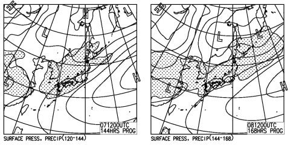

…マズい．

これは，マズい．

シアワセ週末は，今週末で終わりか…？？（かなり涙）．

だけど．

まだ8日の予想ばらつきは大きい段階なので．

まだわからない．

もしかすると，8日の予想が変わって激烈に

冷えるかもしれないのだ！←可能性は低い…

…という，悲しいニュースのあとは．

今日も遅いので．

本日日曜の志賀高原，速報モードにて…

えー．

本日は．

朝から晴天！

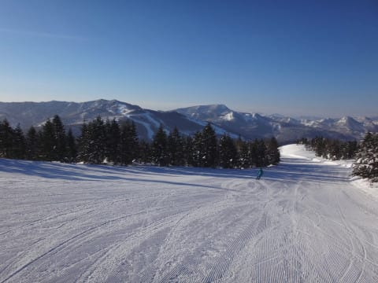

というか…

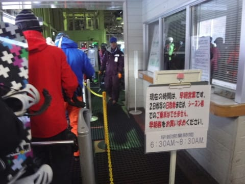

早朝から晴天！！

シアワセな早朝タイムが終わって，

通常営業タイムになっても…

コースはシマシマッ！

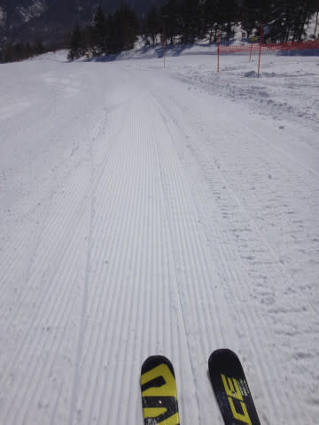

そして，今日は終日天気も良く．

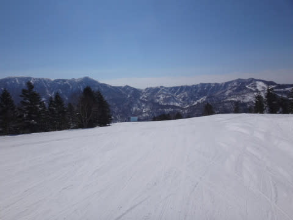

えーっと．

今日は4月ですよね？？

4月の晴天の昼間で，こんなに雪質が

良くていいの？？

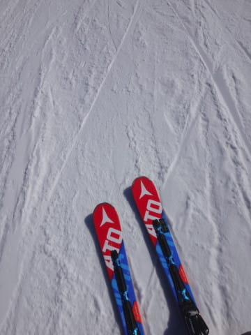

そして．

夕方になっても…

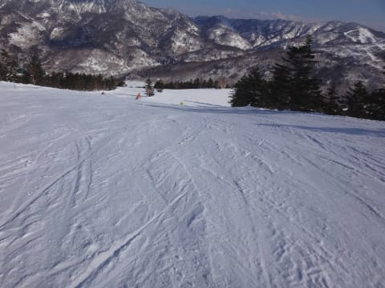

ゲレンデはフラット，雪質はGood！

いいの？

4月の晴天の午後4時のゲレンデが，

こんなGoodコンディションで，いいの？？

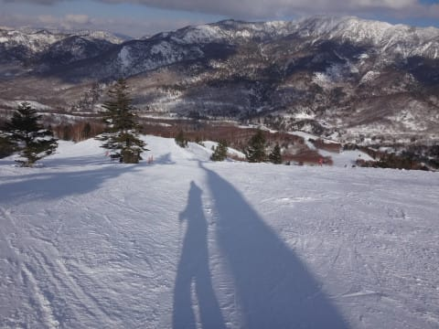

こんなに雪があっていいコンディションなのに…

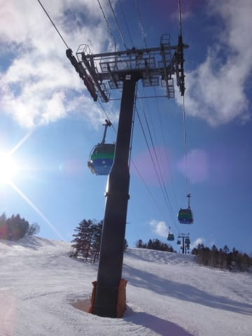

今日で焼額第1ゴンドラ，営業終了なんて！！

もったいないっ！！！！

…ってことで．

天気よし，雪よし．

とても4月と思えない最高シアワセバーンを滑り倒し．

焼額第1ゴンドラの最終営業日を終えたのでした…

…来週から，我が生息地の焼額第1ゴンドラが動かないなんて．

信じられない（涙）．

とりあえず，明日，また詳細レポートやりますので．

お楽しみに…！！

## 💬 コメント一覧

### 💬 コメント by (michi)
**タイトル**: 天気最高でしたね
**投稿日**: 2017-04-03 10:28:56

昨日も息子とヤケビに行ってました。

午前中はコンディション抜群でしたね。

ゴンドラから2回ほどお見かけしましたがお話出来ず残念でした。

本日から東京に異動なんで部屋探しや引越準備などでもう今月は週末スキーは無理そうです（泣）

### 💬 コメント by (Unknown)
**タイトル**: Unknown
**投稿日**: 2017-04-03 11:45:06

土曜の47は午前最高　午後ザブザブで視界は山頂終始ガスで中下は良好　スキーでも15mのキッカーで3D 飛んで凄いです　日曜は朝一奥志賀で約10時から15時ずっとヤケビ第一で滑ってました　金曜からは想像できない位良かったです　奇跡ですがガラガラの抽選①当たりました笑

### 💬 コメント by (まいる)
**タイトル**: 今週末？
**投稿日**: 2017-04-03 12:44:10

Sさん、お疲れさまです

志賀高原、かなり雪よさそうですね

私は土日滑らず家族に尽くしてました。

今週末は、丸沼へ来季ボードの試乗会の予定なんですが、えー！　液体が降ってくるんですか

### 💬 コメント by (Goku)
**タイトル**: 集団暴走
**投稿日**: 2017-04-03 20:31:10

昨日もお世話様でした！

朝イチＧＳの集団暴走楽しかったです～(笑)

そして、最後のsakuraちゃんとのコラボもたのしかったですね。

それにしても、最近１ゴンがブログ読者＆20000ｍメンバーで埋まることが多い気がするのは私だけ？

### 💬 コメント by (しんちゃん)
**タイトル**: ＳＸの真価を見た！
**投稿日**: 2017-04-03 22:50:37

日曜日はホントに楽しかったです。

早朝からご挨拶できて、その後通常時間に、ブログ読者の皆様と集団暴走もできて、夢のような、濃い～時間でした。

ＳＸを履かれて、後ろをご一緒させていただいたときの、板の安定感や、Ｓ様の倒れこむ角度に、ＳＸの真価を見た気がしました。キレッキレでした。

今のうちに現行ＳＸを買い占めておかないといけないかもしれないですね（笑）

### 💬 コメント by (Skier_S)
**タイトル**: 今週末は期待できなさそう…
**投稿日**: 2017-04-04 02:11:53

＞michiさま

あ，今週もいらっしゃったんですね．

残念ながら，おあいできませんでしたね～．

今月は無理でも，5月のGWにはぜひ

志賀高原でお会いしましょう～！！！

＞Unknownさま（かずさんかな…？）

日曜は良かったですよね～！

私は11:20～14:30ころまで，一の瀬方面へ

行ってました…

丁度行き違いになったようですね．

ガラガラの抽選は何が当たったのですか？？

＞まいるさま

土日の家族サービス，お疲れ様でした（笑）．

今週末は…残念ながら，一気にコンディション

悪化しそうです（涙）．

今の天気図だと，日曜が雨になりそうです…

また追って詳細天気予想します．

＞Gokuさま

日曜もお世話になりました～！

午前中のかっとびも楽しかったし，

最後のコラボも楽しめました～！！

確かに最近は大人数で滑ることが

増えましたね（笑）．

最近，知り合いが加速度的に増えている

気がしてます…

＞しんちゃんさま

日曜はお世話になりました～！！

もう，午前中は集団暴走族状態でしたね～．

いやー．

でも．

SX，いい板ですよ．ホントに．

買い占めまくりたい気分でいっぱいです（笑）

