# メインのデスクトップPCを買い替えた…リース落ちの格安中古PCは使えるのか？？その3

📅 投稿日時: 2023-08-20 01:21:41

🏷️ カテゴリ: [PC,カメラ&小物](c0d8caed13e597efe97b661a8ae56bed0.md)

ってなことで，[前回](e181d1dcb2a3fba65586254e7a4e907e7.md)，

旧PCから新PCへの臓器移植

手術は終了したわけですけど…

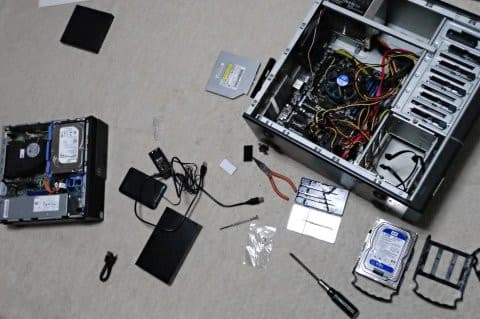

移植手術で旧PCの2TBと3TBのHDDは

新PCにつないだものの．

今回新PCにはつながずに破棄する，

旧PCのシステムディスクだった

2.5インチのSSDからデータを

移植するという作業が待っています．

これは，700円でおつりがくる，

USB接続可能な2.5インチの

HDDケースを買って…

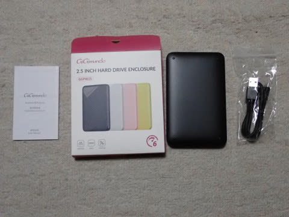

こいつに旧PCのSSDを組み込んで，

新PCにつなぐことで，データ移植を

行います！

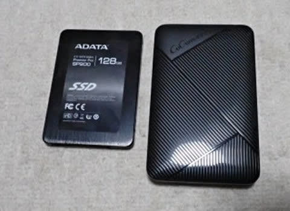

HDDケースの蓋を外して，

SSDを…

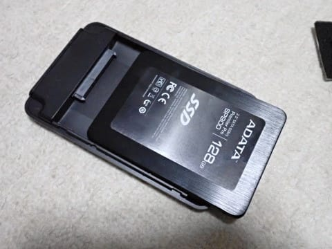

こんな感じではめ込んで．

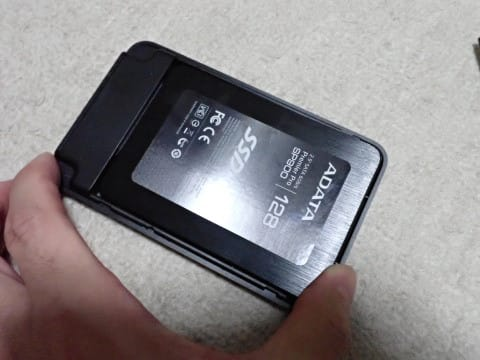

あとは蓋をするだけの簡単組み立て！

こいつも工具不要！

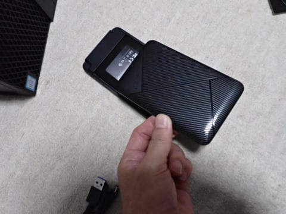

ってなことで．

旧PCのSSDを新PCにUSB接続し，

必要なファイルをコピーすれば…

あとは，新PCに必要なソフトをインストールして，

完全に新PCへ移行完了です！

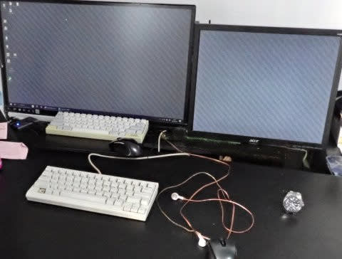

OSはWin8.1からWin11に変わりましたが．

それ以外は，半日程度の作業で元通りの

環境になりました～！

元のPCのデータも，HDDごと移植したので

これまで通りにアクセスできます！

使ってみると…

うん．

ビデオエンコードや重いゲームなどを

するわけでない私にとっては，

CPU性能はこれで十分！

リソースモニタでは，ちゃんとCPUが

6コア見えてますね…

Core i5-8500はH.265のハードウェア

デコーダをもっているので，4k映像を

再生してもCPU負荷は10％以下．

フル負荷でコマ落ちしていた前PCとえらい

違い…

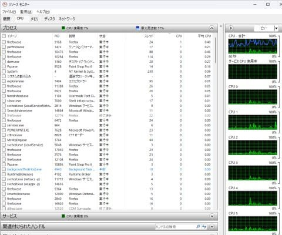

私の使い方ではメモリも8GBほどしか

使ってないようなので…16Gあれば，

メモリも余裕！

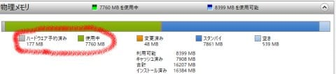

古いPCからHDDを2台移植したのもあり，

ディスク容量も十分だし．

さらに3TのHDDは内蔵から外付け

接続に変えたけど．

この3TBのHDDの転送速度を，

旧PCの内蔵SATA接続時のベンチマークと…

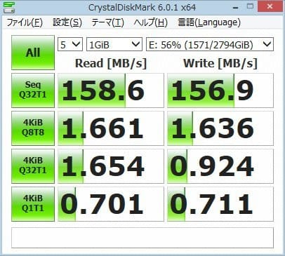

新PCでのUSB接続のベンチマークで比べると…

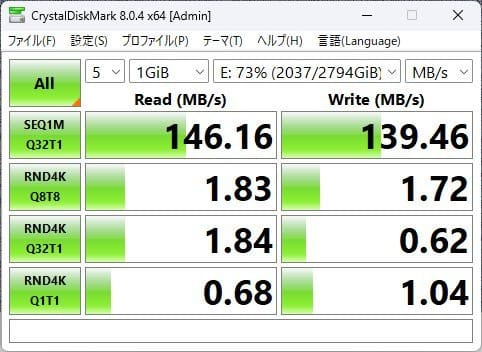

新PC側は高速なUSB 3.2 Gen2というのもあり．

思ったほど性能劣化はありませんね～！！

新PCでシーケンシャルリードが多少遅い以外，

ランダムアクセスはむしろ早くなってる

くらいで．

内蔵と外付けで，体感速度は全く

変わりません．

うん．HDDはUSB外付けで十分だな．

これで，

Windows11のライセンスもついてきて．

Office2019もインストールされてるし．

さらに．

Amazonの説明では，DVD-ROMドライブと書いて

あったこのPC．

うれしい誤算で，実は書き込み可能なDVD-RW

ドライブが乗ってました！！

（乗せ換える必要，なかったんだね…）

ってなことで．

このPCが送料込みで2.6万円なら，すげーー満足！

## 💬 コメント一覧

### 💬 コメント by (カンタロス)
**タイトル**: Unknown
**投稿日**: 2023-08-20 06:53:10

Sさま、こんにちは。

読んでいると私もPCを買い替えたくなってきました（笑）

いまだに、A10-6800使ってますからね～。

当然にWIN11は動かないので10です。

マザボ買って手術やるよりも本体買いなおしたほうが安いという不思議…。

自作の方が安かった時代が懐かしいですね。

### 💬 コメント by (megalith)
**タイトル**: Unknown
**投稿日**: 2023-08-20 16:54:24

ご無沙汰しております。

自分も秋頃PCの更新を予定していています。

去年メインモニターを4Kに更新したので4K動画を再生してみたら動画再生時音にノイズが乗るようになり、調べた結果、グラボの動画再生支援が対応できずものの見事に性能不足が露呈しました。（笑）

俗に言うHasweellおぢさん（笑）なので、色々な意味で総とっかえになりそうです。(苦笑)

極々偶に動画編集もやるので、流石に第13世代i5じゃないとちょっと厳しいかな。（笑）

あっ自分キーボードは中古で購入したFILCOのマジェスタッチテンキーレスのワイヤレスです。（笑）

余談　何をトチ狂ったか今年中古のM1 MBA衝動買いしました。（笑）(いやぁまじでお安く買えたので)サブPCとして使用予定。

### 💬 コメント by (Skier_S)
**タイトル**: なぜかこの記事のページビューが結構すごい
**投稿日**: 2023-08-20 23:04:24

＞カンタロスさま

いや…さすがにそれはそろそろ買い替え時ではないでしょうか？？

リース落ちの安いやつを買うほうが，パーツを個別に買うよりよっぽど安く上がっていいですよ．

ってか，2.8万円ってWin11の正規ライセンスとほぼ同じ金額のような気がします…

＞megalithさま

Haswelおぢさんですか(笑)

そんな表現があるんですね．

動画編集やるならいいCPUが欲しいですよね…

でも，Mac使いだと安い中古はなさそうなんですが…そんなにお安いのがあったんですね．

### 💬 コメント by (megalith)
**タイトル**: Unknown
**投稿日**: 2023-08-21 16:01:21

初代はSandyおじさんで、Ivyおじさん、Haswellおじさんは派生種ですね。（笑）

買ったMBAはカスタムモデルで吊るしモデルとなぜか同額でした。（笑）

しかも充電回数も吊るしモデルより圧倒的に良かったですし。

もし吊るししか無かったら買わなかったですね。

といっても、Kaby Lake Refresh機より圧倒的に高いことは変わりませんけど。（汗）

ちなみに、イオシスで同スペックMBAですと約12万でした。(驚)

### 💬 コメント by (Skier_S)
**タイトル**: ＞megalithさま
**投稿日**: 2023-08-22 00:29:30

私はMacはよくわからないのですが…

カスタムモデルはどのあたりがカスタムされてるんでしょうか．

しかし，今回の経験で10万円越えどころか，もう5万円越えのPCも買えなくなりました…

娘にも，リース落ちの中古のWin11インストール済みVAIOを3万円ちょいで買ってしまいました．

いや．我が家にはこれで十分です…

### 💬 コメント by (megalith)
**タイトル**: Unknown
**投稿日**: 2023-08-22 08:00:56

まず吊るしモデルとは基本スペックのもので、Appleストア以外でも購入が可能なものです。

カスタムモデルは基本的にAppleストアでしか選択できないもの(最近ではヨドバシ等大手販売店でもCTOモデルとして売られている場合があります)です。

M1 MBAに限れば(MBPなどは画面サイズによって色々違うので割愛)ですが、変更できる点はCPU&GPU、メモリの容量、SSDの容量になります。

中古で買う場合は外見では判別不能（笑）ですので、POPの仕様情報で判断するしかありません。

POPの仕様情報がわからない場合は、店員に言って起動して中の仕様を確認しなければなりません。

一番わかり易いのはメモリが16G以上になっていればカスタムモデルです。

吊るしモデルはメモリ8Gしかありませんので。

ただ気をつけてほしいのは、あとからのメモリの増設やSSDの換装はできません。(すべて基盤直付けなので)

自分のはCPU&GPUは上位仕様 メモリ16G SSD512Gでした。

特にCPU&GPUはPOPに記載がなかったので嬉しい誤算でした。（笑）

ご参考になれば幸いです。

### 💬 コメント by (megalith)
**タイトル**: Unknown
**投稿日**: 2023-08-22 11:21:40

追伸　メモリ8GでもCPU&GPUが上位のものやSSDが1TB等になっている場合もカスタムモデルですね（笑）

### 💬 コメント by (Skier_S)
**タイトル**: ＞megalithさま
**投稿日**: 2023-08-23 00:28:53

CPU/GPUが上位で16G&512モデルというのは…

フルオプション状態ですね（笑）．

あとから交換できないものだと，最初からいいのを選ぶしかないわけですが，

今回は当たり品を引いたわけですね…！

### 💬 コメント by (カンタロス)
**タイトル**: Unknown
**投稿日**: 2023-08-24 07:57:54

Sさま、こんにちは。

返信、アドバイスありがとうございます。

買い替えようと思いつつ自宅パソコンの使用時間が週に30分程度しか使わないのでなかなか決心が（笑）

パソコン買わなければ、その分スキーに使えるよね！！とか思い我慢してます。

### 💬 コメント by (Skier_S)
**タイトル**: ＞カンタロスさま
**投稿日**: 2023-08-25 06:03:03

週に30分しか使わないなら，確かに買い替えなくてもよいのかも…

どうしようもなくなるまで我慢して，浮いたお金で物欲に負けてスキー用品を買うのです！！

