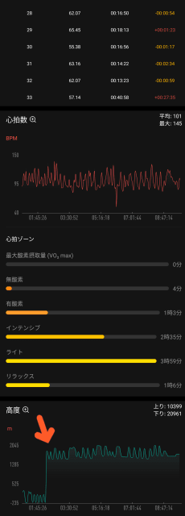

# スマートウォッチ，Amazfit PACEを買ってみた　その9…スマホでスキーのログを見てみたが，高度計が不正確なのが惜しい…

📅 投稿日時: 2020-05-26 00:41:27

🏷️ カテゴリ: [PC,カメラ&小物](c0d8caed13e597efe97b661a8ae56bed0.md)

ということで．

Amazfit PACEを購入して，レポートを

書いてきたわけですが．

[第1回　Amazfit PACEとは？](ed3d5d801313ccbb4de704222aba3cdc0.md)

[第2回　海外通販での注文から到着まで](ee08698196e276d6c47312dbced43bf34.md)

[第3回　到着＆開梱の儀＆初期設定](ed1bf51c8f4791b77b1b4731aae9be689.md)

[第4回　バンド交換＆時計本体の設定画面](e3928a10367db811404c9ce7b1d95f3fe.md)

[第5回　運動記録…スキーで使うとこんな感じ](e494f1a5f2dcecb6c986e7d9821c27fe4.md)

[第6回…過去のスキーの記録を時計本体で見る＆GPXファイルをGoogle Mapで見る](ef027dd244e860f24105fa098fbeedce4.md)

[第7回…スキーログ以外の，時計本体の機能も盛りだくさん](ea509a7c711b06640acb6477bdc2890df.md)

[第8回…スマホアプリを使ってみる](e1f31851c8b18814cc3cbc862eba42859.md)

今回は，スキーモードの記録を

スマホで見るとどうなっているのか

というところをレポートします！

…特に，気になるAmazfit PACEとAmazfit GTRの

記録精度を比べながら見てみようと思います…

まず．

スマホアプリで，運動記録を選ぶ画面を出してみると…

私の場合，Amazfit GTRとAmazfit PACEの両方を

着けて滑っており，両方とも記録しているため，

スマホには，同じ日付で二つずつ記録が

残ってますね…

水色矢印がAmazfit GTRの，

赤色矢印がAmazfit PACEの記録ですが…

同じ日の記録なのに，両者の滑走距離が

全然違うのはなぜなんだろう…？？

Amazfit PACEの記録画面を見てみると…

まずはGPS軌跡が出てきます．

ちなみに．

同じ日のAmazfit GTRの記録画面を見てみると…

同じくGPS軌跡が出てきますが，

ちょっとAmazfit PACEと違う気が…？？

どこが違うか分かりますでしょうか…

どこが違うかと言うと．

Amazfit GTRだと，水色で描いた

リフトの登り部分もGPS軌跡に

出ますが…

Amazfit PACEの記録では，リフトの

登り部分，GPS軌跡がカットされていて，

滑った部分の軌跡のみが記録されて

るんです！

微妙ですが，両者ですでにこんな違いが…

そして．

Amazfit PACEのGPS軌跡を下にスクロールさせると．

次の画面では，記録時間，平均心拍数，消費カロリー，

最大速度，ラップ（滑った本数），滑走標高差などが

出てきますが…

うーん．

4182kcalって，4000kcalも消費してるかな？？

そして，滑走標高差が20961mって，20000m越え

しちゃってますが…？？

…これは，以前にも報告した．

スキーモードでは滑走標高差とカロリーが

2倍になるバグ

が出てきてるようです…

同じ日の，Amazfit GTRの記録の方は．

「合計落差」で示される滑走標高差は

Amazfit PACEのほぼ半分，10398mですし．

カロリーに至っては，1/4の1162kcalです…

こっちの方が正確です．

で，この上のAmazfit GTRの記録には，

Amazfit PACEにはない一時停止時間の表示が

右のほうに00:00:19って出てますが…

そのかわり，Amazfit PACEにあった

ラップ（滑走本数）が出てません！

…これは，滑走本数が出てくれる

Amazfit PACEの方がいいですね…

で．再びAmazfit PACEの記録画面を

さらに下に送ると． 

画面の下の方，速度グラフの次に，

1回の滑降スピードってのがあります！

…スクロールさせていくと…

なんと．

滑った本数1本1本すべての，最大滑走スピードと

1サイクルにかかった時間が延々記録されてます…！！

こ，これはなんとマニアックな…

1日70本滑ったら，70本分全部出てきます！！←リフト70回も乗るのは，20000mな終わった人くらいだから．普通の人はそんなに乗らないから

20000mチャレンジに必要な，

一の瀬ファミリーを8分サイクルで回せるか．

奥志賀ゴンドラを12分で回せるか…

というのが，これで確認できます！！←いや，そんなこと確認しようと思う人はおかしいから．そんな人，ほとんどいないから

ちなみに，Amazfit GTRでは，この1本1本の

記録は出ません．

Amazfit PACEならではの機能です…

で．

この1本1本の記録の次にスクロールさせると…

今度は，心拍数グラフと，心拍ゾーン．

そして，一番下に高度グラフが表示されます．

…ただ，なんだか高度計グラフ，

矢印の部分に変な段差がありますね…

Amazfit GTRでの同じ日の記録はこちら．

1本1本の記録がないので，高度グラフの次に

すぐ心拍グラフ，心拍ゾーン，高度グラフと

出てきますが．

こちらの一番下の高度グラフは，段差がないですね…

高度グラフは，Amazfit GTRの方が正確な

ようです…

両者の高度グラフだけ取り出して

比較してみると…

全く同じ日の記録とは思えませんね（笑）．

うーむ．やはり，Amazfit PACE．

途中まで高度がおかしくて，

マイナス235mとなっていて．

この間，私は地中に潜っちゃってることに

なってるみたいです（涙）

Amazfit PACE，たまたまこの時だけ

おかしかったのではなく．

このほかにも，こんな感じで．

標高1500m以上の志賀高原で滑ってる

はず上のAmazfit PACEのグラフ，

なぜか標高30m~765mで滑ってることに

なってます…（涙）

下側のAmazfit GTRの記録は，大体正しく

1500m~2000mの間を滑ってます．

このほかにも，こっちを見ると，

Amazfit PACEは，なぜか標高2000mピークの

焼額を滑っているのに，2500mまで上がってる

ことになってたり…

同じく，これも下側のAmazfit GTRの記録は大体

正しいですね…

そして，さらにこんな感じで．

Amazfit PACEの記録では，スキー場の

日本最高標高である，2307mの横手山より

高いところで滑った記録が残ってます…（涙）

大体毎回，こんな感じで高度はおかしな

値が記録されてます…

（しかし，この高度記録を振り返ると．

　私はほぼ毎回8時間以上，昼休み無しで滑り

　続けている気がするのは気のせいか！？？）

という感じで．

ほとんどの機能については，結構いい感じの

Amazfit PACEなのですが．

高度計が不正確

という，致命的欠点があるようです…（泣）

残念…

実に，惜しい．

ただ．それとは逆に．

Amazfit PACEとGTRの速度グラフを比較すると．

GPSが正確なAmazfit PACEの方が，

ちゃんとリフトの移動速度まで正しく

グラフに残っています…

どこでリフトに乗ってたか，待ち時間

だったのかが分かるレベルです…

それに比べて，Amazfit GTRの方は，

速度グラフがちょっと不正確です…

とりあえず，速度に関しては，高度と違い

Amazfit PACEの方が圧倒的に正確です．

ってな感じで．

1本1本の記録が見れたり，速度計が正確だったりと，

結構いい感じのAmazfit PACEですが．

…高度計が不正確

という欠点があり．

20000mメンバーにとって大切な，

滑走標高差の記録があてにならない

という，ちょいと残念な結果でした…

でも．

滑走標高差を正確に測りたい！

という人じゃなく，

「大体どのくらい滑ったかの目安」

という程度であれば使えるし．

それ以外の機能はAmazfit GTRより

優れているので．

結構おススメできるのですが…

いや．高度計，惜しい…惜しすぎる…

ってなことで．

これで終わりかとお思いでしょうが．

次回は，Amazfit PACEのGPSの正確さについて

書いてみます．

…GPSは，高度計と違って驚くほどの正確さ

だったので．

次回をお楽しみに…！
