# 2019年8月，座間味で小6の娘と親子ダイビング！その3…ダイビング2本目も悪天候（涙）

📅 投稿日時: 2019-10-14 02:24:19

🏷️ カテゴリ: [ダイビング日記](ce3a7a8d424d112fce83ee85c81a0e344.md)

ということで．

今年1本目のダイビングが終わったあと．

ボートに上がりますが…

雨は止んでません（涙）

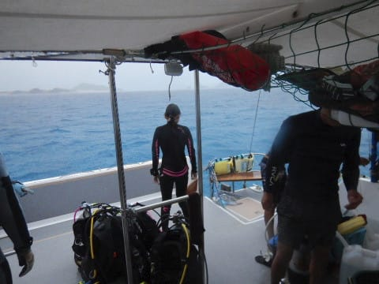

…そして，2本目のポイントに向けて，

移動開始！

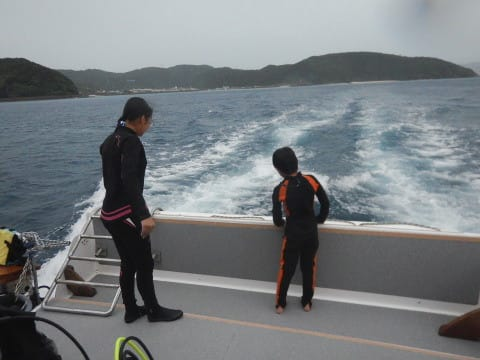

…ですが．

見ての通り，どよーーーーんとした

天気が続いてます…（泣）．

どよーーーんとした海を移動して，

2本目のポイントに到着しましたが…

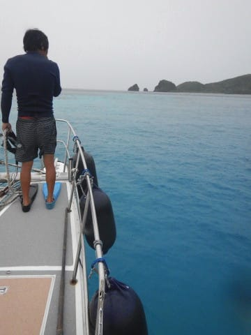

南の島の日差しが無い，

どんよりした海面を

雨粒が叩いている状況で．

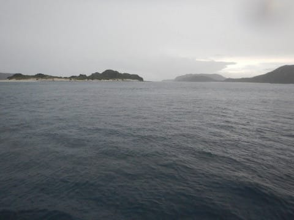

子供たちも，泳ごうという

テンションが上がらない状況の

ようで…

珍しいことに，休憩時間は

ずっと船の上でぼんやり過ごしてました．

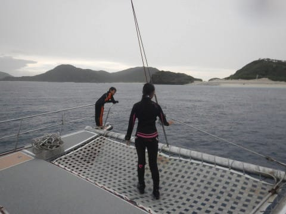

ってことで．

雨粒が叩く水面を恨めし気に見ていると，

2本目のダイビング時間が

やってきたので．

タンクを交換して…

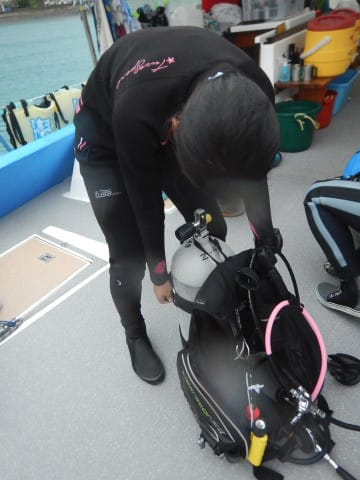

2本目のポイントへエントリー！

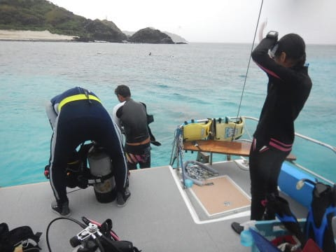

ポイント名は「ガヒ前」

その名の通り，無人島の嘉比島の

目の前のポイント．

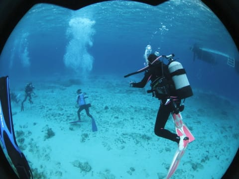

日が射さない海の中は，

相変わらず暗い感じで，

ちょっと残念…

定番の太陽光逆光アングルで

撮影してみても，太陽光が

入らず，写真がイマイチどよーーんと

した感じに仕上がります…（涙）

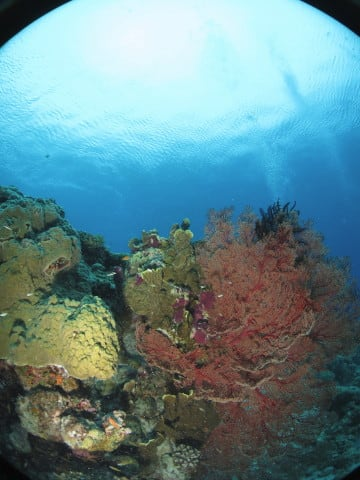

とはいえ，ガイドさんはいろいろ小物を

見せてくれて．

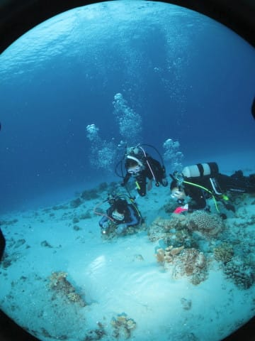

（私は遠くから眺めていたので，

　何を紹介してもらっていたのかは

　分からず…）

いつものデバスズメさんやら．

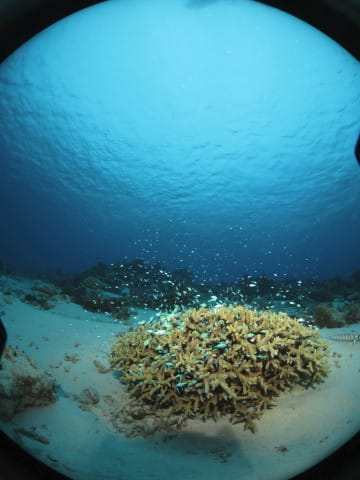

カクレクマノミさん．

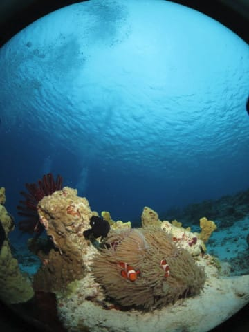

ロクセンヤッコに…

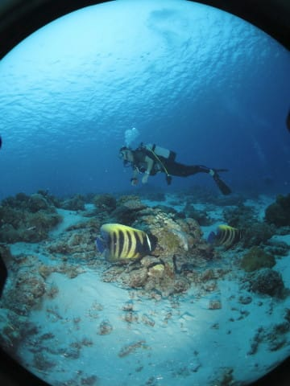

地味なアカヒメジ群れなど．

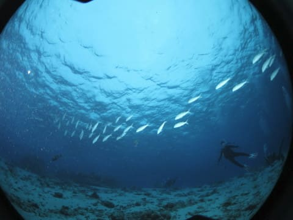

いろんな写真をとってみますが…

残念なことに，どれも日差しが

足りず，海面が暗く写るので．

かなり寂し気な写真になって

しまいました（涙）

ってなことで．

海の中はそこそこ楽しめたものの．

地味な暗い写真しか撮れないまま，

ボート下に戻ってきてしまいました…

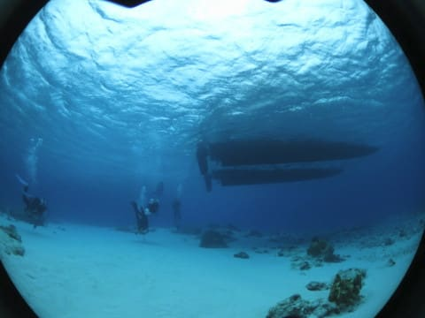

そして，本日2本目もエグジット．

…2本目が終わって，

ボートに上がっても．

雨は多少は弱まったものの，

止むことなく降り続けていたの

でした…（涙）

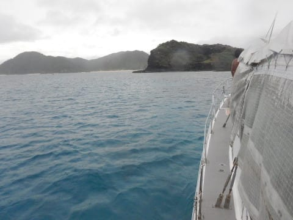
