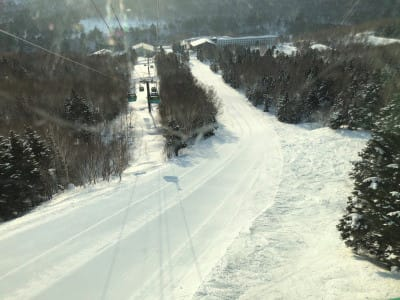

# 2021/2/7(日)の志賀高原スキー場特派員情報！…朝は超晴天シマシマ！だけど，昼前から雪，午後は吹雪気味

📅 投稿日時: 2021-02-08 02:33:26

🏷️ カテゴリ: [日記](cc4b5682fb7b8b144980957a978653fb0.md)

この週末も，家から一歩も出ずに

過ごしました(涙）

最後にうちから出たのはいつの日だったか…

10日間ほど家から出てない気がします(泣)

こんな状況でも，優秀な特派員が志賀の

状況を送ってくださいますので，

今日の志賀高原の情報をば…

本日は，焼額のファーストトラックの

写真から！

…朝8:30の通常営業に先立ち，1500円で

7:50から第1ゴンドラに乗れる，ファーストトラック．

今日はそこそこの人が参加したようです…

そして．

ゴンドラ上から…

シマシマ！！

なんだこれは！

この素晴らしいシマシマは！

お金持ちの方は，1500円払うと

このシマシマを普通より先に

独占できるということか…！！

ということで．

ファーストトラックは，最高級の

エッジ嚙み嚙みシマシマバーンを

味わえたようです…

うらやましぃ～！！

ってな感じで．

通常営業オープン時には，気温は-6℃程度と

そこそこに冷えていて．

バーンはどこに行っても最高シマシマ！

朝のうちは天気も良く，

最高のバーン状況で．

シーズン最高級に楽しめたようですね…

奥志賀も，朝イチはシマシマ！

奥志賀エキスパートコースは，硬めながらも

しっかりエッジが効く，極上快楽バーン

だったようです…！！

そして今日は，おこみん写真が無いのかな？

と思っていたら．

しっかりおこみん写真も送られてきて

ました…(笑)．

ただ．

天気が良かったのは午前中だけだったようで…

午前10時過ぎごろからは徐々に

雲が増え始め．

昼前にはなんだか曇り空になっていき…

昼ごろには，雪がぱらつく天気になったと

思ったら．

午後は本格的な雪になり，

根性の無いスキーヤーふるい落とし機能

が発動したようです…！

…ここは．

昨日の記事で，

　明日は朝のうちは晴れてそうですが．

　昼ごろから雲が増えて，

　午後は雪になりそうです…

と書いたのが見事当たったようです…！

…と，ちょっと自慢したいところだけど．

…最後の方はかなり本格的な雪に

なって，晴天ピカピカの朝から

想像がつかない天気になっていった

ようです…

まぁ，私は予想してましたけどね

（勝ち誇ったような顔で）

午後だけでも，これくらい雪が積もる

本格的な降りになっていたようです…

…ってなことで．

まだトップシーズンど真ん中の志賀高原．

これから明日の8日一日は冷えた雪が降り続け．

志賀高原では9日火曜の午前中くらいまでは

降り続けそうですね…

新潟の海沿いや八方は9日いっぱい降り続けるかな？

10日も冷え冷え，志賀は曇り～時折晴れ間も，

11日は天気は回復傾向…という感じでしょうか．

その後，13日が南岸低気圧でヤバいんですけど…

うーん．

今のところの天気図では，志賀は雨が降ったり

せずになんとか過ごせそう…

というところで．

トップシーズンに1か月以上志賀高原に

行っていない…というか，スキーに行っていない

という，おそらくここ20年以上経験したことのない

事態を過ごしていますが．

特派員の皆さん，引き続き志賀高原の情報を

よろしくお願いします…！

## 💬 コメント一覧

### 💬 コメント by (ぽん)
**タイトル**: Unknown
**投稿日**: 2021-02-08 07:13:59

焼額のファーストトラック。

1番目のゴンドラに乗りました。

シマシマ天国でしたが、Sさんのことを考えて申し訳ない気持ちでいっぱいでした。

早めの復帰を祈ってます。

### 💬 コメント by (レインボー73)
**タイトル**: Unknown
**投稿日**: 2021-02-08 12:08:02

月曜日の志賀高原情報

今日は来期モデルの太板、ヘッド　CORE99 189cm Ｒ19.1 137 101 122 を試乗させていただきました。

朝の湯田中ー4℃ 蓮池ー10℃、上では小雪舞う日。

勇んでオリンピックに飛び込むも、新雪25cmなのに、サラサラ過ぎて板は浮かない。整地と同じ感覚で滑っていたら、前を行く0.1トンの隊員の激しい雪煙が、雪が良すぎてなかなか落ちない。視界がゼロになって上下がわからず、、、

スーパーでも前のボーダーがコケて、一旦停止。イーストは50cm新雪で圧雪は一車分。やっと浮く感触が！

１ゴン脇の非圧雪も25cmくらいかなあ。でも普通。

36日も連続で滑っていると、よほどでないと感激できなくなっている自分、贅沢すぎる自分に、喝！

今のエス様なら、おそらく卒倒悶絶必至バーンなのに。

ダイヤモンドの新雪も、20cmくらいで期待外れ。

ファミリーは豊富なふんわり雪でボコボコ。

パーフェクタは荒れてたけど快適だったとか。ここでも、五天王のこん○⭕様は躊躇なくかっ飛ばしておられたそうな。

銀嶺では、寒くてざる蕎麦でなくラーメンです。

これから西館を狙うんだけど、朝からこれを回してる人がいるとか。

### 💬 コメント by (かず)
**タイトル**: Unknown
**投稿日**: 2021-02-08 12:16:27

今回仕事でいけませんでした 期待ハズレでしたか…

### 💬 コメント by (レインボー73)
**タイトル**: Unknown
**投稿日**: 2021-02-08 16:08:16

月曜日の志賀高原情報２

12時20分たまごが危うくなったので、西館は断念してパーフェクタ経由でヤケビヘもどり、レインボー終了しました。

いつも真っ先に『やめよう』と言う隊員が、『シーズン1のパウダーだ』。また、ヤケビの若い従業員は、

スーパー→登り→ミドル　を、なんと12本もこなしたとか。

『乳酸は？』『そんなものたまったことないです』

私はシーズン最悪の滑りだったのに！

試乗ということで、なんとか浮く感触を得たくて、無理に前をあげようとして乳酸が。もうジ、エンドです。

考えてみれば、全く抵抗のない雪なんだから、ごく普通に滑ればよかったんですよね。脳みそに遅延回路が入ってるんです。気づくのが遅すぎる。若いって、いいなあ。

明日はもっと積もりそうな感じ。

ゲレンデはガラガラです。皆々様、是非とも志賀高原にお越しくださいませ！

### 💬 コメント by (Skier_S)
**タイトル**: 11日までは冷え冷え
**投稿日**: 2021-02-09 02:34:11

＞ぽんさま

ヤケビのファーストトラック一番搬器ですか…！

ヤケビ常連さんがいっぱいいそうですね（笑）．

シマシマ楽しめたようで良かったですね…

K奈川県までシマシマバーン持って来てください（懇願）

＞レインボー73さま

もう来期モデル試乗しているんですね…

いいなぁ…

センター101mm，どうでした？

西舘とかもパウダー良かったんじゃないでしょうか…

しかし，SGS⇒ミドルは一回登りましたけど，

結構効きますよ…！普通はやりません（笑）

＞かずさま

おっと．今日は来れなかったんですね…

明日もパウダーチャンスなんですが．

そのあとはしばらくパウダーチャンスは来なさそうな感じです…

