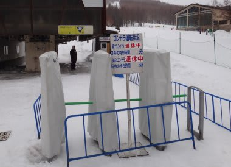

# 3月31日の志賀…明日は最高だろうなぁ

📅 投稿日時: 2012-04-01 00:36:53

という感じで．

土曜日帰りで志賀高原に行ってきたんですが．

…天気予報，一部当たって一部外れましたなぁ．

今日は朝からかなりの強風で，焼額のゴンドラは2本とも営業見合わせ…

ゴンドラが止まるのは昼過ぎからだと思ったんだけどな～．

前線の進みが予想より速かったようで…

で．第2高速リフトも止まっちゃってたんで．

午前中は一の瀬を滑ってました．

天気は，朝のうちはぽつぽつ小ぶりの雨でしたが．

午前10時ごろには土砂降りの雨に…(涙)

雪質も当然，水を吸ったドボドボの雪です．

…土砂降りの中，ドボドボの雪を泣きながら滑っていたら．

スキーヤーのみんなの祈りが通じたのか．

11時をすぎるころから．

空から降ってくるものに，固体が混ざってきました．

と思ったら．

11時半ごろから完全に雪に．

12時ごろには一気に気温が冷えて，吹雪になってきました…

うーむ．

前線通過は午後3時～4時ごろと予想したんだけど．

予想より4時間ほど早かったようだな…

午後1時には，完全前線通過．

前線通過に伴い，気温が一気に低下して雨が雪になっただけじゃなく，

同時に風向きも完全に北に回ったので，

北風に強い焼額第1ゴンドラが運転再開．

しかし…

完全吹雪ですごい勢いで雪が積もりまくるんだけど．

1時間ちょいでこんなに積もったぞ…

で．

前線通過のおかげで，気温も朝のプラス3度程度の気温から，マイナス8度に急降下．

一気に10度以上の急降下だよ…

真冬並みですな．

という感じで．

雨のゲレンデから，あっという間に状況は変化して．

まるでトップシーズンの新雪状態に．

あっという間にブーツパフくらいの深さに積もります．

それも，3月末と思えない気温の低さで，結構いい雪．

この時期にこんな新雪が滑れるとは…

雨で溶けた雪も，あっという間に新雪に隠れちゃいました．

…でも，ゲレンデ全面新雪になっちゃったので，

新雪が苦手な人はつらかったかも…

滑っても滑っても，すぐ新雪に．

いや～

私はハッピーだったんですけどね．

とりあえず．

今日は視界が悪く…

ちょっとスピードを出すのは難しい状況だったけど．

この時期にありえないマイナス36度の寒気が入り，

朝のうちはこんなだった駐車場が…

数時間でこんなになるくらいに積もったので．

圧雪が入った明日の朝は，最高でしょうね～．

明日は，最高だろうな～

…なんで明日に限って滑れないんだろ(激泣）

## 💬 コメント一覧

### 💬 コメント by (雪上の翁)
**タイトル**: 凄い
**投稿日**: 2012-04-02 20:41:41

志賀高原日帰りをさらりとこなしてしまうなんて、毎回思いますが、、

凄すぎます！

そして山の天気の変わり方も、

凄いですね。さすが志賀高原(^-^)

私は今週末の志賀高原が最後になりそうです。

### 💬 コメント by (Skier_S)
**タイトル**: 志賀の日帰りは…
**投稿日**: 2012-04-03 01:09:51

昨シーズン2回やった，月山日帰りに比べれば

志賀は近いですよ（笑）．

私の方は6月まで滑りますから，

まだ2ヶ月半以上シーズンは続きます．

まだまだレポートは続きますよ～．

今週末，志賀高原のどこかで私が滑ってるか

もしれません…

