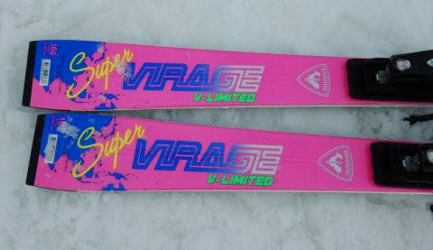

# 2021シーズンモデルのスキー板，試乗レポート…ROSSIGNOL SUPER VIRAGE V Limited

📅 投稿日時: 2020-04-28 08:39:27

えー．

本日は，昨日の20000mチャレンジ投稿の続きを

行こうかと思ってましたが，ちょっとバタバタ

してるので，書きためていたスキー試乗レポートです！

で，

志賀高原では，まて昨日も雪が降っているようですね…

GWが始まっているというのに，

高天ヶ原はモーグルバーン側も真っ白だし…

一の瀬も完全に真っ白！

（[志賀高原索道協会ライブカメラページ](https://www.shigakogen.gr.jp/live/index.html)より）

うーむ．

やはり，今シーズンのGW，例年並みか

それ以上の雪が残りましたね…

ってなことで，本題へ．

今回の試乗レポートは，ロシニョール編です．

では，どうぞ～！！

○ROSSIGNOL SUPERVIRAGE V Limited 166cm

基礎小回り用

これまで続いたROSSIGNOLのデモモデル，

DEMO Alpha, Beta…

というモデル名を捨て．

SUPER VIRAGEシリーズとなった，来季のDEMOモデル．

上のクラスから，

・SUPER VIRAGE V Limited　(2020モデルのDEMO Alpha TI LTDに相当)

・SUPER VIRAGE V TECH　(2020モデルのDEMO Alpha TIに相当)

・SUPER VIRAGE V VERSATILE　(2020モデルのDEMO Alpha PLUSに相当)

・SUPER VIRAGE IV　(2020モデルのDEMO Betaに相当)

・SUPER VIRAGE III　(2020モデルのDEMO Gammaに相当)

というラインナップになるようで．

…基本的に，2020年モデルからサイドカーブも

ビンディングも変わってないようなので，

コスメ＆名称チェンジだけの継続モデル

みたいですね…

とりあえず，今回試乗したのは，SUPER VIRAGEでも

最高モデルとなる　SUPER VIRAGE Vでも，

R22プレートが付いたLIMITEDになります．

滑ってみたところ…

うは．

これもハイスピードの安定性は抜群にいいですね…

R22プレートがしっかりしているので，かなり

足元がしっかりした強い板です．

この強い板が，スピードが出てきて，

たわみが出始めてくると…

ガッツリグリップして，気持ちよく切れていきます．

しっかりグリップして，足元がどっしりした

感じがあるので，スピードが出て行った時の

安定感はかなり強い感じ．

…ただ，逆に言うと，グリップが強くて

足元に重さを感じる板なので，

低速でのコントロール性は多少犠牲に

なっている感はあります…

ゆっくり滑った時に，

「これはどうしたらいいんだろう…？？」

と戸惑うほどの板の回らなさ，

手ごわさを感じます．

ゆっくり滑った中で，いろいろな小技を

使うような板ではありません．

そういう滑りをしたい人は，この板の

Limitedを選ばない方がシアワセです．

ただ，スピードを上げていくと…

どこまでスピードを上げて行っても，

どこまで横Gを上げていっても，

ビクともずれない足元の信頼感．

切れていくアグレッシブさ，

怖さを全く感じず，さらにスピードを

上げたくなるような，高速域での

バツグンの安定性…

この板はどこまでスピードを上げて行っても

板がばたつかず，「まだまだ大丈夫！」という

余裕を感じるので，安心してハイスピードの中

さらに圧を高めていったり，好きなように

操作できる余裕があります．

谷回りであまりトップを抑える必要が無く，

センターにしっかり乗って行ければ

回り始めるので，ちょっと昔の

ロッカー板っぽいターン始動…

そして，テールの張りが強めなので，

ターンの仕上げでテールを抑えると

板がすっと抜けていき，そのまま

切り替わって自動的に次のターンの

トップが捉えていく感じで．

谷回りで板を動かしていく，最近の

流行りの動きと違う，ロッカースキーの

時代に流行った動きにマッチしてる

感じ…

低速でズラシのコントロールとかしようと

思うとつらいですが．

ひたすらハイスピードのガッツリカービングで

かっ飛ばしたい人には，かなりいい感じを

受ける板だと思います．

## 💬 コメント一覧

### 💬 コメント by (yumi)
**タイトル**: Unknown
**投稿日**: 2020-04-28 18:28:09

Ｓさぁ～ん🙄🎵😁

あぁ～ン😅

20000㍍ の続き（本編）を 楽しみ😃🎶にしてたのにぃ～😣

西舘さん✨文章が上手ですよねぇ☺️

いつも コメント欄の長文に スゴいなぁ～👍

って、思ってましたが・・・

原稿まで 送っていたとは・・・🤔

### 💬 コメント by (Unknown)
**タイトル**: Unknown
**投稿日**: 2020-04-28 21:32:35

SUPER VIRAGEシリーズ・・・

なんだか、とっても懐かしい名称に戻りましたね！

この「SUPER VIRAGE」って名称、Ｓさんが中学生位の時じゃないでしょうか・・・

あの当時は、２ｍなんて今では考えられない長さの板を準指の皆さんが器用に扱っていました・・・（古～）

### 💬 コメント by (Skier_S)
**タイトル**: GW前進行でバタバタしてました
**投稿日**: 2020-04-29 05:38:24

＞yumiさま

すみません…ちょっとGW8連休直前で，仕事一区切りつけるのに

バタバタしてたので…

今日，後編投稿しました！

＞Unknownさま

Super Virage，かなり懐かしいです…

私も3歳の頃からスキーを始めており，社会人になる前後まで

197cmとかの板を履いていました（笑）．

そのころ，RossignolはSuper Virageとか，OPENとか

流行りましたよね…

でも，今の時代にリバイバルするとは思いませんでした…！！

